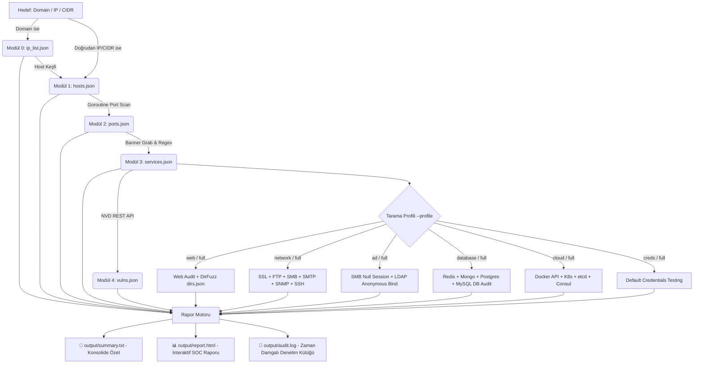

<div align="center">

# ⚡ SpecterRecon (v2.0.0 — Universal Pentest Edition)
### *Universal High-Performance Infrastructure & Application Security Assessment Engine in Go*

[](https://go.dev/)
[](#)
[](#)
[](#)
[](#)

<br>

```ascii
  ____                  _             ____                     
 / ___| _ __   ___  ___| |_ ___ _ __ |  _ \ ___  ___ ___  _ __ 
 \___ \| '_ \ / _ \/ __| __/ _ \ '__|| |_) / _ \/ __/ _ \| '_ \ 
  ___) | |_) |  __/ (__| ||  __/ |   |  _ <  __/ (_| (_) | | | |
 |____/| .__/ \___|\___|\__\___|_|   |_| \_\___|\___\___/|_| |_|
       |_|                                                     
    -- Universal Recon & Vulnerability Scanner for All Pentests --   
```

<p align="center">
  <b>SpecterRecon v2.0.0</b>, siber güvenlik uzmanları, sızma testi (pentest) ekipleri ve CTF/lab araştırmacıları için geliştirilmiş; <b>Web Uygulamaları, Ağ Altyapısı, Active Directory, Veritabanları, Cloud/DevOps, IoT/OT ve SSL/TLS denetimlerini</b> tek bir bağımsız binary dosyasında toplayan <b>130+ kontrollük evrensel güvenlik tarama motorudur</b>.
</p>

---

</div>

## 🎯 1. Projenin Amacı

Geleneksel güvenlik tarayıcıları genellikle yalnızca tek bir ortama odaklanır (Nmap gibi sadece ağ/port tarayanlar veya Gobuster/ffuf gibi sadece web dizinlerini hedefleyenler). 

**SpecterRecon'un temel amacı:**
- Keşiften zafiyet tespitine ve raporlamaya kadar olan **tüm sızma testi (pentest) süreçlerini tek bir çatı altında otomatikleştirmektir**.
- **Python veya harici runtime/bağımlılık karmaşasına son vererek** saf Go (Golang) dili ile **tek bir bağımsız çalıştırılabilir binary (`specter-recon.exe`)** üretmektir.
- Her test türünde (Web, Ağ, Windows/AD, Veritabanı, Cloud/DevOps, IoT/OT, SSL/TLS) **farklı araçlar arasında geçiş yapma zorunluluğunu ortadan kaldırmak**, bulunan tüm verileri otomatik olarak bir sonraki modüle aktaran **modüler bir pipeline mimarisi** sunmaktır.
- Sonuçları hem terminalde anlık olarak canlı tablolarla göstermek hem **tek bir insan-okunabilir metin dosyasında (`output/summary.txt`)** toplamak hem de **görsel SOC HTML raporu (`output/report.html`)** olarak sunmaktır.

---

## 🧰 2. Kullanılan Teknolojiler (Tech Stack)

SpecterRecon, maksimum performans, düşük bellek kullanımı ve yüksek erişilebilirlik için Go ekosisteminin en güçlü bileşenleriyle inşa edilmiştir:

| Bileşen | Teknoloji / Kütüphane | Açıklama |
|---|---|---|
| **Çekirdek Dili** | `Go (Golang) 1.21+` | Yüksek derleme hızı, düşük bellek ayak izi, sıfır runtime bağımlılığı ve cross-platform tek binary desteği. |
| **Eşzamanlılık (Concurrency)** | `Goroutines` + `Worker Pools` + `sync.WaitGroup` | Non-blocking asenkron ağ soket bağlantıları ile binlerce portu ve isteği paralel işleme. |
| **CLI & Komut Motoru** | `github.com/spf13/cobra` | Tip güvenli CLI flag yönetimi, alt komut mimarisi (`scan`, `fullscan`, `ssl`, `smb`, `creds`, `dns`, `report`). |
| **Zengin Terminal Arayüzü** | `github.com/pterm/pterm` | Renkli loglar, kutulu canlı tablolar, ilerleme durumları ve konsol çıktısı. |
| **Zafiyet Veritabanı** | `NVD REST API v2` + Offline Cache | NIST NVD API üzerinden resmi CVSS v3.1 puanı, zafiyet açıklamaları ve offline SQLite/JSON önbelleği. |
| **Veri & Yapılandırma** | `encoding/json` + `gopkg.in/yaml.v3` | Modüller arası veri iletimi için katı JSON modelleri ve `service_wordlist_map.yaml`. |
| **Raporlama Motoru** | Standart `html/template` | XSS korumalı, responsive, karanlık temalı SOC güvenlik dashboard'u (`output/report.html`). |

---

## ⚙️ 3. Çalışma Şekli (Execution Workflow)

SpecterRecon, hedef girildiğinde **otomatik veri aktarımı yapan 6 temel boru hattı adımında** çalışır:

1. **📡 Adım 0 — DNS & Subdomain Keşfi:** Target bir domain ise (`example.com`) A/AAAA kayıtları çözümlenir ve opsiyonel Goroutine brute-force ile subdomainler keşfedilir. IP/CIDR ise bu adım otomatik atlanır.
2. **🔍 Adım 1 — Canlı Host Keşfi (Discovery):** ARP tablosu, ICMP ping ve TCP SYN/ping probları ile ağdaki canlı makine IP'leri tespit edilir.
3. **🔌 Adım 2 — Eşzamanlı Port Taraması:** Seçilen port aralığında (`top-20`, `top-100`, `top-1000`, `1-65535`) Goroutine Worker Pool mimarisi ile TCP connect taraması yürütülür.
4. **🏷️ Adım 3 — Banner Grabbing & Servis Tespiti:** Açık portlarda HTTP header analizi, TLS handshaking ve Raw Socket probları ile çalışan servis adı ve versiyonu (`Apache 2.4.49`, `OpenSSH 8.9p1`, `Redis`, `SMBv1` vb.) çıkarılır.
5. **🛡️ Adım 4 — CVE & Zafiyet Eşleştirmesi:** Tespit edilen servis ve versiyonlar NVD API v2 veritabanında taranarak resmi **CVSS v3.1 skoru** ve açıklamalara dönüştürülür.
6. **🚀 Adım 5 — Profil Tabana Dayalı Güvenlik Modülleri:** Seçilen profile göre (`web`, `network`, `ad`, `database`, `ssl`, `cloud`, `full`) ilgili derinlemesine kontrol modülleri yürütülür.
7. **📊 Adım 6 — Konsolide Raporlama:** Elde edilen tüm bulgular aynı anda terminale basılır, `output/summary.txt` dosyasına yazılır ve `output/report.html` SOC raporuna dönüştürülür.

---

## 🏗️ 4. Proje Mimarisi ve Veri Akışı (Data Flow)

SpecterRecon, modüllerin bir önceki modülün JSON çıktısını otomatik girdi olarak kullandığı **Lineer Pipeline (Boru Hattı)** mimarisiyle tasarlanmıştır:



---

## 📋 5. Tarama Profilleri ve Çalışma Planı (`--profile`)

SpecterRecon, ihtiyaca göre hedefe özel modülleri tetikleyen 7 farklı **çalışma profili** sunar:

| Profil | Amacı | Çalıştırılan Modüller | Örnek Komut |
|---|---|---|---|
| `web` | Web Uygulama Pentest | HTTP Security Headers, CORS, Dangerous Methods, GraphQL, Cookie Flags, Reflected XSS, Error SQLi, Web Fuzzing | `specter-recon scan target.com --profile web --authorized` |
| `network` | Ağ Altyapı Pentest | SSL Audit, FTP Anon/Write, SMB Null/Signing/v1, SMTP Relay/VRFY, SNMP Community Brute, SSH Audit | `specter-recon scan 192.168.1.0/24 --profile network --authorized` |
| `ad` | Active Directory Pentest | SMB Null Session, SMB Signing, SMBv1, NetBIOS Query, Anonymous LDAP Bind, AD Domain Naming | `specter-recon scan dc.company.com --profile ad --authorized` |
| `database` | Veritabanı Audit | Redis NOAUTH, MongoDB Unprotected, Memcached, Postgres Trust Auth, MySQL, MSSQL, Elasticsearch | `specter-recon scan 192.168.1.10 --profile database --authorized` |
| `ssl` | SSL/TLS Sertifika Audit | Sertifika son kullanma tarihi, Self-signed kontrolü, SSLv3/TLS1.0/1.1 zayıf protokol tespiti, SANs | `specter-recon scan example.com --profile ssl --authorized` |
| `cloud` | Cloud & DevOps Audit | Docker API (2375/2376), Kubernetes API Server (6443/8080), etcd (2379/2380), Consul, Prometheus, Grafana | `specter-recon scan 192.168.1.10 --profile cloud --authorized` |
| `full` | **Eksiksiz Tam Pentest** | **Yukarıdaki tüm 130+ güvenlik kontrolü ve modülün tamamı** | `specter-recon fullscan 192.168.1.10 --authorized` |

---

## 📦 Proje Dizin Ağacı

```
Cyber-Security/
├── main.go                  # Uygulama ana giriş noktası
├── go.mod                   # Go modül tanımı (Go 1.21+)
├── config.yaml              # Merkezi tarama ve port yapılandırması
├── README.md                # Kapsamlı v2.0.0 dokümantasyonu
│
├── cmd/                     # Cobra CLI komutları
│   ├── root.go              # Yasal izin (--authorized) kontrolü
│   ├── scan.go              # Profil tabanlı boru hattı komutu (--profile)
│   ├── fullscan.go          # Tüm adımları tek komutla çalıştıran kısayol
│   ├── ssl.go               # SSL/TLS audit komutu
│   ├── smb.go               # SMB null session & signing audit komutu
│   ├── creds.go             # Default credential testing komutu
│   ├── dns.go               # DNS Enumeration komutu
│   ├── discover.go          # Host keşif komutu
│   ├── portscan.go          # Port tarama komutu
│   ├── banner.go            # Banner grabbing komutu
│   ├── vuln.go              # CVE zafiyet analiz komutu
│   ├── dirfuzz.go           # Web fuzzer komutu
│   └── report.go            # Rapor üretim komutu
│
├── core/                    # Çekirdek yardımcılar & Veri Modelleri
│   ├── models.go            # Tüm pentest modülleri için Go struct şemaları
│   ├── storage.go           # JSON saklama + Genişletilmiş SaveSummaryTxt
│   └── logger.go            # PTerm konsol tabloları (PrintSslTable, PrintSmbTable...)
│
└── modules/                 # Güvenlik Modülleri
    ├── ssl_tls.go           # SSL/TLS Sertifika & Zayıf Protokol Audit
    ├── http_audit.go        # HTTP Security Headers, CORS, GraphQL, Methods
    ├── ftp_enum.go          # FTP Anonymous Login, Write Check (MKD), FTPS
    ├── smb.go               # SMB Null Session, SMBv1, SMB Signing, NetBIOS Query
    ├── ssh_audit.go         # SSH KEXINIT Zayıf Algoritma & Banner Analizi
    ├── db_enum.go           # Redis NOAUTH, Mongo Unprotected, Postgres Trust Auth...
    ├── smtp.go              # SMTP Open Relay, VRFY User Enum, STARTTLS
    ├── snmp.go              # UDP 161 SNMP Community Brute & sysDescr Query
    ├── creds.go             # Default Credential Testing Engine
    ├── container.go         # Docker API, Kubernetes API, etcd, Consul, Prometheus
    ├── ldap.go              # Anonymous LDAP Bind & Active Directory Domain Query
    ├── webvuln.go           # Reflected XSS, Error-Based SQLi, Open Redirect
    ├── nfs.go               # NFS 2049 RPC Export & Mount Check
    ├── iot.go               # Modbus TCP (PLC), RTSP Camera, VNC RFB Check
    ├── portscan.go          # Goroutine Worker Pool Port Tarayıcısı
    ├── discovery.go         # Host Keşfi (ARP / ICMP / TCP ping)
    ├── banner.go            # Banner Grabbing & Versiyon Çıkarımı
    ├── vulnmatch.go         # NVD API & Offline CVE Eşleştirici
    ├── dirfuzz.go           # Deterministik Akıllı Web Fuzzer
    ├── report.go            # HTML Rapor Üreticisi
    └── modules_test.go      # Go birim testleri (8 test)
```

---

## 💻 Kullanım Kılavuzu & Komutlar

### 🚀 1. Hızlı Kurulum ve Derleme

```bash
# Go bağımlılıklarını indirin
go mod tidy

# Bağımsız ikili (binary) dosyayı derleyin
go build -o specter-recon.exe main.go
```

---

### 🌟 2. Otomatik Pentest Taramaları

```bash
# 🚀 Tam Kapsamlı Eksiksiz Pentest Taraması
.\specter-recon.exe fullscan 192.168.1.10 --authorized

# 🌐 Web Uygulama Taraması (Subdomain Brute-Force Dahil)
.\specter-recon.exe scan example.com --profile web --subdomains --authorized

# 🖥️ Active Directory Ortamı Taraması
.\specter-recon.exe scan 192.168.1.10 --profile ad --authorized

# 🗄️ Veritabanı ve Sunucu Taraması
.\specter-recon.exe scan 192.168.1.10 --profile database --authorized
```

---

### 🧩 3. Modülleri Tek Başına Çalıştırma

```bash
# 🔒 SSL/TLS Sertifika ve Protokol Audit
.\specter-recon.exe ssl 192.168.1.10:443

# 🖥️ SMB Null Session & Signing Denetimi
.\specter-recon.exe smb 192.168.1.10 --authorized

# 🔑 Varsayılan Credential Tespiti
.\specter-recon.exe creds 192.168.1.10 --authorized

# 📂 Web Dizin Fuzzing
.\specter-recon.exe dirfuzz http://192.168.1.10:8080 --authorized

# 📊 Mevcut JSON'lardan Rapor Üretme
.\specter-recon.exe report -t "Lab Target" -o output/report.html
```

---

## 📄 `output/summary.txt` Örnek Çıktısı

Her taramadan sonra otomatik oluşturulan konsolide insan-okunabilir metin özeti:

```
=== SpecterRecon Tarama Özeti ===
Hedef : 192.168.1.10
Tarih : 2026-08-26 16:30:00
Süre  : 18.45 saniye

[HOSTLAR] (1)
  + 192.168.1.10 [tcp_ping, alive]

[AÇIK PORTLAR] (6)
  + 192.168.1.10:21     ftp             [open]
  + 192.168.1.10:22     ssh             [open]
  + 192.168.1.10:443    https           [open]
  + 192.168.1.10:445    microsoft-ds    [open]
  + 192.168.1.10:2375   docker          [open]
  + 192.168.1.10:6379   redis           [open]

[SSL/TLS BULGULARI] (2)
  !! 192.168.1.10:443 — Zayıf protokol destekleniyor: TLSv1.0
  !! 192.168.1.10:443 — Self-Signed (Öz İmzalı) Sertifika

[SMB BULGULARI] (2)
  !! 192.168.1.10:445 — NULL SESSION AKTİF
  !! 192.168.1.10:445 — SMB SIGNING DEVRE DIŞI (relay riski)

[FTP BULGULARI] (1)
  !! 192.168.1.10:21 — ANONYMOUS FTP GİRİŞİ MÜMKÜN

[VERİTABANI BULGULARI] (1)
  !! 192.168.1.10:6379 [redis] — REDIS AUTH OLMADAN ERİŞİLEBİLİR!

[CONTAINER/CLOUD BULGULARI] (1)
  !! 192.168.1.10:2375 [docker] — KİMLİK DOĞRULAMASIZ ERİŞİM AÇIK

=== ÖZET ===
  Hostlar        : 1
  Açık Portlar   : 6
  Zafiyetler     : 2 toplam (1 kritik/yüksek)
  Web Bulguları  : 4 toplam
  Rapor          : output/report.html
  Süre           : 18.45 saniye
```

---

## 🧪 Testleri Çalıştırma

```bash
# Tüm Go birim testlerini yürüt (8 test)
go test -v ./modules/...
```

---

## ⚖️ Yasal Uyarı ve Etik Bildirimi

> **ÖNEMLİ:** Bu araç yalnızca **yasal izin alınmış sistemler**, yetkili sızma testi sözleşmeleri, laboratuvar ortamları ve CTF yarışmaları için tasarlanmıştır. İzin alınmamış üçüncü taraf sistemlere karşı tarama yapmak yasalara aykırıdır. Geliştiriciler, aracın kötüye kullanımından sorumlu tutulamaz.
