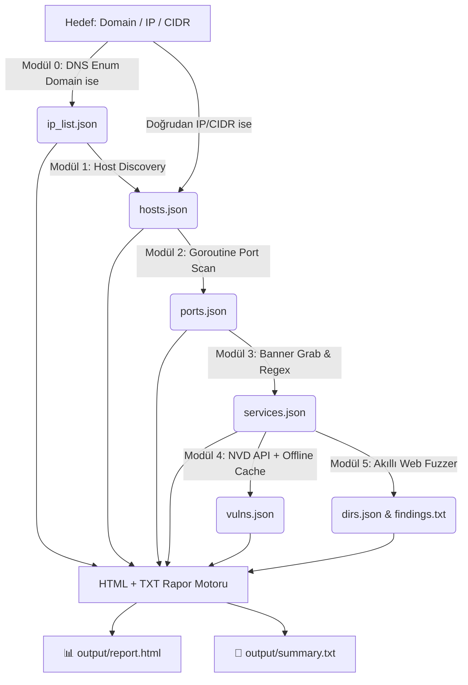

<div align="center">

# ⚡ SpecterRecon (v1.2.0)
### *Next-Gen High-Performance Network Reconnaissance & Vulnerability Assessment Engine in Go*

[](https://go.dev/)
[](#)
[](#)
[](#)
[](#)

<br>

```ascii
  ____                  _             ____                     
 / ___| _ __   ___  ___| |_ ___ _ __ |  _ \ ___  ___ ___  _ __ 
 \___ \| '_ \ / _ \/ __| __/ _ \ '__|| |_) / _ \/ __/ _ \| '_ \ 
  ___) | |_) |  __/ (__| ||  __/ |   |  _ <  __/ (_| (_) | | | |
 |____/| .__/ \___|\___|\__\___|_|   |_| \_\___|\___\___/|_| |_|
       |_|                                                     
    -- Fast, Modular Network Recon & Vulnerability Scanner --   
```

<p align="center">
  <b>SpecterRecon</b>, siber güvenlik uzmanları, sızma testi (pentest) ekipleri ve CTF/lab araştırmacıları için geliştirilmiş; <b>DNS Enumeration, aktif ağ keşfi, Goroutine tabanlı asenkron port taraması, servis/versiyon parmak izi analizi, NVD REST API destekli CVE zafiyet eşleştirmesi, deterministik akıllı web dizin/dosya fuzzer'ı ve modern HTML SOC raporlamasını</b> tek bir bağımsız binary dosyasında birleştiren yeni nesil güvenlik tarama motorudur.
</p>

---

</div>

## 📌 Neden SpecterRecon?

Geleneksel tarayıcılar genellikle ya yalnızca port tarar (Nmap gibi) ya da yalnızca web dizinlerini hedefler (Gobuster/ffuf gibi). **SpecterRecon**, keşiften raporlamaya tüm adımları **birbirine veri aktaran modüler bir boru hattı (pipeline) mimarisinde** toplar:

1. **📡 Otomatik DNS & Subdomain Keşfi:** Domain girildiğinde (`example.com`) otomatik A/AAAA çözümü ve opsiyonel Goroutine brute-force ile subdomain keşfi yapar; IP/CIDR girildiğinde bu adımı otomatik atlar.
2. **⚡ Saf Go Gücü & Goroutine Eşzamanlılığı:** Go'nun hafif eşzamanlılık modeli (`Goroutines` + `Worker Pools`) ile binlerce portu ve web yolunu milisaniyeler içinde non-blocking olarak tarar.
3. **🛡️ Otomatik CVE & Risk Skorlama:** Tanımlanan servis/versiyonları (örn: `Apache 2.4.49`, `OpenSSH 8.9p1`) NVD REST API v2 ve yerel zafiyet veritabanında arayarak **CVSS v3.1 puanlarına** göre sıralar.
4. **🎯 Deterministik Akıllı Web Fuzzing:** Sadece HTTP/HTTPS portlarında çalışır; tespit edilen teknolojiye göre (`WordPress` > `Jenkins` > `Apache` > … öncelik sırasıyla) `service_wordlist_map.yaml` üzerinden **her çalıştırmada aynı** wordlist'i seçer ve hassas dosya uyarıları üretir.
5. **📄 Tek TXT Özet + HTML SOC Raporu:** Tarama sonuçlarını hem `output/summary.txt` (tüm bulgular tek insan-okunabilir metin dosyasında) hem de `output/report.html` (karanlık temalı, responsive, filtreli) olarak dışa aktarır.
6. **🔒 Tutarlı Güvenlik Guardrail'leri:** Tüm komutlarda (`scan`, `portscan`, `discover`, `dns`, `dirfuzz`, `banner`, `vuln`) yetkisiz taramaları önlemek için izin doğrulaması (`--authorized`) ve denetim kütüğü (`output/audit.log`) zorunlu tutulur.
7. **📦 Tek Bağımsız Binary:** Python veya harici runtime bağımlılığı olmadan doğrudan çalıştırılabilir (`specter-recon.exe` / `specter-recon`).

---

## 🏗️ Mimari ve Veri Akışı (Data Flow)

SpecterRecon, her modülün bir önceki adımın çıktısı olan JSON verisini girdi alıp zenginleştirdiği **Lineer Pipeline (Boru Hattı)** mimarisini kullanır:



---

## 🧰 Teknoloji Yığını (Tech Stack)

| Bileşen | Teknoloji | Açıklama |
|---|---|---|
| **Programlama Dili** | `Go (Golang) 1.21+` | Yüksek derleme hızı, düşük bellek ayak izi ve tek ikili (binary) çıktı. |
| **Eşzamanlılık** | `Goroutines` + `Worker Pools` + `sync.WaitGroup` | Sıfır bellek sızıntısı ile binlerce paralel ağ bağlantısı. |
| **CLI & Arayüz** | `github.com/spf13/cobra` + `github.com/pterm/pterm` | Tip güvenli CLI argümanları, renkli kutular, canlı loglar ve tablolar. |
| **DNS & Ağ** | Standart `net`, `context`, `crypto/tls` | Non-blocking DNS çözümleyici, TCP Connect ve SSL denetimi. |
| **Veri & Yapılandırma** | `encoding/json`, `gopkg.in/yaml.v3` | Katı JSON modelleri, `service_wordlist_map.yaml` ve `config.yaml`. |
| **Rapor Şablonlama**| Standart `html/template` | XSS güvenli, karanlık temalı modern SOC güvenlik dashboard'u. |

---

## 📦 Proje Dizin Ağacı

```
Cyber-Security/
├── main.go                  # Uygulama ana giriş noktası
├── go.mod                   # Go modül tanımı (Go 1.21+)
├── go.sum                   # Go bağımlılık doğrulama hashleri
├── config.yaml              # Merkezi tarama ve port yapılandırması
├── README.md                # Kapsamlı proje dokümantasyonu
│
├── cmd/                     # Cobra CLI komutları
│   ├── root.go              # Ana komut ve yasal izin (--authorized) kontrolü
│   ├── scan.go              # Tam otomatik 6 adımlı pipeline komutu
│   ├── dns.go               # Modül 0: DNS Enumeration komutu
│   ├── discover.go          # Modül 1: Host keşif komutu
│   ├── portscan.go          # Modül 2: TCP port tarama komutu
│   ├── banner.go            # Modül 3: Banner grabbing ve versiyon komutu
│   ├── vuln.go              # Modül 4: CVE zafiyet analiz komutu
│   ├── dirfuzz.go           # Modül 5: Web dizin fuzzer komutu
│   └── report.go            # Modül 6: HTML + TXT rapor üretim komutu
│
├── core/                    # Çekirdek yardımcılar
│   ├── models.go            # Go struct veri şemaları (DNS, Host, Port, Service, Vuln, Finding)
│   ├── storage.go           # JSON/TXT saklama, yükleme ve SaveSummaryTxt yardımcıları
│   └── logger.go            # PTerm konsol tabloları ve audit.log kaydedici
│
├── modules/                 # Güvenlik modülleri
│   ├── dns_enum.go          # Modül 0: DNS A/AAAA Çözümleme & Subdomain Brute-Force
│   ├── discovery.go         # Modül 1: Host Keşfi (ARP / ICMP / TCP ping)
│   ├── portscan.go          # Modül 2: Goroutine Worker Pool Port Tarayıcısı
│   ├── banner.go            # Modül 3: Banner Grabbing & Versiyon Çıkarımı
│   ├── vulnmatch.go         # Modül 4: NVD API & Offline CVE Eşleştirici
│   ├── dirfuzz.go           # Modül 5: Deterministik Akıllı Web Fuzzer
│   ├── report.go            # Modül 6: HTML Rapor Üreticisi
│   └── modules_test.go      # Go birim testleri (7 test)
│
├── templates/               # Rapor şablonları
│   └── report.html.tmpl     # Modern karanlık temalı HTML rapor şablonu
│
├── wordlists/               # Fuzzing kelime listeleri
│   ├── service_wordlist_map.yaml # Servis ➔ Wordlist öncelik eşleştirme konfigürasyonu
│   ├── subdomains.txt       # Subdomain brute-force listesi
│   ├── apache.txt           # Apache sunucu yolları
│   ├── wordpress.txt        # WordPress CMS yolları
│   ├── jenkins.txt          # Jenkins otomasyon yolları
│   ├── common.txt           # Yaygın dizinler ve API yolları
│   └── sensitive.txt        # .env, .git, config, backup dosyaları
│
└── output/                  # Tarama sonuçları (Otomatik üretilir)
    ├── ip_list.json         # DNS çözümleme ve subdomain sonuçları
    ├── hosts.json           # Keşfedilen canlı hostlar
    ├── ports.json           # Açık port listesi
    ├── services.json        # Tanımlanan servisler & teknolojiler
    ├── vulns.json           # CVE zafiyetleri ve CVSS puanları
    ├── dirs.json            # Web dizin bulguları (JSON)
    ├── findings.txt         # Web bulguları ve eşleşen listeler (Düz metin)
    ├── summary.txt          # 🆕 Tüm bulgular tek insan-okunabilir özet dosyası
    ├── report.html          # İnteraktif görsel HTML raporu
    └── audit.log            # Zaman damgalı işlem denetim kütüğü
```

---

## 🚀 Hızlı Başlangıç & Kurulum

### 1. Bağımlılıkları İndirin ve Derleyin

```bash
# Go bağımlılıklarını indirin
go mod tidy

# Bağımsız çalıştırılabilir ikili (binary) dosyayı derleyin
go build -o specter-recon.exe main.go
```

---

## 💻 Kullanım Kılavuzu & Komutlar

### 🌟 1. Tam Otomatik Pipeline Taraması (`scan`)

Tüm adımları (DNS Enum ➔ Keşif ➔ Port Tarama ➔ Banner ➔ CVE Analizi ➔ Web Fuzzing ➔ HTML Rapor + TXT Özet) sırasıyla yürütür:

```bash
# Domain üzerinde tam tarama (Otomatik DNS çözümleme yapar)
.\specter-recon.exe scan example.com --authorized

# Domain üzerinde Subdomain Brute-Force dahil tarama
.\specter-recon.exe scan example.com --subdomains --authorized

# Yerel IP üzerinde tarama (DNS Enum otomatik atlanır)
.\specter-recon.exe scan 127.0.0.1 --authorized

# Bir alt ağda (subnet) en popüler 20 portu tarama
.\specter-recon.exe scan 192.168.1.0/24 -p top-20 --authorized

# Stealth / Sessiz Mod (İstekler arasına 200 ms gecikme koyarak)
.\specter-recon.exe scan 192.168.1.10 -d 200 --authorized

# CVE eşleştirme ve dizin fuzzing'i atlayarak hızlı tarama
.\specter-recon.exe scan 192.168.1.10 --skip-vuln --skip-dirfuzz --authorized

# Özel çıktı dizini belirterek tarama
.\specter-recon.exe scan 192.168.1.10 -o /tmp/myscan --authorized
```

> Tarama tamamlandığında `output/summary.txt` dosyasında tüm bulgular (hostlar, portlar, servisler, zafiyetler, web dizin bulguları) tek bir insan-okunabilir özet olarak oluşturulur.

---

### 🧩 2. Modülleri Adım Adım Bağımsız Çalıştırma

Her modül tek başına çalışabilir ve varsayılan olarak `output/` dizinini kullanır — hiçbir ek flag belirtmeden zincir halinde çalıştırabilirsiniz:

```bash
# 📡 0. Sadece DNS Enumeration & Subdomain Keşfi
.\specter-recon.exe dns example.com --subdomains --authorized

# 🔍 1. Sadece Canlı Hostları Keşfetme (ARP / ICMP / TCP Ping)
.\specter-recon.exe discover 192.168.1.0/24 --authorized

# 🔌 2. Sadece Port Taraması Yapma
.\specter-recon.exe portscan 192.168.1.10 -p top-100 --authorized

# 🏷️ 3. Açık Portlar İçin Banner & Versiyon Tespiti
#    (output/ports.json'u okur → output/services.json'a yazar)
.\specter-recon.exe banner --authorized

# 🛡️ 4. Servis Listesi İçin CVE/Zafiyet Eşleştirme
#    (output/services.json'u okur → output/vulns.json'a yazar)
.\specter-recon.exe vuln --authorized

# 📂 5. Web Hedefinde Dizin/Dosya Fuzzing
.\specter-recon.exe dirfuzz http://192.168.1.10:8080 -w wordlists/common.txt --authorized

# 📊 6. Mevcut JSON Verilerinden HTML Raporu + summary.txt Üretme
.\specter-recon.exe report -t "Lab Target"

# 📊 6b. Farklı bir çıktı dizininden rapor üretme
.\specter-recon.exe report -t "Lab Target" -d /tmp/myscan -o /tmp/myscan/report.html
```

---

### 📄 `output/summary.txt` Örnek Çıktısı

Her `scan` veya `report` komutundan sonra otomatik oluşturulan özet dosyasının formatı:

```
=== SpecterRecon Tarama Özeti ===
Hedef : 192.168.1.10
Tarih : 2026-08-26 15:00:00
Süre  : 42.50 saniye

[HOSTLAR] (1)
  + 192.168.1.10 [tcp_ping, alive]

[AÇIK PORTLAR] (3)
  + 192.168.1.10:22    ssh             [open]
  + 192.168.1.10:80    http            [open]
  + 192.168.1.10:443   https           [open]

[SERVİSLER & VERSİYON] (3)
  + 192.168.1.10:22  ssh         OpenSSH 8.9p1
  + 192.168.1.10:80  http        Apache/2.4.49 [SSL]
  + 192.168.1.10:443 https       Apache/2.4.49 [SSL]

[ZAFİYETLER] (1)
  !! [HIGH / CVSS:7.5] CVE-2021-41773 -> http (192.168.1.10:80)

[WEB BULGULARI] (2)
  + [200] http://192.168.1.10:80/admin (4321 B) [KRİTİK DOSYA]
  + [403] http://192.168.1.10:80/.env  (0 B)

=== ÖZET ===
  Hostlar        : 1
  Açık Portlar   : 3
  Zafiyetler     : 1 toplam (1 kritik/yüksek)
  Web Bulguları  : 2 toplam (1 hassas dosya)
  Rapor          : output/report.html
  Süre           : 42.50 saniye
```

---

## 🎯 Akıllı Wordlist Seçim Sistemi

Web fuzzing sırasında servis banner'ından algılanan teknolojiye göre **deterministik öncelik sırasıyla** wordlist seçilir:

| Öncelik | Teknoloji | Wordlist |
|---------|-----------|----------|
| 1 | WordPress | `wordlists/wordpress.txt` |
| 2 | Jenkins | `wordlists/jenkins.txt` |
| 3 | Apache | `wordlists/apache.txt` |
| 4+ | nginx, tomcat, iis… | Özel wordlist (YAML'dan) |
| Varsayılan | Tanımlanamayan | `wordlists/common.txt` |

Wordlist haritası `wordlists/service_wordlist_map.yaml` dosyasından özelleştirilebilir. Belirlenen wordlist bulunamazsa uyarı verilir ve varsayılana düşülür.

---

## 🧪 Testleri Çalıştırma

```bash
# Tüm Go birim testlerini yürüt (7 test)
go test -v ./modules/...
```

Testler şunları kapsar:
- `TestIsDomainName` — Domain / IP / CIDR ayrımı
- `TestSmartWordlistSelection` — Deterministik wordlist öncelik sırası (wordpress > apache dahil)
- `TestParseTargets` — IP ve IP aralığı ayrıştırma
- `TestParsePortSpecs` — Port spec ayrıştırma (top-20, özel aralık)
- `TestExtractVersionFromText` — Banner'dan versiyon çıkarımı
- `TestMatchOfflineCVEs` — Offline CVE veritabanı eşleştirme
- `TestReportGeneration` — HTML rapor üretme ve içerik doğrulama

---

## 🔄 Değişiklik Geçmişi

### v1.2.0 — 2026-08-26 (Güncel)
- 🆕 **`output/summary.txt`**: Tüm tarama bulguları (host, port, servis, CVE, web) tek okunabilir metin dosyasında toplanıyor
- 🆕 **`report --output-dir` flag**: Rapor komutu artık farklı çıktı dizinlerini destekliyor
- 🔧 **Deterministik wordlist seçimi**: `SelectWordlistForService()` map iterasyonu yerine sabit öncelik listesi kullanıyor
- 🔧 **Wordlist uyarıları**: Wordlist dosyası bulunamazsa sessiz fail yerine açık uyarı veriliyor
- 🔧 **Tutarlı guardrail**: `banner` ve `vuln` komutları artık diğer tüm komutlar gibi scope permission kontrolü yapıyor
- 🔧 **Output dizini garantisi**: Tüm komutlar (`portscan`, `banner`, `vuln`, `dns`, `discover`, `dirfuzz`) artık `output/` dizinini otomatik oluşturuyor
- 🔧 **NVD rate limit**: API key'siz kullanımda bekleme 600ms → 6s'ye çıkarıldı (NVD limiti: 5 istek/30s)
- 🔧 **PHP Backdoor CVE ID**: Geçersiz `CVE-2021-00001` → `PHP-BACKDOOR-2021` olarak düzeltildi
- 🐛 **Go 1.21 `min()` çakışması**: `cmd/scan.go`'daki özel `min()` fonksiyonu kaldırıldı, builtin kullanılıyor
- 🧪 **Yeni test**: WordPress + Apache çakışmasında öncelik sırası doğrulama testi eklendi

### v1.1.0
- Subdomain brute-force, DNS Enumeration pipeline entegrasyonu
- Multi-host port tarama desteği
- PTerm tablo arayüzü iyileştirmeleri

---

## ⚖️ Yasal Uyarı ve Etik Bildirimi

> **ÖNEMLİ:** Bu araç yalnızca **yasal izin alınmış sistemler**, yetkili sızma testi sözleşmeleri, laboratuvar ortamları ve CTF yarışmaları için tasarlanmıştır. İzin alınmamış üçüncü taraf sistemlere karşı tarama yapmak yasalara aykırıdır. Geliştiriciler, aracın kötüye kullanımından sorumlu tutulamaz.
