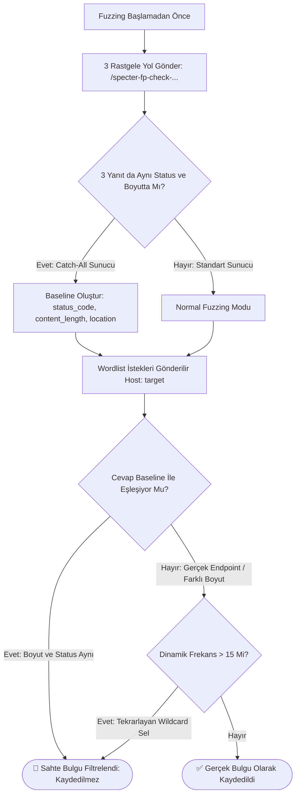
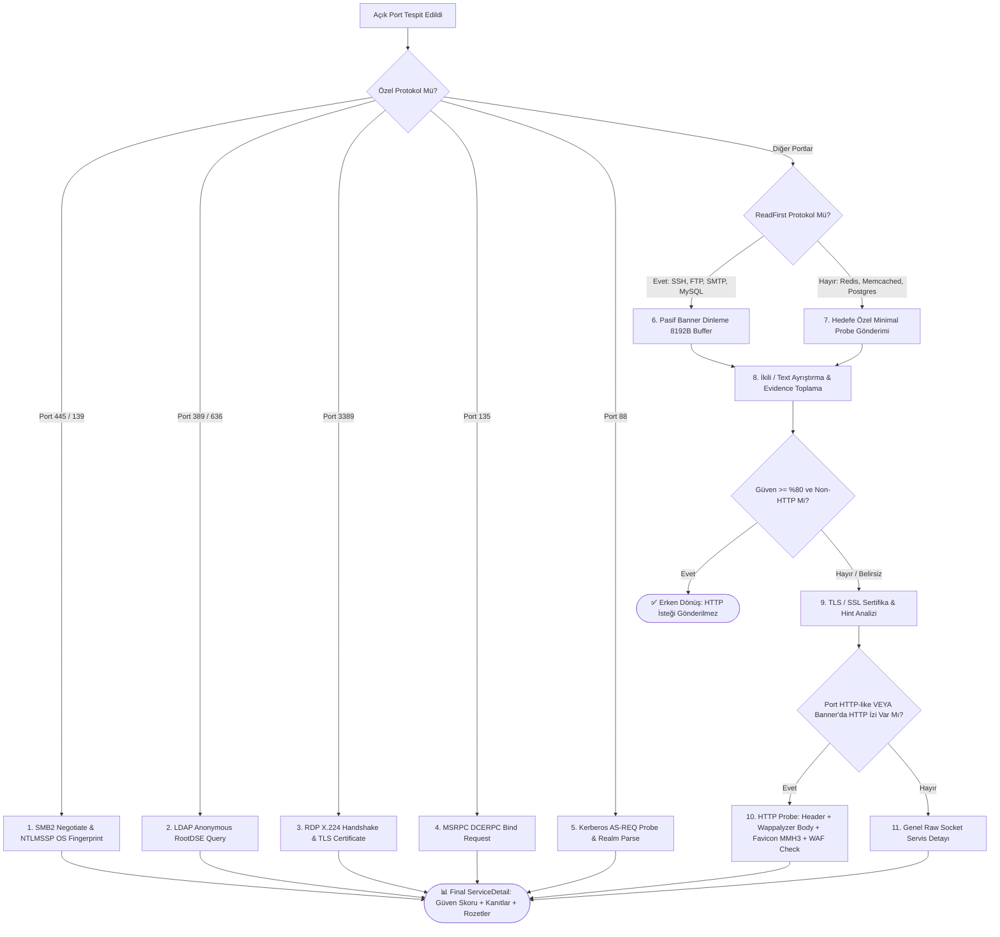
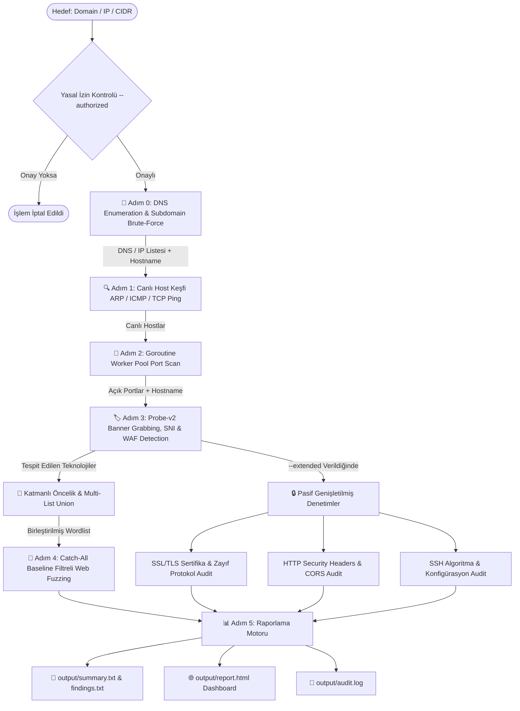

<div align="center">

# ⚡ SpecterRecon (v0.8.0 — Context-Aware Smart Recon Engine)
### *Yüksek Performanslı, Eşzamanlı ve Bağlam Duyarlı Ağ Keşif & Fuzzing Motoru*

[](https://go.dev/)
[](#)
[](#)
[](#)
[](#)
[-success?style=for-the-badge&logo=target&logoColor=white)](#)
[](#)

<br>

```ascii
  ____                  _             ____                     
 / ___| _ __   ___  ___| |_ ___ _ __ |  _ \ ___  ___ ___  _ __ 
 \___ \| '_ \ / _ \/ __| __/ _ \ '__|| |_) / _ \/ __/ _ \| '_ \ 
  ___) | |_) |  __/ (__| ||  __/ |   |  _ <  __/ (_| (_) | | | |
 |____/| .__/ \___|\___|\__\___|_|   |_| \_\___|\___\___/|_| |_|
       |_|                                                     
    -- Context-Aware High Performance Reconnaissance Engine --   
```

<p align="center">
  <b>SpecterRecon</b>, siber güvenlik araştırmacıları, sızma testi uzmanları ve SOC analistleri için <b>Go (Golang)</b> ile geliştirilmiş; <b>DNS Enumeration, Canlı Host Tespiti, Yüksek Hızlı Port Tarama, Probe-v2 Tabanlı Servis & Versiyon Tespiti (SMB2 NTLMSSP OS Fingerprint, LDAP RootDSE, RDP TLS, MSRPC, Kerberos), WAF/CDN Tespiti (Akamai, Cloudflare, AWS), Catch-All & Soft-404 Filtreli Akıllı Web Fuzzing ve Pasif Genişletilmiş Denetim (SSL/HTTP/SSH)</b> süreçlerini tek bir bağımsız binary içerisinde otomatikleştiren yeni nesil keşif motorudur.
</p>

---

</div>

## 📌 İçindekiler

- [🎯 1. Projenin Amacı ve Vizyonu](#-1-projenin-amacı-ve-vizyonu)
- [✨ 2. Öne Çıkan Özellikler ve v0.8.0 İnovasyonları](#--2-öne-çıkan-özellikler-ve-v080-i̇novasyonları)
- [⚡ 3. Nmap & Masscan Hibrit Entegrasyonu ve Tarama Profilleri](#-3-nmap--masscan-hibrit-entegrasyonu-ve-tarama-profilleri)
- [🛡️ 4. Web Fuzzing False Positive Önleme (Catch-All & Soft-404 Filtresi)](#-4-web-fuzzing-false-positive-önleme-catch-all--soft-404-filtresi)
- [🔬 5. Servis & Versiyon Tespit Motoru (Service Detection Engine v2)](#-5-servis--versiyon-tespit-motoru-service-detection-engine-v2)
- [🛠️ 6. Teknoloji Yığını (Tech Stack)](#️-6-teknoloji-yığını-tech-stack)
- [🔄 7. Çalışma Prensibi ve Pipeline Mimarisi](#-7-çalışma-prensibi-ve-pipeline-mimarisi)
- [📁 8. Proje Dosya ve Klasör Yapısı](#-8-proje-dosya-ve-klasör-yapısı)
- [📥 9. Kurulum ve Derleme](#-9-kurulum-ve-derleme)
- [🚀 10. Kullanım Rehberi ve Komut Örnekleri](#-10-kullanım-rehberi-ve-komut-örnekleri)
  - [⚡ İnteraktif Shell Modu (Metasploit Tarzı)](#-i̇nteraktif-shell-modu-metasploit-tarzı)
  - [📡 Tam Recon Pipeline Taraması (`scan` & `fullscan`)](#-tam-recon-pipeline-taraması-scan--fullscan)
  - [🧩 Bağımsız Modül Komutları](#-bağımsız-modül-komutları)
- [📊 11. Raporlama ve Çıktı Mimarisi](#-11-raporlama-ve-çıktı-mimarisi)
- [🔮 12. Gelecek Yol Haritası (Roadmap)](#-12-gelecek-yol-haritası-roadmap)
- [⚖️ 13. Yasal Uyarı ve Lisans](#️-13-yasal-uyarı-ve-lisans)

---

## 🎯 1. Projenin Amacı ve Vizyonu

Geleneksel güvenlik araçları (Nmap, Nikto, Dirb vb.) genellikle ayrı ayrı çalıştırılmayı, karmaşık komut dizilimlerini veya Python runtime/bağımlılık yüklerini gerektirir. Modern kurumsal ağlarda ise Windows Domain Controller, Active Directory servisleri, Akamai/Cloudflare WAF arkasında çalışan web sistemleri ve mikroservis mimarileri yer alır.

**SpecterRecon'un Temel Prensipleri:**
1. **Hibrit Tarama Esnekliği (Masscan + Nmap NSE + Go Native):** Harici araçlar varsa gücünden faydalanır, yoksa %100 taşınabilir (zero-dependency) Go motoruyla hatasız çalışmaya devam eder.
2. **Çift Doğrulama ve Çelişki Şeffaflığı (Conflict Resolution):** Masscan gibi durumsuz (stateless) SYN tarayıcıların açık dediği portlar native TCP handshake ile teyit edilir; teyit edilemeyenler silinmez, **`⚠️ Conflicting Ports`** olarak raporda ayrı gösterilir.
3. **Sıfır Sahte Bulgu (Zero False-Positive Fuzzing):** Catch-All 301/302 yönlendirmeleri ve Soft-404 sayfaları baseline tespitiyle filtrelenir; yüzlerce sahte bulgu elenerek sadece gerçek endpoint'ler raporlanır.
4. **WAF & CDN Bilinçli Keşif:** Zorunlu `Host` header'ı ve SNI yapılandırması sayesinde AkamaiGHost, Cloudflare, AWS CloudFront arkasındaki hedeflerde 400 Bad Request engellerine takılmadan teknoloji tespiti yapılır.
5. **Kimlik Doğrulamasız Derin OS & Servis Tespiti:** SMB2 NTLMSSP Type 2 ve LDAP Anonymous RootDSE protokol handshake'leri ile kimlik bilgisi gerekmeden tam Windows Server sürümü, Build numarası, Active Directory Domain ve Forest adını çıkarır.

---

## ✨ 2. Öne Çıkan Özellikler ve v0.8.0 İnovasyonları

* **⚡ Nmap & Masscan Hibrit Entegrasyonu:**
  - **Seviye 1 (İçe Aktarma):** Önceden alınmış `nmap -oX` (XML) ve `masscan -oJ` (JSON) çıktılarını tek komutla içe aktararak görselleştirme ve fuzzing pipeline'ına bağlama.
  - **Seviye 2 (Subprocess Wrapper):** İsteğe bağlı `--use-masscan` ile devasa ağ bloklarını saniyeler içinde tarama.
  - **Seviye 3 (NSE Zafiyet Entegrasyonu):** `--use-nmap-nse` veya `--profile aggressive` ile tespit edilen port ve servislere özel (`config.yaml` haritalı) NSE zafiyet scriptlerini (MS17-010, SSL Heartbleed vb.) otomatik çalıştırma.
* **🎯 3 Farklı Tarama Profili (`--profile`):**
  - **`balanced` (Varsayılan):** Dengeli, kararlı native Go worker havuzu.
  - **`aggressive`:** Yüksek hızlı Masscan + Hedefe özel Nmap NSE zafiyet taraması + SecLists Full Fuzzing.
  - **`stealth`:** Düşük worker, randomize gecikmeli istekler, Masscan/NSE kapalı sessiz keşif.
* **🛡️ Açık Port Doğrulama & Çelişki Katmanı (Conflict Detection):**
  - Masscan tarafından bildirilen açık portlar native TCP handshake ile teyit edilir. Teyit edilenler `✓ MASSCAN (Teyitli)`, ulaşılamayanlar (SYN Proxy vb.) `⚠️ MASSCAN (Çelişkili)` olarak şeffaf şekilde raporlanır.
* **🛡️ Catch-All & Soft-404 Baseline Filtresi:**
  - Fuzzing öncesi 3 rastgele yol (`/specter-fp-check-...`) sorgulanarak sunucunun wildcard yönlendirme davranışı çıkarılır ve sahte 301/302 bulguları engellenir.
* **🌐 WAF & CDN Algılama ve Zorunlu Host Header'ı:**
  - AkamaiGHost, Cloudflare, AWS CloudFront, Imperva, F5 BIG-IP ve Sucuri WAF sistemleri tespit edilerek raporda `🛡️ WAF` rozetiyle gösterilir.
* **🔬 Yeni Nesil Servis & Versiyon Tespit Motoru (Engine v2):**
## 🛡️ 3. Web Fuzzing False Positive Önleme (Catch-All & Soft-404 Filtresi)

Akamai, CloudFront veya Nginx wildcard yönlendirmesi kullanan sunucularda geleneksel araçlar binlerce sahte `[301] Moved Permanently` veya `[200] Soft-404` bulgusu üretir. SpecterRecon bunu 2 aşamalı akıllı filtreleme ile çözer:



---

## 🔬 4. Servis & Versiyon Tespit Motoru (Service Detection Engine v2)



---

## 🛠️ 5. Teknoloji Yığını (Tech Stack)

| Katman | Teknoloji / Kütüphane | Kullanım Amacı |
|---|---|---|
| **Programlama Dili** | `Go (Golang) 1.21+` | Native performans, minimum bellek ayak izi, platformlar arası derleme. |
| **CLI Framework** | `github.com/spf13/cobra` | Modüler komut yapısı, parametre yönetimi ve help dokümantasyonu. |
| **Terminal UI & Tablolar** | `github.com/pterm/pterm` | Canlı kutulu tablolar, renkli SOC logları ve açılış banner'ı. |
| **Rate Limiter** | `golang.org/x/time/rate` | Token Bucket algoritması ile non-blocking hız sınırlama. |
| **Yapılandırma** | `gopkg.in/yaml.v3` | `service_wordlist_map.yaml` ve `config.yaml` ayrıştırıcı. |
| **Wordlist Ekosistemi** | `danielmiessler/SecLists` | Git submodule olarak entegre edilmiş kapsamlı wordlist kütüphanesi. |
| **Rapor Şablon Motoru** | `html/template` | XSS korumalı, responsive ve modern HTML SOC raporu oluşturucu. |

---

## 🔄 6. Çalışma Prensibi ve Pipeline Mimarisi



---

## 📁 7. Proje Dosya ve Klasör Yapısı

```
Cyber-Security/
├── main.go                       # Uygulama ana giriş noktası
├── go.mod                        # Go modül bağımlılık tanımı (Go 1.21+)
├── config.yaml                   # Tarama, probe-v2, zaman aşımı ve port ayarları
├── README.md                     # Proje ana dokümantasyonu
│
├── cmd/                          # Cobra CLI komut katmanı
│   ├── root.go                   # Kök komut ve hedef bazlı izin teyidi doğrulaması
│   ├── scan.go                   # Ana recon pipeline komutu (Hostname & SNI aktarımı)
│   ├── fullscan.go               # scan --extended kısayolu
│   ├── shell.go                  # İnteraktif Metasploit-style konsol modu
│   ├── dns.go                    # Bağımsız DNS & Subdomain tarama komutu
│   ├── discover.go               # Bağımsız Host keşif komutu
│   ├── portscan.go               # Bağımsız Port tarama komutu
│   ├── banner.go                 # Bağımsız Banner grabbing & versiyon komutu
│   ├── dirfuzz.go                # Bağımsız Web Dizin fuzzer komutu (Catch-All baseline filtreli)
│   ├── ssl.go                    # Bağımsız SSL/TLS audit komutu
│   └── report.go                 # JSON çıktılarından HTML/TXT rapor üretme komutu
│
├── core/                         # Çekirdek veri modelleri ve yardımcılar
│   ├── models.go                 # Go struct şemaları (VersionEvidence, SSLServiceInfo, WAF info vb.)
│   ├── storage.go                # JSON/TXT kaydetme/okuma ve özet rapor yazıcısı
│   └── logger.go                 # PTerm konsol logları, canlı tablolar ve güven skorları
│
├── modules/                      # Keşif ve Analiz Motorları
│   ├── dirfuzz.go                # Catch-All Baseline & Soft-404 filtreli Akıllı Web Fuzzer
│   ├── smb_probe.go              # SMB2 Negotiate & NTLMSSP OS Fingerprint Motoru
│   ├── ldap_probe.go             # LDAP/LDAPS Anonymous RootDSE ASN.1 Keşif Motoru
│   ├── favicon.go                # Favicon Murmur3 (MMH3) 32-bit Hash & Framework İmzaları
│   ├── service_probes.go         # Probe Registry, RDP TLS, MSRPC, Kerberos & Binary Parsers
│   ├── banner.go                 # Wappalyzer-tarzı Body Regex, WAF Tespiti & AnalyzeService Boru Hattı
│   ├── dns_enum.go               # DNS çözümleme & Subdomain brute-force motoru
│   ├── discovery.go              # ARP, ICMP ve TCP SYN ping ile canlı host keşfi
│   ├── portscan.go               # Goroutine Worker Pool TCP Connect tarayıcısı
│   ├── ssl_tls.go                # SSL/TLS SNI, sertifika geçerlilik ve zayıf protokol denetleyici
│   ├── http_audit.go             # HTTP Security Headers, CORS, GraphQL ve yöntem denetleyici
│   ├── ssh_audit.go              # SSH algoritma, banner ve root login denetleyici
│   ├── report.go                 # HTML Rapor oluşturucu motor
│   └── modules_test.go           # Tüm modüller için kapsamlı Go birim testleri (Unit Tests)
│
├── templates/
│   └── report.html.tmpl          # Modern, responsive SOC HTML raporu şablonu (WAF & Güven Rozetleri ile)
│
└── wordlists/                    # Wordlist dosyaları ve yapılandırma
    ├── common.txt                # Hızlı web dizin listesi (Quick mod)
    ├── api.txt                   # Hızlı API endpoint listesi
    ├── nextjs.txt                # Hızlı Next.js framework yolları
    ├── django.txt                # Hızlı Django admin/api yolları
    ├── rails.txt                 # Hızlı Ruby on Rails yolları
    ├── apache.txt                # Apache web sunucusuna özel yollar
    ├── jenkins.txt               # Jenkins CMS/CI-CD yolları
    ├── wordpress.txt             # WordPress eklenti/tema yolları
    ├── sensitive.txt             # Hassas dosya listesi (.env, .git, config, sql vb.)
    ├── subdomains.txt            # Subdomain brute-force listesi
    ├── service_wordlist_map.yaml # Servis ➔ Wordlist eşleştirme haritası (Quick & Full)
    └── SecLists/                 # SecLists git submodule (Full mod kapsamlı listeler)
```

---

## 📥 8. Kurulum ve Derleme

```bash
# 1. Repoyu submodule'ler ile birlikte klonlayın
git clone --recurse-submodules https://github.com/1Ssalih/SpecterRecon.git
cd SpecterRecon

# Eğer submodule'ler gelmediyse elle güncelleyin:
git submodule update --init --recursive

# 2. Bağımlılıkları indirin
go mod download

# 3. Bağımsız binary dosyasını derleyin
go build -o specter-recon.exe main.go
```

---

## 🚀 9. Kullanım Rehberi ve Komut Örnekleri

### ⚡ İnteraktif Shell Modu (Metasploit Tarzı)

```powershell
.\specter-recon.exe
```

Açılan **`specter-recon >`** istemcisinde doğrudan komutlarınızı yazabilirsiniz:

```text
specter-recon > scan scanme.nmap.org --subdomains
specter-recon > fullscan 192.168.1.10
specter-recon > dirfuzz http://192.168.1.10:8080 --service springboot --delay 50
specter-recon > ssl scanme.nmap.org:443
specter-recon > help
specter-recon > exit
```

---

### 📡 Tam Recon Pipeline Taraması (`scan` & `fullscan`)

```bash
# 1. Temel Recon Taraması (Balanced Profil: Go Native Port + Banner + Catch-All Filtreli DirFuzz)
.\specter-recon.exe scan example.com --authorized

# 2. Saldırgan Profil (Aggressive: Masscan + Nmap NSE + SecLists Full Fuzzing)
.\specter-recon.exe scan 10.0.0.0/16 --profile aggressive --authorized

# 3. Gizli / Sessiz Profil (Stealth: 20 Worker, 100ms Gecikmeli İstekler)
.\specter-recon.exe scan example.com --profile stealth --authorized

# 4. Nmap XML Çıktısını İçe Aktarma ve Fuzzing/Raporlama Pipeline'ına Bağlama (Seviye 1)
.\specter-recon.exe scan --nmap-xml nmap_results.xml --authorized

# 5. Masscan JSON Çıktısını İçe Aktarma ve Native TCP Handshake ile Doğrulama (Seviye 1)
.\specter-recon.exe scan --masscan-json masscan_output.json --authorized

# 6. Tespit Edilen Servislere Otomatik Nmap NSE Zafiyet Scriptleri Çalıştırma (Seviye 3)
.\specter-recon.exe scan example.com --use-nmap-nse --authorized

# 7. Subdomain Brute-Force ve Pasif Genişletilmiş Modüllerle (SSL + HTTP + SSH Audit)
.\specter-recon.exe scan example.com --subdomains --extended --authorized

# 8. Tam Kapsamlı Tarama (scan --extended kısayolu)
.\specter-recon.exe fullscan 192.168.1.10 --authorized

# 9. SecLists ile Derin Wordlist Taraması (Full Mod)
.\specter-recon.exe scan example.com --wordlist-size full --authorized
```

---

### 🧩 Bağımsız Modül Komutları

```bash
# 📡 DNS Enumeration
.\specter-recon.exe dns example.com --subdomains --authorized

# 🔍 Canlı Host Keşfi
.\specter-recon.exe discover 192.168.1.0/24 --authorized

# 🔌 Yüksek Hızlı Port Taraması
.\specter-recon.exe portscan 192.168.1.10 -p top-100 -t 100 --authorized

# 🏷️ Banner Grabbing & Service Detection (Probe-v2 veya Nmap/Masscan Dosyası)
.\specter-recon.exe banner -i output/ports.json -o output/services.json --authorized
.\specter-recon.exe banner -i masscan_output.json --authorized
.\specter-recon.exe banner -i nmap_output.xml --authorized

# 📂 Akıllı Web Dizin Fuzzing (Catch-All Baseline ve Soft-404 Filtreli)
.\specter-recon.exe dirfuzz http://192.168.1.10:8080 --service springboot --authorized

# ⏱️ Rate Limiter (Token Bucket) ile Web Fuzzing (50ms gecikme = 20 req/s)
.\specter-recon.exe dirfuzz http://192.168.1.10 -d 50 --authorized

# 🔒 SSL/TLS Sertifika & Protokol Audit
.\specter-recon.exe ssl example.com:443

# 📊 Mevcut Çıktılardan Rapor Üretme
.\specter-recon.exe report -t "Lab Target" -d output/ -o output/report.html
```

---

## 📊 10. Raporlama ve Çıktı Mimarisi

Tarama tamamlandığında `output/` dizininde otomatik olarak zengin veri çıktıları üretilir:

### 1. `output/summary.txt` (Metin Taraması Özeti)
Tüm hostlar, açık portlar, versiyonlar, güven yüzdeleri, WAF koruma durumları, filtrelenmiş web dizin bulguları ve SSL/HTTP/SSH denetim sonuçları tek bir konsolide metin dosyasında özetlenir.

### 2. `output/services.json` (Yapılandırılmış Servis & Kanıt JSON'u)
Her servis için `hostname`, `waf_detected`, `waf_name`, `version_source`, `version_confidence`, `probe_used`, `evidence` ve `ssl_info` alanlarını içeren zengin JSON formatı.

### 3. `output/findings.txt` (Dizin ve Hassas Dosya Bulguları)
Catch-All 301/302 sahte bulgularından arındırılmış, gerçek durum kodları, yanıt boyutları, teknoloji eşleşmeleri ve `[CRITICAL SENSITIVE: Potential Sensitive File (Access Denied)]` etiketleri ile filtrelenmiş liste.

### 4. `output/report.html` (Modern SOC Güvenlik Dashboard'u)
XSS korumalı, Glassmorphism CSS temalı, WAF rozetleri ve güven yüzdeleri içeren filtrelenebilir görsel güvenlik raporu.

---

## 🔮 11. Gelecek Yol Haritası (Roadmap)

* [ ] **🌐 Pasif OSINT API Entegrasyonları:** Subfinder / SecurityTrails / Chaos API entegrasyonu.
* [ ] **📤 SIEM & JSON/CSV Export:** Splunk, ElasticSearch veya DefectDojo için doğrudan JSONL aktarımı.
* [ ] **🐳 Container Desteği:** Multi-arch Docker Container desteği.

---

## ⚖️ 12. Yasal Uyarı ve Lisans

> ⚠️ **YASAL UYARI:**  
> **SpecterRecon**, yalnızca **yasal olarak izin alınmış sızma testi sözleşmeleri**, kurum içi güvenlik denetimleri, eğitim lab ortamları ve CTF yarışmaları için geliştirilmiştir. Yetkisiz ağlara veya sistemlere izin almadan tarama yapmak yasalara (TCK Madde 243/244, 5651 Sayılı Kanun, CFAA vb.) aykırıdır ve ağır cezai sorumluluk doğurur.  
> Proje geliştiricisi, aracın kötüye kullanımından doğabilecek hiçbir yasal veya cezai sorumluluğu kabul etmez.

### Lisans
Bu proje **MIT Lisansı** altında lisanslanmıştır. Detaylar için `LICENSE` dosyasına başvurabilirsiniz.
