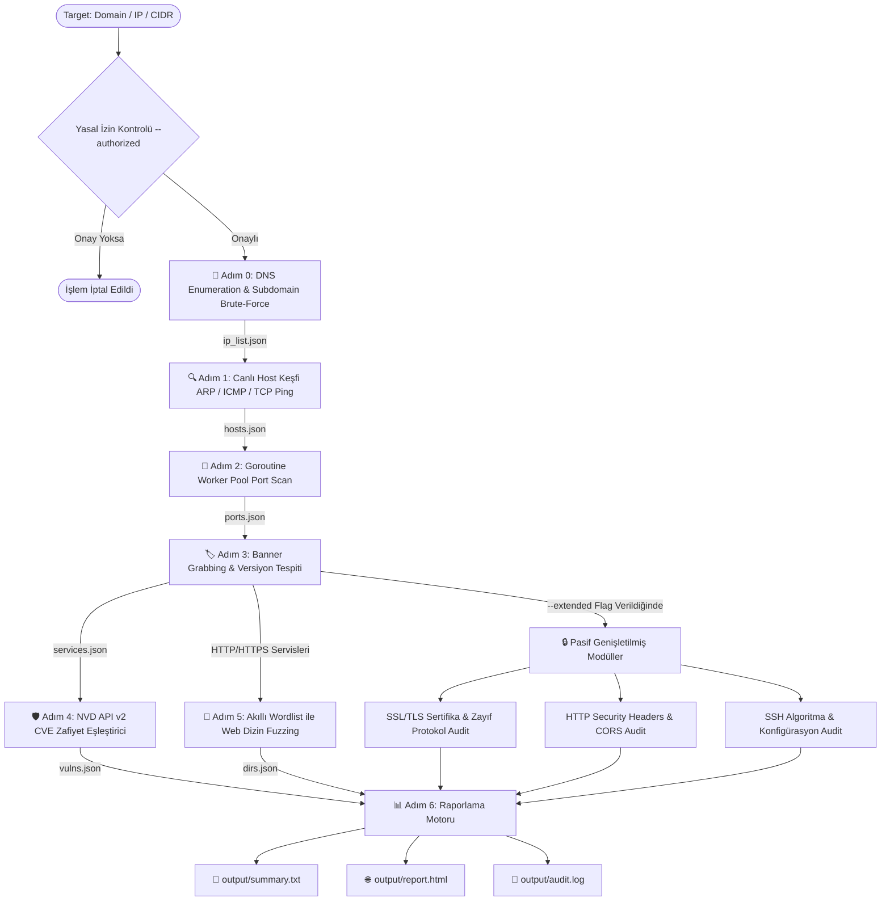

<div align="center">

# ⚡ SpecterRecon (v3.0.0 — Focused Recon Engine)
### *Yüksek Performanslı, Eşzamanlı ve Modüler Ağ Keşif & Zafiyet Analiz Motoru*

[](https://go.dev/)
[](#)
[](#)
[](#)
[](#)
[](#)

<br>

```ascii
  ____                  _             ____                     
 / ___| _ __   ___  ___| |_ ___ _ __ |  _ \ ___  ___ ___  _ __ 
 \___ \| '_ \ / _ \/ __| __/ _ \ '__|| |_) / _ \/ __/ _ \| '_ \ 
  ___) | |_) |  __/ (__| ||  __/ |   |  _ <  __/ (_| (_) | | | |
 |____/| .__/ \___|\___|\__\___|_|   |_| \_\___|\___\___/|_| |_|
       |_|                                                     
    -- Focused Recon & Vulnerability Scanner --   
```

<p align="center">
  <b>SpecterRecon</b>, siber güvenlik araştırmacıları, sızma testi (pentest) uzmanları ve SOC/Red Team ekipleri için sıfırdan <b>Go (Golang)</b> dili ile geliştirilmiş; <b>DNS Keşfi, Host Tespiti, Port Tarama, Versiyon Çıkarımı, Zafiyet Eşleştirme ve Web Dizin Fuzzing</b> süreçlerini tek bir bağımsız binary içerisinde otomatikleştiren yüksek hızlı ağ keşif motorudur.
</p>

---

</div>

## 📌 İçindekiler

- [🎯 1. Projenin Amacı ve Vizyonu](#-1-projenin-amacı-ve-vizyonu)
- [✨ 2. Öne Çıkan Özellikler](#--2-öne-çıkan-özellikler)
- [🛠️ 3. Teknoloji Yığını (Tech Stack)](#️-3-teknoloji-yığını-tech-stack)
- [🔄 4. Çalışma Prensibi ve Pipeline Mimarisi](#-4-çalışma-prensibi-ve-pipeline-mimarisi)
- [📁 5. Proje Dosya ve Klasör Yapısı](#-5-proje-dosya-ve-klasör-yapısı)
- [📥 6. Kurulum ve Derleme](#-6-kurulum-ve-derleme)
- [🚀 7. Kullanım Rehberi ve Komut Örnekleri](#-7-kullanım-rehberi-ve-komut-örnekleri)
  - [⚡ İnteraktif Shell Modu](#-i̇nteraktif-shell-modu)
  - [📡 Tam Recon Pipeline Taraması (`scan` & `fullscan`)](#-tam-recon-pipeline-taraması-scan--fullscan)
  - [🧩 Bağımsız Modül Komutları](#-bağımsız-modül-komutları)
- [📊 8. Raporlama Çıktıları](#-8-raporlama-çıktıları)
- [🔮 9. Gelecek Yol Haritası ve Önerilen İyileştirmeler](#-9-gelecek-yol-haritası-ve-önerilen-i̇yileştirmeler)
- [⚖️ 10. Yasal Uyarı ve Lisans](#️-10-yasal-uyarı-ve-lisans)

---

## 🎯 1. Projenin Amacı ve Vizyonu

Geleneksel güvenlik araçları (Nmap, Nikto, Dirb vb.) genellikle ayrı ayrı çalıştırılmayı, karmaşık komut dizilimlerini veya Python runtime/bağımlılık yüklerini gerektirir. Ayrıca sızma testlerinde gürültü çıkaran, izinsiz erişim veya varsayılan şifre denemesi yapan saldırı araçları yasal ve etik riskler doğurur.

**SpecterRecon'un Varoluş Amacı:**
1. **Saf Keşif (Reconnaissance) Odağı:** Sistemi izinsiz erişim denemeleri (brute-force, exploit, credential testing) ile riske atmadan; yalnızca sistem, port, servis, zafiyet ve web dizin bilgilerini **pasif/deterministik yöntemlerle toplamak**.
2. **Sıfır Bağımlılık (Zero-Dependency):** Python, Java veya harici kütüphane gerektirmeyen, Windows, Linux ve macOS üzerinde tek bir `specter-recon.exe` olarak çalışan **bağımsız (standalone) Go binary'si sunmak**.
3. **Otomatik Boru Hattı (Pipeline):** DNS enumeration'dan başlayan, bulunan IP'leri host keşfine, açık portları versiyon analizine ve web servislerini otomatik dizin fuzzer'ına besleyen **modüler veri akışı sağlamak**.
4. **Etik ve Yasal Guardrail:** Her tarama öncesinde yasal izin `--authorized` kontrolü veya interaktif konsolda yetki teyidi isteyerek yetkisiz kullanım riskini engellemek.

---

## ✨ 2. Öne Çıkan Özellikler

* **🚀 Yüksek Eşzamanlılık (Goroutine Worker Pools):** Ağ soket işlemleri ve port taramaları binlerce eşzamanlı Goroutine ile saniyeler içinde tamamlanır.
* **🎯 Akıllı Servis-Wordlist Eşleştirmesi:** Banner analizi sonucunda hedefte çalışan teknoloji (WordPress, Jenkins, Apache vb.) tespit edilir ve `service_wordlist_map.yaml` üzerinden hedefe özel en uygun wordlist otomatik seçilir.
* **📚 SecLists Entegrasyonu (Git Submodule):** Siber güvenlik dünyasının standart wordlist deposu olan SecLists, projeye `git submodule` olarak entegre edilmiştir. `--wordlist-size quick|full` bayrağı ile hızlı veya derin tarama seçilebilir.
* **🛡️ Resmi NVD REST API v2 Zafiyet Motoru:** Tespit edilen servis ve versiyonlar NIST NVD veritabanıyla eşleştirilerek resmi CVE kodları, CVSS v3.1 puanları ve zafiyet özetleri çıkarılır.
* **🔒 İzinli/Etik Guardrail Güvenlik Kontrolü:** İzinsiz taramaları önlemek amacıyla `--authorized` doğrulaması veya interaktif shell modunda tek seferlik izin teyidi zorunludur.
* **💻 İnteraktif Metasploit-Style Konsol Modu:** Program parametresiz çalıştırıldığında CLI oturumu başlatılır, sürekli `.exe` adı yazma zorunluluğu ortadan kalkar.
* **📊 Çoklu Raporlama Formats:** Sonuçlar anlık terminal içi renkli PTerm tablolarında, tek bir metin özetinde (`summary.txt`) ve modern SOC tarzı HTML raporunda (`report.html`) sunulur.

---

## 🛠️ 3. Teknoloji Yığını (Tech Stack)

| Katman | Teknoloji / Kütüphane | Kullanım Amacı |
|---|---|---|
| **Programlama Dili** | `Go (Golang) 1.21+` | Derlenmiş native hız, düşük RAM/CPU kullanımı, cross-platform derleme. |
| **CLI Motoru** | `github.com/spf13/cobra` | Komut, alt komut, flag yönetimi ve `--help` dokümantasyonu. |
| **Terminal UI** | `github.com/pterm/pterm` | Canlı kutulu tablolar, renkli log seviyeleri ve açılış banner'ı. |
| **Yapılandırma** | `gopkg.in/yaml.v3` | `service_wordlist_map.yaml` okuma ve wordlist haritalama. |
| **Zafiyet Verileri** | `NIST NVD REST API v2` | CVE ve CVSS puanlarının dinamik sorgulanması. |
| **Wordlist Deposu** | `danielmiessler/SecLists` | Submodule olarak entegre edilmiş kapsamlı dizin ve subdomain listeleri. |
| **Rapor Şablonu** | `html/template` | XSS korumalı, CSS Glassmorphism tasarımlı SOC raporu. |

---

## 🔄 4. Çalışma Prensibi ve Pipeline Mimarisi

SpecterRecon bir hedef aldığında (Domain, IP veya CIDR), veriyi otomatik olarak bir sonraki aşamaya ileten **6 adımlı boru hattını (pipeline)** çalıştırır:



---

## 📁 5. Proje Dosya ve Klasör Yapısı

```
Cyber-Security/
├── main.go                       # Uygulama ana giriş noktası (RootCmd'yi tetikler)
├── go.mod                        # Go modül bağımlılık tanımı (Go 1.21+)
├── config.yaml                   # Tarama, zaman aşımı ve varsayılan port ayarları
├── README.md                     # Proje ana dokümantasyonu
├── specterrecon-inceleme.md      # Kod inceleme ve doğrulama raporu
│
├── cmd/                          # Cobra CLI komut katmanı
│   ├── root.go                   # Kök komut ve izin teyidi doğrulaması
│   ├── scan.go                   # Ana recon pipeline komutu (--extended desteği)
│   ├── fullscan.go               # scan --extended kısayolu
│   ├── shell.go                  # İnteraktif Metasploit-style konsol modu
│   ├── dns.go                    # Bağımsız DNS & Subdomain tarama komutu
│   ├── discover.go               # Bağımsız Host keşif komutu
│   ├── portscan.go               # Bağımsız Port tarama komutu
│   ├── banner.go                 # Bağımsız Banner grabbing & versiyon komutu
│   ├── vuln.go                   # Bağımsız CVE zafiyet eşleştirme komutu
│   ├── dirfuzz.go                # Bağımsız Web Dizin fuzzer komutu (--service desteği)
│   ├── ssl.go                    # Bağımsız SSL/TLS audit komutu
│   └── report.go                 # JSON çıktılarından HTML/TXT rapor üretme komutu
│
├── core/                         # Çekirdek veri modelleri ve yardımcılar
│   ├── models.go                 # Tüm Go struct şemaları (HostInfo, ServiceDetail, Vuln vb.)
│   ├── storage.go                # JSON kaydetme/okuma ve SaveSummaryTxt yazıcısı
│   └── logger.go                 # PTerm konsol logları, renkli çıktılar ve canlı tablolar
│
├── modules/                      # Keşif ve Analiz Modülleri
│   ├── dns_enum.go               # DNS çözümleme & Subdomain brute-force motoru
│   ├── discovery.go              # ARP, ICMP ve TCP SYN ping ile canlı host keşfi
│   ├── portscan.go               # Goroutine Worker Pool TCP Connect tarayıcısı
│   ├── banner.go                 # HTTP/HTTPS & Raw Socket banner grabbing ve Regex eşleştirici
│   ├── vulnmatch.go              # NVD REST API v2 ve çevrimdışı CVE eşleştirici
│   ├── dirfuzz.go                # Akıllı servise özel wordlist seçicili Web Fuzzer
│   ├── ssl_tls.go                # SSL/TLS sertifika süresi, zayıf şifre ve protokol denetleyici
│   ├── http_audit.go             # HTTP Security Headers, CORS, GraphQL ve yöntem denetleyici
│   ├── ssh_audit.go              # SSH algoritma, banner ve root login denetleyici
│   ├── report.go                 # HTML Rapor oluşturucu motor
│   └── modules_test.go           # Tüm modüller için Go birim testleri (Unit Tests)
│
├── templates/
│   └── report.html.tmpl          # Modern, responsive SOC HTML raporu şablonu
│
└── wordlists/                    # Wordlist dosyaları ve yapılandırma
    ├── common.txt                # Hızlı web dizin listesi (Quick mod)
    ├── apache.txt                # Apache web sunucusuna özel yollar
    ├── jenkins.txt               # Jenkins CMS/CI-CD yolları
    ├── wordpress.txt             # WordPress eklenti/tema yolları
    ├── sensitive.txt             # Hassas dosya listesi (.env, .git, config vb.)
    ├── subdomains.txt            # Subdomain brute-force listesi
    ├── service_wordlist_map.yaml # Servis ➔ Wordlist eşleştirme haritası
    └── SecLists/                 # SecLists git submodule (Full mod kapsamlı listeler)
```

---

## 📥 6. Kurulum ve Derleme

### Gereksinimler
* **Go (Golang):** Version `1.21` veya üzeri
* **Git:** Submodule çekimi için

### Adım Adım Kurulum

```bash
# 1. Repoyu submodule'ler ile birlikte klonlayın
git clone --recurse-submodules https://github.com/1Ssalih/SpecterRecon.git
cd SpecterRecon

# Eğer submodule'ler gelmediyse elle güncelleyin:
git submodule update --init --recursive

# 2. Bağımlılıkları indirin
go mod download

# 3. Bağımsız binary dosyasını derleyin
go build -o specter-recon.exe main.go
```

Derleme tamamlandığında dizinde tek bir **`specter-recon.exe`** (Linux/macOS'ta `specter-recon`) oluşturulacaktır.

---

## 🚀 7. Kullanım Rehberi ve Komut Örnekleri

### ⚡ İnteraktif Shell Modu

Her defasında komut satırına `.exe` adı yazmak istemiyorsanız, parametresiz çalıştırarak **İnteraktif Konsol Modu**'na girebilirsiniz:

```powershell
.\specter-recon.exe
```

Açılan **`specter-recon >`** istemcisinde doğrudan komutlarınızı yazabilirsiniz:

```text
specter-recon > scan scanme.nmap.org --subdomains
specter-recon > fullscan 192.168.1.10
specter-recon > dirfuzz http://192.168.1.10:8080 --service jenkins --wordlist-size full
specter-recon > ssl scanme.nmap.org:443
specter-recon > help
specter-recon > exit
```

---

### 📡 Tam Recon Pipeline Taraması (`scan` & `fullscan`)

```bash
# 1. Temel Recon Taraması (DNS + Discovery + Port + Banner + CVE + DirFuzz)
.\specter-recon.exe scan example.com --authorized

# 2. Subdomain Brute-Force Dahil Tarama
.\specter-recon.exe scan example.com --subdomains --authorized

# 3. Pasif Genişletilmiş Modüllerle (SSL + HTTP Audit + SSH Audit)
.\specter-recon.exe scan example.com --extended --authorized

# 4. Tam Kapsamlı Tarama (scan --extended kısayolu)
.\specter-recon.exe fullscan 192.168.1.10 --authorized

# 5. SecLists ile Derin Wordlist Taraması
.\specter-recon.exe scan example.com --wordlist-size full --authorized

# 6. Özel Port ve Thread Ayarları ile
.\specter-recon.exe scan 192.168.1.10 -p 1-1024 -t 100 -o output_dir --authorized
```

---

### 🧩 Bağımsız Modül Komutları

Pipeline haricinde modülleri tek başına da çalıştırabilirsiniz:

```bash
# 📡 DNS Enumeration
.\specter-recon.exe dns example.com --subdomains --authorized

# 🔍 Host Keşfi
.\specter-recon.exe discover 192.168.1.0/24 --authorized

# 🔌 Port Taraması
.\specter-recon.exe portscan 192.168.1.10 -p top-1000 -t 100 --authorized

# 🏷️ Banner Grabbing
.\specter-recon.exe banner -i output/ports.json -o output/services.json --authorized

# 🛡️ CVE Zafiyet Eşleştirme
.\specter-recon.exe vuln -i output/services.json --authorized

# 📂 Akıllı Web Dizin Fuzzing (Servis Belirterek)
.\specter-recon.exe dirfuzz http://192.168.1.10:8080 --service jenkins --authorized

# 🔒 SSL/TLS Sertifika & Protokol Audit
.\specter-recon.exe ssl example.com:443

# 📊 Mevcut Çıktılardan Rapor Üretme
.\specter-recon.exe report -t "Lab Target" -d output/ -o output/report.html
```

---

## 📊 8. Raporlama Çıktıları

Tarama tamamlandığında `output/` dizininde otomatik olarak iki temel rapor üretilir:

### 1. `output/summary.txt` (Metin Taraması Özeti)
Tüm hostlar, açık portlar, versiyonlar, bulunan zafiyetler ve hassas dizinler insan-okunabilir tek bir özet dosyasında birleştirilir.

### 2. `output/report.html` (Modern SOC Güvenlik Dashboard'u)
XSS korumalı, Glassmorphism CSS temalı, filtrelenebilir ve yazdırmaya uygun görsel güvenlik raporu:

* **Özet Metrik Kartları:** Toplam Host, Açık Port, Zafiyet ve Dizin sayıları.
* **CVSS Şiddet Dağılımı:** CRITICAL, HIGH, MEDIUM, LOW zafiyet rozetleri.
* **Bulgu Tabloları:** Zafiyetlerin CVE ID'leri, etkilenen servisler ve resmi açıklamaları.

---

## 🔮 9. Gelecek Yol Haritası ve Önerilen İyileştirmeler

SpecterRecon'un gelecekteki sürümlerinde eklenmesi planlanan ve topluluk katkısına açık geliştirme fikirleri:

1. **🌐 Subfinder / SecurityTrails / Chaos API Entegrasyonu:** Pasif subdomain keşfi için üçüncü taraf API entegrasyonları ekleyerek OSINT kapasitesini artırmak.
2. **🛡️ WAF (Web Application Firewall) Tespiti:** Cloudflare, Akamai, AWS WAF gibi sistemleri önceden algılayan sezgisel tarama modülü.
3. **📤 SIEM & JSON/CSV Export:** Tarama sonuçlarını Splunk, ElasticSearch veya DefectDojo gibi ortamlara aktarmak için yapısını standardize etmek.
4. **🐳 Official Docker Image & CI/CD Pipeline:** GitHub Actions üzerinden otomatik Docker Container derlemesi ve yayınlanması.
5. **🖥️ Embedded Web UI / Dashboard:** `specter-recon server` komutuyla yerel bir web arayüzü başlatarak taramaları tarayıcı üzerinden yönetebilme olanağı.

---

## ⚖️ 10. Yasal Uyarı ve Lisans

> ⚠️ **YASAL UYARI:**  
> **SpecterRecon**, yalnızca **yasal olarak izin alınmış sızma testi sözleşmeleri**, kurum içi güvenlik denetimleri, eğitim lab ortamları ve CTF yarışmaları için geliştirilmiştir. Yetkisiz ağlara veya sistemlere izin almadan tarama yapmak yasalara (TCK Madde 243/244, CFAA vb.) aykırıdır ve ağır cezai sorumluluk doğurur.  
> Proje geliştiricisi, aracın kötüye kullanımından doğabilecek hiçbir yasal veya hukuki sorumluluğu kabul etmez.

### Lisans
Bu proje **MIT Lisansı** altında lisanslanmıştır. Detaylar için `LICENSE` dosyasına başvurabilirsiniz.
