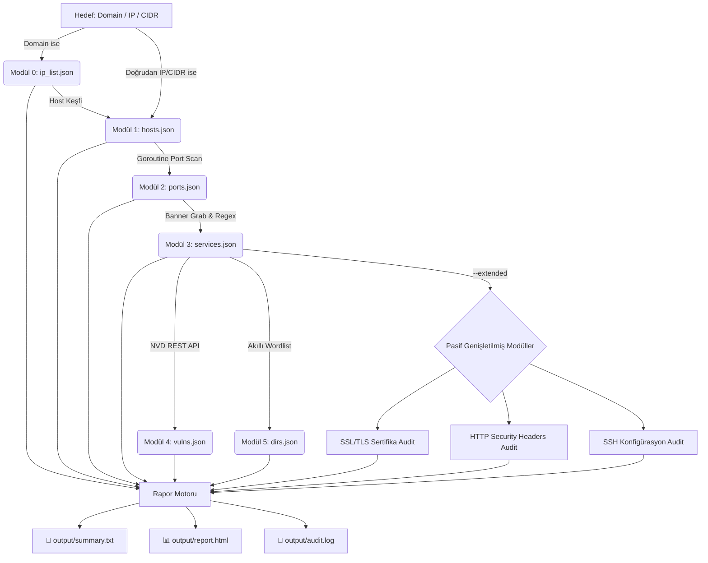

<div align="center">

# ⚡ SpecterRecon (v3.0.0 — Focused Recon Pipeline)
### *High-Performance Network Reconnaissance & Vulnerability Analysis Engine in Go*

[](https://go.dev/)
[](#)
[](#)
[](#)
[](#)

<br>

```ascii
  ____                  _             ____                     
 / ___| _ __   ___  ___| |_ ___ _ __ |  _ \ ___  ___ ___  _ __ 
 \___ \| '_ \ / _ \/ __| __/ _ \ '__|| |_) / _ \/ __/ _ \| '_ \ 
  ___) | |_) |  __/ (__| ||  __/ |   |  _ <  __/ (_| (_) | | | |
 |____/| .__/ \___|\___|\__\___|_|   |_| \_\___|\___\___/|_| |_|
       |_|                                                     
    -- Focused Recon & Vulnerability Scanner --   
```

<p align="center">
  <b>SpecterRecon v3.0.0</b>, siber güvenlik uzmanları, sızma testi (pentest) ekipleri ve CTF/lab araştırmacıları için geliştirilmiş; <b>DNS Enumeration, Host Discovery, Port Scanning, Banner Grabbing, CVE Matching ve Web Directory Fuzzing</b> gibi temel keşif (recon) adımlarını tek bir bağımsız binary dosyasında toplayan <b>yüksek performanslı ağ keşif motorudur</b>.
</p>

---

</div>

## 🎯 1. Projenin Amacı

**SpecterRecon'un temel amacı:**
- Keşiften zafiyet tespitine ve raporlamaya kadar olan **tüm recon (keşif) süreçlerini tek bir çatı altında otomatikleştirmektir**.
- **Python veya harici runtime/bağımlılık karmaşasına son vererek** saf Go (Golang) dili ile **tek bir bağımsız çalıştırılabilir binary (`specter-recon.exe`)** üretmektir.
- Bulunan tüm verileri otomatik olarak bir sonraki modüle aktaran **modüler bir pipeline mimarisi** sunmaktır.
- Sonuçları hem terminalde anlık canlı tablolarla göstermek hem **tek bir insan-okunabilir metin dosyasında (`output/summary.txt`)** toplamak hem de **görsel SOC HTML raporu (`output/report.html`)** olarak sunmaktır.

---

## 🧰 2. Kullanılan Teknolojiler (Tech Stack)

| Bileşen | Teknoloji / Kütüphane | Açıklama |
|---|---|---|
| **Çekirdek Dili** | `Go (Golang) 1.21+` | Yüksek derleme hızı, düşük bellek ayak izi, sıfır runtime bağımlılığı. |
| **Eşzamanlılık** | `Goroutines` + `Worker Pools` + `sync.WaitGroup` | Non-blocking asenkron ağ soket bağlantıları ile binlerce portu paralel işleme. |
| **CLI & Komut Motoru** | `github.com/spf13/cobra` | Alt komut mimarisi (`scan`, `fullscan`, `dns`, `discover`, `portscan`, `banner`, `vuln`, `dirfuzz`, `report`, `ssl`, `shell`). |
| **Zengin Terminal Arayüzü** | `github.com/pterm/pterm` | Renkli loglar, kutulu canlı tablolar ve konsol çıktısı. |
| **Zafiyet Veritabanı** | `NVD REST API v2` + Offline Cache | NIST NVD API üzerinden resmi CVSS v3.1 puanı ve zafiyet açıklamaları. |
| **Wordlist Entegrasyonu** | `SecLists` (git submodule) | Gerçek SecLists reposundan kapsamlı dizin/dosya listeleri. |
| **Raporlama Motoru** | Standart `html/template` | XSS korumalı, responsive, karanlık temalı SOC güvenlik dashboard'u. |

---

## ⚙️ 3. Çalışma Şekli (Pipeline)

SpecterRecon, hedef girildiğinde **otomatik veri aktarımı yapan 6 temel boru hattı adımında** çalışır:

1. **📡 Adım 0 — DNS & Subdomain Keşfi:** Target bir domain ise A/AAAA kayıtları çözümlenir ve opsiyonel brute-force ile subdomainler keşfedilir.
2. **🔍 Adım 1 — Canlı Host Keşfi:** ARP tablosu, ICMP ping ve TCP SYN probları ile canlı makine IP'leri tespit edilir.
3. **🔌 Adım 2 — Eşzamanlı Port Taraması:** Goroutine Worker Pool mimarisi ile TCP connect taraması yürütülür.
4. **🏷️ Adım 3 — Banner Grabbing & Servis Tespiti:** HTTP header analizi, TLS handshaking ve Raw Socket probları ile servis adı ve versiyonu çıkarılır.
5. **🛡️ Adım 4 — CVE & Zafiyet Eşleştirmesi:** Tespit edilen servis ve versiyonlar NVD API v2'de taranarak CVSS v3.1 skoru ve açıklamalar üretilir.
6. **📂 Adım 5 — Web Dizin Fuzzing:** Akıllı servise özel wordlist seçimi ile dizin/dosya taraması yapılır.
7. **📊 Adım 6 — Raporlama:** Tüm bulgular `output/summary.txt` ve `output/report.html` olarak sunulur.

### Opsiyonel Genişletilmiş Modüller (`--extended`)

`--extended` bayrağıyla pasif güvenlik denetimleri de pipeline'a eklenir:
- **SSL/TLS Audit:** Sertifika son kullanma tarihi, self-signed kontrolü, zayıf protokol tespiti
- **HTTP Security Audit:** Eksik güvenlik header'ları, tehlikeli HTTP metodları, CORS sorunları, GraphQL introspection
- **SSH Audit:** Zayıf algoritma tespiti, root login / parola girişi kontrolü

---

## 🏗️ 4. Proje Mimarisi ve Veri Akışı



---

## 📦 Proje Dizin Ağacı

```
Cyber-Security/
├── main.go                  # Uygulama ana giriş noktası
├── go.mod                   # Go modül tanımı (Go 1.21+)
├── config.yaml              # Merkezi tarama ve port yapılandırması
├── README.md                # Proje dokümantasyonu
│
├── cmd/                     # Cobra CLI komutları
│   ├── root.go              # Yasal izin (--authorized) kontrolü
│   ├── scan.go              # Recon pipeline komutu (--extended opsiyonel)
│   ├── fullscan.go          # scan --extended kısayolu
│   ├── ssl.go               # SSL/TLS audit komutu
│   ├── dns.go               # DNS Enumeration komutu
│   ├── discover.go          # Host keşif komutu
│   ├── portscan.go          # Port tarama komutu
│   ├── banner.go            # Banner grabbing komutu
│   ├── vuln.go              # CVE zafiyet analiz komutu
│   ├── dirfuzz.go           # Web fuzzer komutu (--service akıllı seçim)
│   ├── report.go            # Rapor üretim komutu
│   └── shell.go             # İnteraktif konsol modu
│
├── core/                    # Çekirdek yardımcılar & Veri Modelleri
│   ├── models.go            # Go struct şemaları
│   ├── storage.go           # JSON saklama + SaveSummaryTxt
│   └── logger.go            # PTerm konsol tabloları
│
├── modules/                 # Güvenlik Modülleri
│   ├── dns_enum.go          # DNS Enumeration & Subdomain Brute-Force
│   ├── discovery.go         # Host Keşfi (ARP / ICMP / TCP ping)
│   ├── portscan.go          # Goroutine Worker Pool Port Tarayıcısı
│   ├── banner.go            # Banner Grabbing & Versiyon Çıkarımı
│   ├── vulnmatch.go         # NVD API & Offline CVE Eşleştirici
│   ├── dirfuzz.go           # Deterministik Akıllı Web Fuzzer
│   ├── report.go            # HTML Rapor Üreticisi
│   ├── ssl_tls.go           # SSL/TLS Sertifika & Zayıf Protokol Audit (--extended)
│   ├── http_audit.go        # HTTP Security Headers, CORS, GraphQL (--extended)
│   ├── ssh_audit.go         # SSH Algoritma & Konfigürasyon Audit (--extended)
│   └── modules_test.go      # Go birim testleri
│
├── templates/
│   └── report.html.tmpl     # HTML rapor şablonu
│
└── wordlists/               # Wordlist dosyaları
    ├── common.txt            # Temel dizin listesi (quick mod)
    ├── apache.txt            # Apache'ye özel yollar (quick mod)
    ├── jenkins.txt           # Jenkins yolları (quick mod)
    ├── wordpress.txt         # WordPress yolları (quick mod)
    ├── sensitive.txt         # Hassas dosyalar (quick mod)
    ├── subdomains.txt        # Subdomain listesi
    ├── service_wordlist_map.yaml  # Servis → wordlist eşleştirmesi
    └── SecLists/             # SecLists git submodule (full mod)
```

---

## 💻 Kullanım Kılavuzu & Komutlar

### 🚀 1. Hızlı Kurulum ve Derleme

```bash
# Repoyu klonla (SecLists submodule dahil)
git clone --recurse-submodules https://github.com/YourUsername/SpecterRecon.git
cd SpecterRecon

# Bağımsız binary derle
go build -o specter-recon.exe main.go
```

---

### ⚡ 2. İnteraktif Konsol Modu (ÖNERİLEN)

Sürekli `.\specter-recon.exe` veya `--authorized` yazmak istemiyorsanız, uygulamayı **parametresiz çalıştırarak İnteraktif Konsol Modu'na** girebilirsiniz:

```powershell
.\specter-recon.exe
```

Açılan **`specter-recon >`** istemcisinde doğrudan komutlarınızı yazabilirsiniz:

```text
specter-recon > fullscan scanme.nmap.org
specter-recon > scan scanme.nmap.org --extended
specter-recon > ssl scanme.nmap.org:443
specter-recon > dirfuzz http://scanme.nmap.org --service jenkins
specter-recon > exit
```

> 💡 **Not:** Shell moduna girişte tek seferlik yasal izin onayı sorulur. Onayladıktan sonra her komutta tekrar sorulmaz.

---

### 🌟 3. Recon Taramaları

```bash
# Temel recon pipeline (DNS + Port + Banner + CVE + DirFuzz)
.\specter-recon.exe scan example.com --authorized

# Genişletilmiş modüllerle (SSL + HTTP Audit + SSH Audit)
.\specter-recon.exe scan example.com --extended --authorized

# Tam kapsamlı tarama (scan --extended kısayolu)
.\specter-recon.exe fullscan 192.168.1.10 --authorized

# Subdomain brute-force dahil
.\specter-recon.exe scan example.com --subdomains --authorized

# SecLists ile kapsamlı wordlist kullanımı
.\specter-recon.exe scan example.com --wordlist-size full --authorized
```

---

### 🧩 4. Modülleri Tek Başına Çalıştırma

```bash
# 🔒 SSL/TLS Sertifika ve Protokol Audit
.\specter-recon.exe ssl 192.168.1.10:443

# 📂 Web Dizin Fuzzing (akıllı wordlist seçimi)
.\specter-recon.exe dirfuzz http://192.168.1.10:8080 --service jenkins --authorized

# 📂 Web Dizin Fuzzing (SecLists ile)
.\specter-recon.exe dirfuzz http://192.168.1.10:8080 --wordlist-size full --authorized

# 📊 Mevcut JSON'lardan Rapor Üretme
.\specter-recon.exe report -t "Lab Target" -o output/report.html
```

---

## 📄 `output/summary.txt` Örnek Çıktısı

```
=== SpecterRecon Tarama Özeti ===
Hedef : 192.168.1.10
Tarih : 2026-08-27 10:30:00
Süre  : 12.45 saniye

[HOSTLAR] (1)
  + 192.168.1.10 [tcp_ping, alive]

[AÇIK PORTLAR] (4)
  + 192.168.1.10:22     ssh             [open]
  + 192.168.1.10:80     http            [open]
  + 192.168.1.10:443    https           [open]
  + 192.168.1.10:8080   http-proxy      [open]

[SERVİSLER & VERSİYON] (4)
  + 192.168.1.10:22   ssh   OpenSSH 8.9p1
  + 192.168.1.10:80   http  Apache/2.4.49
  + 192.168.1.10:443  https nginx/1.21.0 [SSL]
  + 192.168.1.10:8080 http  Jenkins 2.375

[ZAFİYETLER] (2)
  !! [HIGH / CVSS:7.5] CVE-2021-41773 -> http (192.168.1.10:80)
  !! [MEDIUM / CVSS:5.3] CVE-2022-22721 -> http (192.168.1.10:80)

[WEB BULGULARI] (6)
  + [200] http://192.168.1.10/admin (4523 B) [KRİTİK DOSYA]
  + [200] http://192.168.1.10/.env (128 B) [KRİTİK DOSYA]
  + [200] http://192.168.1.10/robots.txt (89 B)

=== ÖZET ===
  Hostlar        : 1
  Açık Portlar   : 4
  Zafiyetler     : 2 toplam (1 kritik/yüksek)
  Web Bulguları  : 6 toplam (2 hassas dosya)
  Rapor          : output/report.html
  Süre           : 12.45 saniye
```

---

## 🧪 Testleri Çalıştırma

```bash
go test -v ./modules/...
```

---

## ⚖️ Yasal Uyarı ve Etik Bildirimi

> **ÖNEMLİ:** Bu araç yalnızca **yasal izin alınmış sistemler**, yetkili sızma testi sözleşmeleri, laboratuvar ortamları ve CTF yarışmaları için tasarlanmıştır. İzin alınmamış üçüncü taraf sistemlere karşı tarama yapmak yasalara aykırıdır. Geliştiriciler, aracın kötüye kullanımından sorumlu tutulamaz.
