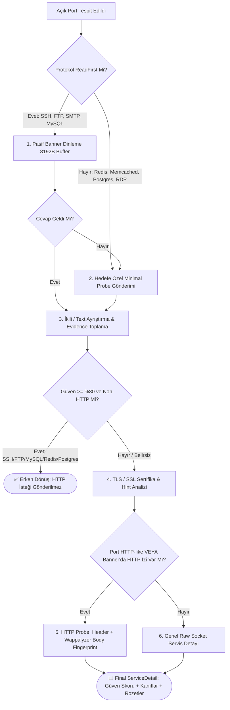
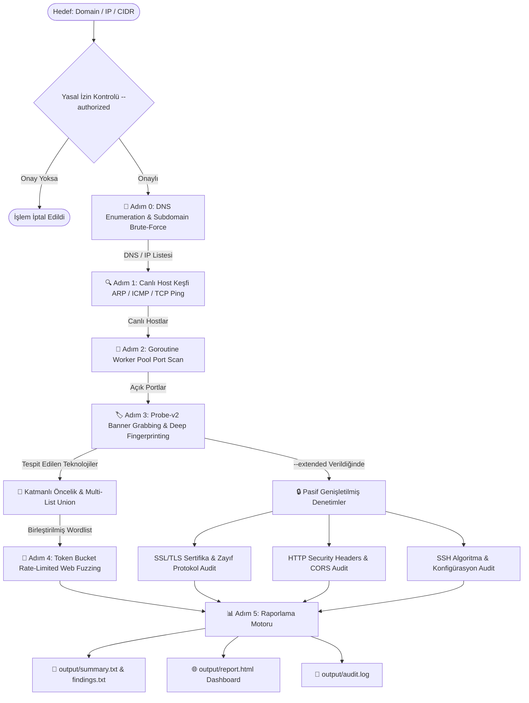

<div align="center">

# ⚡ SpecterRecon (v0.8.0 — Context-Aware Smart Recon Engine)
### *Yüksek Performanslı, Eşzamanlı ve Bağlam Duyarlı Ağ Keşif & Fuzzing Motoru*

[](https://go.dev/)
[](#)
[](#)
[-success?style=for-the-badge&logo=target&logoColor=white)](#)
[-emerald?style=for-the-badge&logo=speedtest&logoColor=white)](#)
[](#)
[](#)

<br>

```ascii
  ____                  _             ____                     
 / ___| _ __   ___  ___| |_ ___ _ __ |  _ \ ___  ___ ___  _ __ 
 \___ \| '_ \ / _ \/ __| __/ _ \ '__|| |_) / _ \/ __/ _ \| '_ \ 
  ___) | |_) |  __/ (__| ||  __/ |   |  _ <  __/ (_| (_) | | | |
 |____/| .__/ \___|\___|\__\___|_|   |_| \_\___|\___\___/|_| |_|
       |_|                                                     
    -- Context-Aware High Performance Reconnaissance Engine --   
```

<p align="center">
  <b>SpecterRecon</b>, siber güvenlik araştırmacıları, sızma testi uzmanları ve SOC analistleri için <b>Go (Golang)</b> ile geliştirilmiş; <b>DNS Enumeration, Canlı Host Tespiti, Yüksek Hızlı Port Tarama, Probe-v2 Tabanlı Servis & Versiyon Tespiti (Confidence Scoring & TLS Probing), Wappalyzer Tarzı Gövde/Başlık İmzalamalı Parmak İzi, Katmanlı (Tiered) Akıllı Web Fuzzing ve Pasif Genişletilmiş Denetim (SSL/HTTP/SSH)</b> süreçlerini tek bir bağımsız binary içerisinde otomatikleştiren yeni nesil keşif motorudur.
</p>

---

</div>

## 📌 İçindekiler

- [🎯 1. Projenin Amacı ve Vizyonu](#-1-projenin-amacı-ve-vizyonu)
- [✨ 2. Öne Çıkan Özellikler ve v0.8.0 İnovasyonları](#--2-öne-çıkan-özellikler-ve-v080-i̇novasyonları)
- [🔬 3. Servis & Versiyon Tespit Motoru (Service Detection Engine v2)](#-3-servis--versiyon-tespit-motoru-service-detection-engine-v2)
- [🛠️ 4. Teknoloji Yığını (Tech Stack)](#️-4-teknoloji-yığını-tech-stack)
- [🔄 5. Çalışma Prensibi ve Pipeline Mimarisi](#-5-çalışma-prensibi-ve-pipeline-mimarisi)
- [📁 6. Proje Dosya ve Klasör Yapısı](#-6-proje-dosya-ve-klasör-yapısı)
- [📥 7. Kurulum ve Derleme](#-7-kurulum-ve-derleme)
- [🚀 8. Kullanım Rehberi ve Komut Örnekleri](#-8-kullanım-rehberi-ve-komut-örnekleri)
  - [⚡ İnteraktif Shell Modu (Metasploit Tarzı)](#-i̇nteraktif-shell-modu-metasploit-tarzı)
  - [📡 Tam Recon Pipeline Taraması (`scan` & `fullscan`)](#-tam-recon-pipeline-taraması-scan--fullscan)
  - [🧩 Bağımsız Modül Komutları](#-bağımsız-modül-komutları)
- [📊 9. Raporlama ve Çıktı Mimarisi](#-9-raporlama-ve-çıktı-mimarisi)
- [🔮 10. Gelecek Yol Haritası (Roadmap)](#-10-gelecek-yol-haritası-roadmap)
- [⚖️ 11. Yasal Uyarı ve Lisans](#️-11-yasal-uyarı-ve-lisans)

---

## 🎯 1. Projenin Amacı ve Vizyonu

Geleneksel güvenlik araçları (Nmap, Nikto, Dirb vb.) genellikle ayrı ayrı çalıştırılmayı, karmaşık komut dizilimlerini veya Python runtime/bağımlılık yüklerini gerektirir. Modern web ve ağ altyapıları ise tek bir teknolojiden ibaret değildir (Örn: Nginx reverse proxy arkasında Spring Boot API veya Django mikroservisi, SSH ve veritabanı portları).

**SpecterRecon'un Temel Prensipleri:**
1. **Bağlam Duyarlı Akıllı Keşif (Context-Aware Recon):** Statik araçların aksine hedefi analiz eder; tek bir teknolojiye kilitlenmeyip tüm teknoloji yığınını katmanlar halinde (Tiered Priority) tanımlar.
2. **Gürültüsüz & Güvenilir Servis Tespiti:** SSH, FTP, MySQL gibi protokollere körlemesine HTTP isteği göndermez; pasif banner dinleme, hedefe özel minimal probe'lar ve confidence skorlama ile %100 temiz ve doğrulanabilir sonuçlar üretir.
3. **Sıfır Bağımlılık (Zero-Dependency):** Python, Java veya ek kütüphane gerektirmeksizin Windows, Linux ve macOS üzerinde tek bir `specter-recon.exe` olarak çalışan **bağımsız (standalone) Go binary'si sunar**.
4. **Etik ve Yasal Guardrail:** Her hedef için yasal izin `--authorized` kontrolü ve interaktif konsolda yetki teyidi zorunludur.

---

## ✨ 2. Öne Çıkan Özellikler ve v0.8.0 İnovasyonları

* **🔬 Yeni Nesil Servis & Versiyon Tespit Motoru (Engine v2):**
  - Pasif Dinleme (ReadFirst) + Hedefe Özel Minimal Probe'lar + İkili (Binary) Handshake Ayrıştırma.
  - Kanıt Bazlı Güven Skorlama (Confidence Score: 0-100) ve Öncelikli Regex Motoru.
  - TLS/SSL Sertifika Metadata Çıkarımı (`ProbeTLSService`).
  - Geciktirilmiş ve Akıllı HTTP Fallback (HTTP dışı servislere sıfır gereksiz HTTP trafiği).
* **🎯 Katmanlı Öncelik Sistemi (Tiered Priority Wordlist Selection):** 
  - Geleneksel düz arama yerine **4 Katmanlı Akıllı Eşleştirme Motoru**:
    - **Tier 1 (High-Value Apps):** Jenkins, GitLab, Grafana, WordPress, Drupal, Joomla, SharePoint
    - **Tier 2 (Frameworks & APIs):** Spring Boot, Django, Rails, ASP.NET, PHP, Swagger, REST APIs, Next.js
    - **Tier 3 (Dedicated Services):** Elasticsearch, Kibana
    - **Tier 4 (Web Sunucuları):** Tomcat, IIS, Apache, Nginx, Lighttpd, Werkzeug
* **🧹 Wappalyzer Tarzı Derin Gövde ve Header Parmak İzi (Deep Fingerprinting):**
  - Yalnızca HTTP Header veya `<title>` değil; HTML gövdesindeki `<meta name="generator"...>`, JavaScript nesneleri (`__NEXT_DATA__`, `ng-app`, `data-reactroot`, `data-v-`), çerezler (`csrftoken`, `ASP.NET_SessionId`) ve hata sayfaları (`Whitelabel Error Page`) regex ile taranarak çoklu teknoloji tespiti yapılır.
* **⚡ Çoklu Liste Birleştirme (Multi-List Union & MergeUnique):**
  - Eşleşen teknolojiler için wordlist'ler bellekte sırayı koruyarak ve tekrarları ayıklayarak (`MergeUnique`) tek bir optimize fuzzing kümesi haline getirilir.
* **🛡️ Token Bucket Hız Sınırlayıcı (`golang.org/x/time/rate`):**
  - `time.Sleep` yerine Go'nun resmi token bucket rate limiter'ı kullanılarak eşzamanlı worker havuzları bloklanmadan kontrollü ve gizli (stealth) istek akışı sağlanır.
* **🔍 Hassas Dosya ve Durum Kodu İyileştirmesi (401/403 Access Denied):**
  - `.env`, `.git/HEAD`, `backup.sql` gibi kritik dosyalar `401 Unauthorized` veya `403 Forbidden` döndüğünde sistem bunu tespit eder ve SOC raporunda **`⚠️ HASSAS (403/401 Erişim Engellendi)`** olarak işaretler.
* **📚 SecLists Entegrasyonu (Git Submodule):**
  - `--wordlist-size quick` (hızlı hafif listeler) ve `--wordlist-size full` (SecLists derin listeleri) seçenekleri tam senkronizedir.
* **💻 İnteraktif Metasploit-Style Konsol Modu:**
  - Parametresiz çalıştırıldığında CLI oturumu başlatılır.
* **📊 Modern SOC HTML Dashboard'u:**
  - Glassmorphism CSS temalı, teknoloji hapları (technology badges), güven yüzdeleri ve baskıya uygun profesyonel görsel rapor üretir.

---

## 🔬 3. Servis & Versiyon Tespit Motoru (Service Detection Engine v2)

SpecterRecon v0.8.0, geleneksel "Önce HTTP dene, sonra raw socket oku" yaklaşımını tamamen terk ederek kurumsal düzeyde bir **Service Version Detection Engine** mimarisine geçmiştir:



### Desteklenen Özel Protokol Spesifikasyonları (Probe Registry)
- **SSH (22, 2222):** Pasif dinleme, OpenSSH / Dropbear / libssh ayrıştırma (Güven: %90-95).
- **FTP (21, 2121):** Çok satırlı (multi-line) banner okuma, `SYST` ve `HELP` probe'ları (vsftpd, ProFTPD, Pure-FTPd, FileZilla).
- **SMTP (25, 465, 587):** `EHLO` ve `HELO` probe'ları (Postfix, Exim, Sendmail, Exchange).
- **POP3 (110, 995) & IMAP (143, 993):** `CAPA` ve `CAPABILITY` ayrıştırma (Dovecot, Courier, Exchange).
- **Redis (6379):** `INFO server` probe'u ve `redis_version` tespiti (Güven: %95).
- **Memcached (11211):** `version` probe'u ve `VERSION` tespiti (Güven: %95).
- **MySQL / MariaDB (3306):** İkili handshake paketi ayrıştırıcısı, MariaDB vs MySQL ayrımı (Güven: %95).
- **PostgreSQL (5432):** `SSLRequest` paketi (`0x04 0xd2 0x16 0x2f`) ve hata banner'ı analizi.
- **MongoDB (27017):** İkili `isMaster` probe'u ve kablo protokolü tespiti.
- **RDP (3389):** TPKT / X.224 Connection Request tespiti.
- **SIP (5060):** `OPTIONS` probe'u.

---

## 🛠️ 4. Teknoloji Yığını (Tech Stack)

| Katman | Teknoloji / Kütüphane | Kullanım Amacı |
|---|---|---|
| **Programlama Dili** | `Go (Golang) 1.21+` | Native performans, minimum bellek ayak izi, platformlar arası derleme. |
| **CLI Framework** | `github.com/spf13/cobra` | Modüler komut yapısı, parametre yönetimi ve help dokümantasyonu. |
| **Terminal UI & Tablolar** | `github.com/pterm/pterm` | Canlı kutulu tablolar, renkli SOC logları ve açılış banner'ı. |
| **Rate Limiter** | `golang.org/x/time/rate` | Token Bucket algoritması ile non-blocking hız sınırlama. |
| **Yapılandırma** | `gopkg.in/yaml.v3` | `service_wordlist_map.yaml` ve `config.yaml` ayrıştırıcı. |
| **Wordlist Ekosistemi** | `danielmiessler/SecLists` | Git submodule olarak entegre edilmiş kapsamlı wordlist kütüphanesi. |
| **Rapor Şablon Motoru** | `html/template` | XSS korumalı, responsive ve modern HTML SOC raporu oluşturucu. |

---

## 🔄 5. Çalışma Prensibi ve Pipeline Mimarisi

SpecterRecon bir hedef aldığında (Domain, IP veya CIDR), veriyi otomatik olarak bir sonraki aşamaya aktaran **modüler boru hattını (pipeline)** çalıştırır:



---

## 📁 6. Proje Dosya ve Klasör Yapısı

```
Cyber-Security/
├── main.go                       # Uygulama ana giriş noktası
├── go.mod                        # Go modül bağımlılık tanımı (Go 1.21+)
├── config.yaml                   # Tarama, probe-v2, zaman aşımı ve port ayarları
├── README.md                     # Proje ana dokümantasyonu
├── specterrecon-inceleme.md      # Kod inceleme ve mimari raporu
│
├── cmd/                          # Cobra CLI komut katmanı
│   ├── root.go                   # Kök komut ve hedef bazlı izin teyidi doğrulaması
│   ├── scan.go                   # Ana recon pipeline komutu (--extended desteği)
│   ├── fullscan.go               # scan --extended kısayolu
│   ├── shell.go                  # İnteraktif Metasploit-style konsol modu
│   ├── dns.go                    # Bağımsız DNS & Subdomain tarama komutu
│   ├── discover.go               # Bağımsız Host keşif komutu
│   ├── portscan.go               # Bağımsız Port tarama komutu
│   ├── banner.go                 # Bağımsız Banner grabbing & versiyon komutu
│   ├── dirfuzz.go                # Bağımsız Web Dizin fuzzer komutu (--service & auto-probe)
│   ├── ssl.go                    # Bağımsız SSL/TLS audit komutu
│   └── report.go                 # JSON çıktılarından HTML/TXT rapor üretme komutu
│
├── core/                         # Çekirdek veri modelleri ve yardımcılar
│   ├── models.go                 # Go struct şemaları (VersionEvidence, SSLServiceInfo, ServiceDetail vb.)
│   ├── storage.go                # JSON/TXT kaydetme/okuma ve özet rapor yazıcısı
│   └── logger.go                 # PTerm konsol logları, canlı tablolar ve güven skorları
│
├── modules/                      # Keşif ve Analiz Motorları
│   ├── service_probes.go         # Probe Registry, Binary Handshake Parsers, Multi-Read Buffering & TLS Probe
│   ├── banner.go                 # Wappalyzer-tarzı HTML Body regex & Akıllı AnalyzeService Boru Hattı
│   ├── dns_enum.go               # DNS çözümleme & Subdomain brute-force motoru
│   ├── discovery.go              # ARP, ICMP ve TCP SYN ping ile canlı host keşfi
│   ├── portscan.go               # Goroutine Worker Pool TCP Connect tarayıcısı
│   ├── dirfuzz.go                # Katmanlı (Tiered) Akıllı Wordlist seçicili Web Fuzzer
│   ├── ssl_tls.go                # SSL/TLS SNI, sertifika geçerlilik ve zayıf protokol denetleyici
│   ├── http_audit.go             # HTTP Security Headers, CORS, GraphQL ve yöntem denetleyici
│   ├── ssh_audit.go              # SSH algoritma, banner ve root login denetleyici
│   ├── report.go                 # HTML Rapor oluşturucu motor
│   └── modules_test.go           # Tüm modüller için kapsamlı Go birim testleri (Unit Tests)
│
├── templates/
│   └── report.html.tmpl          # Modern, responsive SOC HTML raporu şablonu (Güven Rozetleri ile)
│
└── wordlists/                    # Wordlist dosyaları ve yapılandırma
    ├── common.txt                # Hızlı web dizin listesi (Quick mod)
    ├── api.txt                   # Hızlı API endpoint listesi
    ├── nextjs.txt                # Hızlı Next.js framework yolları
    ├── django.txt                # Hızlı Django admin/api yolları
    ├── rails.txt                 # Hızlı Ruby on Rails yolları
    ├── apache.txt                # Apache web sunucusuna özel yollar
    ├── jenkins.txt               # Jenkins CMS/CI-CD yolları
    ├── wordpress.txt             # WordPress eklenti/tema yolları
    ├── sensitive.txt             # Hassas dosya listesi (.env, .git, config, sql vb.)
    ├── subdomains.txt            # Subdomain brute-force listesi
    ├── service_wordlist_map.yaml # Servis ➔ Wordlist eşleştirme haritası (Quick & Full)
    └── SecLists/                 # SecLists git submodule (Full mod kapsamlı listeler)
```

---

## 📥 7. Kurulum ve Derleme

### Gereksinimler
* **Go (Golang):** Version `1.21` veya üzeri
* **Git:** Submodule çekimi için

### Adım Adım Kurulum

```bash
# 1. Repoyu submodule'ler ile birlikte klonlayın
git clone --recurse-submodules https://github.com/1Ssalih/SpecterRecon.git
cd SpecterRecon

# Eğer submodule'ler gelmediyse elle güncelleyin:
git submodule update --init --recursive

# 2. Bağımlılıkları indirin
go mod download

# 3. Bağımsız binary dosyasını derleyin
go build -o specter-recon.exe main.go
```

Derleme tamamlandığında dizinde tek bir **`specter-recon.exe`** (Linux/macOS'ta `specter-recon`) oluşturulacaktır.

---

## 🚀 8. Kullanım Rehberi ve Komut Örnekleri

### ⚡ İnteraktif Shell Modu (Metasploit Tarzı)

Her defasında komut satırına binary adı yazmak istemiyorsanız, parametresiz çalıştırarak **İnteraktif Konsol Modu**'na girebilirsiniz:

```powershell
.\specter-recon.exe
```

Açılan **`specter-recon >`** istemcisinde doğrudan komutlarınızı yazabilirsiniz:

```text
specter-recon > scan scanme.nmap.org --subdomains
specter-recon > fullscan 192.168.1.10
specter-recon > dirfuzz http://192.168.1.10:8080 --service springboot --delay 50
specter-recon > ssl scanme.nmap.org:443
specter-recon > help
specter-recon > exit
```

---

### 📡 Tam Recon Pipeline Taraması (`scan` & `fullscan`)

```bash
# 1. Temel Recon Taraması (DNS + Discovery + Port + Banner + DirFuzz)
.\specter-recon.exe scan example.com --authorized

# 2. Subdomain Brute-Force Dahil Tarama
.\specter-recon.exe scan example.com --subdomains --authorized

# 3. Pasif Genişletilmiş Modüllerle (SSL + HTTP Audit + SSH Audit)
.\specter-recon.exe scan example.com --extended --authorized

# 4. Tam Kapsamlı Tarama (scan --extended kısayolu)
.\specter-recon.exe fullscan 192.168.1.10 --authorized

# 5. SecLists ile Derin Wordlist Taraması (Full Mod)
.\specter-recon.exe scan example.com --wordlist-size full --authorized

# 6. Rate Limiter ve Özel Portlar ile Tarama
.\specter-recon.exe scan 192.168.1.10 -p 1-1024 -t 50 -d 50 --authorized
```

---

### 🧩 Bağımsız Modül Komutları

Pipeline haricinde modülleri tek başına da çalıştırabilirsiniz:

```bash
# 📡 DNS Enumeration
.\specter-recon.exe dns example.com --subdomains --authorized

# 🔍 Canlı Host Keşfi
.\specter-recon.exe discover 192.168.1.0/24 --authorized

# 🔌 Yüksek Hızlı Port Taraması
.\specter-recon.exe portscan 192.168.1.10 -p top-100 -t 100 --authorized

# 🏷️ Banner Grabbing & Service Detection (Probe-v2)
.\specter-recon.exe banner -i output/ports.json -o output/services.json --authorized

# 📂 Akıllı Web Dizin Fuzzing (Otomatik Servis Tespiti veya Manuel Belirterek)
.\specter-recon.exe dirfuzz http://192.168.1.10:8080 --service springboot --authorized

# ⏱️ Rate Limiter (Token Bucket) ile Web Fuzzing (50ms gecikme = 20 req/s)
.\specter-recon.exe dirfuzz http://192.168.1.10 -d 50 --authorized

# 🔒 SSL/TLS Sertifika & Protokol Audit
.\specter-recon.exe ssl example.com:443

# 📊 Mevcut Çıktılardan Rapor Üretme
.\specter-recon.exe report -t "Lab Target" -d output/ -o output/report.html
```

---

## 📊 9. Raporlama ve Çıktı Mimarisi

Tarama tamamlandığında `output/` dizininde otomatik olarak zengin veri çıktıları üretilir:

### 1. `output/summary.txt` (Metin Taraması Özeti)
Tüm hostlar, açık portlar, versiyonlar, güven yüzdeleri (örn: `Güven: %95, Kaynak: binary_parser`), web dizin bulguları ve SSL/HTTP/SSH denetim sonuçları tek bir konsolide metin dosyasında özetlenir.

### 2. `output/services.json` (Yapılandırılmış Servis & Kanıt JSON'u)
Her servis için `version_source`, `version_confidence`, `probe_used`, `evidence` ve `ssl_info` alanlarını içeren zengin JSON formatı.

### 3. `output/findings.txt` (Dizin ve Hassas Dosya Bulguları)
Durum kodları, yanıt boyutları, teknoloji eşleşmeleri ve `[CRITICAL SENSITIVE: Potential Sensitive File (Access Denied)]` etiketleri ile filtrelenmiş liste.

### 4. `output/report.html` (Modern SOC Güvenlik Dashboard'u)
XSS korumalı, Glassmorphism CSS temalı, filtrelenebilir ve yazdırmaya uygun görsel güvenlik raporu:
* **Özet Metrik Kartları:** Toplam DNS Kaydı, Keşfedilen Host, Açık Port ve Web Bulgu sayıları.
* **Teknoloji & Güven Rozetleri:** Tespit edilen framework'ler ve tespit güven skorları.
* **Hassas Dosya Rozetleri:** 401/403 erişim engelleri için özel kırmızı güvenlik uyarıları.
* **Genişletilmiş Denetim Tabloları:** SSL/TLS sertifika geçerliliği, HTTP güvenlik başlıkları ve SSH konfigürasyon bulguları.

---

## 🔮 10. Gelecek Yol Haritası (Roadmap)

* [ ] **🌐 Pasif OSINT API Entegrasyonları:** Subfinder / SecurityTrails / Chaos API entegrasyonu.
* [ ] **🛡️ WAF (Web Application Firewall) Tespiti:** Cloudflare, Akamai, AWS WAF gibi sistemleri sezgisel olarak algılayıp uyarı veren modül.
* [ ] **📤 SIEM & JSON/CSV Export:** Splunk, ElasticSearch veya DefectDojo için doğrudan JSONL aktarımı.
* [ ] **🐳 Container Desteği:** Multi-arch Docker Container desteği.

---

## ⚖️ 11. Yasal Uyarı ve Lisans

> ⚠️ **YASAL UYARI:**  
> **SpecterRecon**, yalnızca **yasal olarak izin alınmış sızma testi sözleşmeleri**, kurum içi güvenlik denetimleri, eğitim lab ortamları ve CTF yarışmaları için geliştirilmiştir. Yetkisiz ağlara veya sistemlere izin almadan tarama yapmak yasalara (TCK Madde 243/244, 5651 Sayılı Kanun, CFAA vb.) aykırıdır ve ağır cezai sorumluluk doğurur.  
> Proje geliştiricisi, aracın kötüye kullanımından doğabilecek hiçbir yasal veya cezai sorumluluğu kabul etmez.

### Lisans
Bu proje **MIT Lisansı** altında lisanslanmıştır. Detaylar için `LICENSE` dosyasına başvurabilirsiniz.
