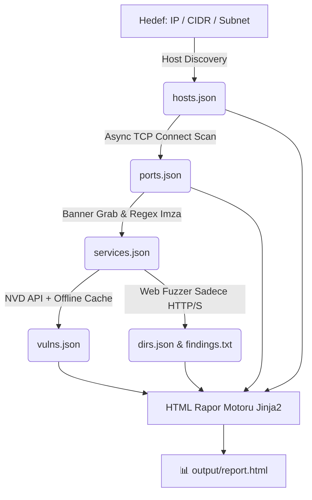

<div align="center">

# ⚡ SpecterRecon (v1.0.0)
### *Next-Gen Asynchronous Network Reconnaissance & Vulnerability Assessment Engine*

[](https://www.python.org/)
[](#)
[](#)
[](#)
[](#)

<br>

```ascii
  ____                  _             ____                     
 / ___| _ __   ___  ___| |_ ___ _ __ |  _ \ ___  ___ ___  _ __ 
 \___ \| '_ \ / _ \/ __| __/ _ \ '__|| |_) / _ \/ __/ _ \| '_ \ 
  ___) | |_) |  __/ (__| ||  __/ |   |  _ <  __/ (_| (_) | | | |
 |____/| .__/ \___|\___|\__\___|_|   |_| \_\___|\___\___/|_| |_|
       |_|                                                     
   -- Fast, Modular Network Recon & Vulnerability Scanner --   
```

<p align="center">
  <b>SpecterRecon</b>, siber güvenlik uzmanları, sızma testi (pentest) ekipleri ve CTF/lab araştırmacıları için geliştirilmiş; <b>aktif ağ keşfi, asenkron port taraması, servis/versiyon parmak izi analizi, NVD REST API destekli CVE zafiyet eşleştirmesi, web dizin/dosya fuzzer'ı ve modern HTML SOC raporlamasını</b> tek bir güçlü pipeline'da birleştiren yeni nesil bir güvenlik tarama aracıdır.
</p>

---

</div>

## 📌 Neden SpecterRecon?

Geleneksel tarayıcılar genellikle ya yalnızca port tarar (Nmap gibi) ya da yalnızca web dizinlerini hedefler (Gobuster/ffuf gibi). **SpecterRecon**, keşiften raporlamaya tüm adımları **birbirine veri aktaran modüler bir pipeline mimarisinde** toplar:

1. **⚡ Yüksek Performanslı Asenkron Motor:** `asyncio` ve `httpx` ile yüzlerce portu ve web yolunu milisaniyeler içinde non-blocking olarak tarar.
2. **🛡️ Otomatik CVE & Risk Skorlama:** Tanımlanan servis/versiyonları (örn: `Apache 2.4.49`, `OpenSSH 8.9p1`) NVD REST API v2 ve yerel zafiyet veritabanında arayarak **CVSS v3.1 puanlarına** göre sıralar.
3. **🎯 Akıllı Web Fuzzing:** Sadece HTTP/HTTPS tespit edilen portlarda otomatik devreye girer; `.env`, `.git/HEAD`, `backup.sql` gibi kritik sızıntı dosyalarını anında alarm olarak işaretler.
4. **📊 Görsel HTML SOC Raporu:** Tarama sonuçlarını karanlık temalı, responsive, filtreli ve görsel istatistik kartlarına sahip bağımsız bir HTML raporu olarak dışa aktarır.
5. **🔒 Güvenlik & Denetim Guardrail'leri:** Yetkisiz taramaları önlemek için izin doğrulaması (`--authorized`) ve yapılan her eylemi kaydeden denetim kütüğü (`output/audit.log`) içerir.

---

## 🏗️ Mimari ve Veri Akışı (Data Flow)

SpecterRecon, her modülün bir önceki adımın çıktısı olan JSON verisini girdi alıp zenginleştirdiği **Lineer Pipeline (Boru Hattı)** mimarisini kullanır:



---

## 🧰 Teknoloji Yığını (Tech Stack)

| Bileşen | Teknoloji | Açıklama |
|---|---|---|
| **Çalışma Zamanı** | `Python 3.9+` | Temiz, modüler ve yüksek okunabilirlikli kod tabanı. |
| **Eşzamanlılık** | `asyncio` + `Semaphore` | Bloke olmayan I/O, kaynak tasarrufu ve kontrollü ağ yükü. |
| **CLI & Arayüz** | `typer` + `rich` | Tip güvenli CLI, dinamik tablolar, renkli loglar ve paneller. |
| **Web & HTTP** | `httpx` (Async Client) | HTTP/2, SSL denetimi, header analizi ve yüksek hızlı istekler. |
| **Ağ Paketleri** | `scapy` & `socket` | Yerel ARP taraması + çoklu platform socket/ping fallback'i. |
| **Veri Modelleme** | `pydantic` (v2) | Katı veri doğrulaması ve hatasız JSON girdi/çıktı dönüşümleri. |
| **Rapor Şablonlama**| `jinja2` | Karanlık temalı modern SOC güvenlik dashboard raporu. |
| **Konfigürasyon** | `pyyaml` | Esnek ve merkezi `config.yaml` ayar yönetimi. |

---

## 📦 Proje Dizin Ağacı

```
Cyber-Security/
├── main.py                  # CLI ana kontrol noktası ve komut yönlendirici
├── config.yaml              # Merkezi tarama ve port ayarları
├── requirements.txt         # Gerekli Python kütüphaneleri
├── README.md                # Proje kullanım kılavuzu
│
├── core/                    # Çekirdek yardımcılar
│   ├── models.py            # Pydantic v2 veri şemaları (Host, Port, Service, Vuln, Finding)
│   ├── storage.py           # JSON saklama ve yükleme yardımcıları
│   └── logger.py            # Rich konsol arayüzü ve audit.log kaydedici
│
├── modules/                 # Güvenlik modülleri
│   ├── discovery.py         # Modül 1: Host Keşfi (ARP / ICMP / TCP ping)
│   ├── portscan.py          # Modül 2: Asenkron Port Tarayıcısı
│   ├── banner.py            # Modül 3: Banner Grabbing & Versiyon Çıkarımı
│   ├── vuln_match.py        # Modül 4: NVD API & Offline CVE Eşleştirici
│   ├── dirfuzz.py           # Modül 5: Web Dizin ve Hassas Dosya Fuzzer'ı
│   └── report.py            # Modül 6: Jinja2 HTML Rapor Üreticisi
│
├── templates/               # Rapor şablonları
│   └── report.html.j2       # Modern karanlık temalı HTML raporu
│
├── wordlists/               # Fuzzing kelime listeleri
│   ├── common.txt           # Yaygın dizinler ve API yolları
│   └── sensitive.txt        # .env, .git, config, backup dosyaları
│
├── tests/                   # Otomatik test paketi
│   ├── test_all.py          # Modül seviyesi birim testleri
│   └── test_e2e.py          # Uçtan uca mock sunucu entegrasyon testi
│
└── output/                  # Tarama sonuçları (Otomatik üretilir)
    ├── hosts.json           # Keşfedilen hostlar
    ├── ports.json           # Açık port listesi
    ├── services.json        # Tanımlanan servisler & teknolojiler
    ├── vulns.json           # CVE zafiyetleri ve CVSS puanları
    ├── dirs.json            # Web dizin bulguları (JSON)
    ├── findings.txt         # Web bulguları (Düz metin)
    ├── report.html          # İnteraktif görsel HTML raporu
    └── audit.log            # Zaman damgalı işlem denetim kütüğü
```

---

## 🚀 Hızlı Başlangıç & Kurulum

### 1. Go (Golang) Sürümü — Önerilen (En Hızlı & Tek Binary)

```bash
# Bağımlılıkları indirin
go mod tidy

# Bağımsız çalıştırılabilir ikili (binary) dosyayı derleyin
go build -o specter-recon.exe main.go

# Artık Python ve pip olmadan doğrudan çalıştırabilirsiniz:
.\specter-recon.exe scan 127.0.0.1 --authorized
```

---

### 2. Python Sürümü ile Çalıştırma

```bash
# Sanal ortamı oluşturun ve aktifleştirin
python -m venv .venv
# Windows:
.venv\Scripts\activate
# Linux/macOS:
source .venv/bin/activate

# Bağımlılıkları yükleyin
pip install -r requirements.txt

# Çalıştırın
python main.py scan 127.0.0.1 --authorized
```

---

## 💻 Kullanım Kılavuzu & Komutlar (Go Binary & Python)

### 🌟 1. Tam Otomatik Pipeline Taraması (`scan`)

Tüm adımları (Keşif ➔ Port Tarama ➔ Banner ➔ CVE Analizi ➔ Web Fuzzing ➔ HTML Rapor) sırasıyla yürütür:

```bash
# Go Binary ile:
.\specter-recon.exe scan 127.0.0.1 --authorized

# Bir alt ağda (subnet) en popüler 20 portu tarama
.\specter-recon.exe scan 192.168.1.0/24 -p top-20 --authorized

# Belirli portları 100 eşzamanlı bağlantı ile tarama
.\specter-recon.exe scan 10.10.10.50 -p 80,443,8080,3306 -t 100 --authorized

# Stealth / Sessiz Mod (İstekler arasına 200 ms gecikme koyarak)
.\specter-recon.exe scan 192.168.1.10 -d 200 --authorized

# Web fuzzing adımını atlayıp yalnızca port ve CVE analizi yapma
.\specter-recon.exe scan 10.10.10.25 --skip-dirfuzz --authorized
```

---

### 🧩 2. Modülleri Bağımsız Çalıştırma

Herhangi bir adımı tek başına bağımsız bir araç gibi kullanabilirsiniz:

```bash
# 🔍 1. Sadece Canlı Hostları Keşfetme (ARP / ICMP / TCP Ping)
.\specter-recon.exe discover 192.168.1.0/24 --authorized

# 🔌 2. Sadece Port Taraması Yapma
.\specter-recon.exe portscan 192.168.1.10 -p top-100 --authorized

# 🏷️ 3. Açık Portlar İçin Banner & Versiyon Tespiti
.\specter-recon.exe banner -i output/ports.json -o output/services.json

# 🛡️ 4. Servis Listesi İçin CVE/Zafiyet Eşleştirme
.\specter-recon.exe vuln -i output/services.json -o output/vulns.json

# 📂 5. Web Hedefinde Dizin/Dosya Fuzzing
.\specter-recon.exe dirfuzz http://192.168.1.10:8080 -w wordlists/common.txt --authorized

# 📊 6. Mevcut JSON Verilerinden HTML Raporu Üretme
.\specter-recon.exe report -t "Lab Target" -o output/report.html
```

---

## 🖥️ Canlı & Zengin Terminal Arayüzü

SpecterRecon, tarama sırasında ve sonucunda tüm bulguları terminalde son derece okunaklı, renkli ve zengin `Rich` tabloları halinde canlı olarak sunar:

- 🌐 **Host Tablosu:** IP, MAC adresi, keşif yöntemi (ARP/ICMP/TCP) ve yanıt gecikmesi (`latency_ms`).
- 🔌 **Açık Port Tablosu:** Port/protokol, varsayılan servis adı, açık/kapalı durumu ve yanıt süresi.
- 🏷️ **Servis & Versiyon Tablosu:** Hedef `IP:Port`, tespit edilen servis (`HTTP`, `SSH`, `MySQL` vb.), kesin versiyon ve banner metni.
- 🛡️ **CVE & Zafiyet Tablosu:** CVE ID'si, CVSS skoru, renkli şiddet rozetleri ([bold red]CRITICAL[/], [bold yellow]HIGH[/], [cyan]MEDIUM[/]), etkilenen servis ve zafiyet özeti.
- 📁 **Web Dizin & Dosya Tablosu:** Yanıt durum kodları (`200 OK`, `301 REDIR`, `401 AUTH`), URL yolları, sayfa başlıkları ve `[⚠️ HASSAS DOSYA]` alarmları (`.env`, `.git` vb.).
- 📊 **Yönetici Özet Paneli:** Taranan hedef, açık port sayısı, bulunan zafiyet sayısı ve üretilen HTML rapor dosyası.

---

## 📊 Örnek HTML Güvenlik Raporu (`output/report.html`)

Tarama tamamlandığında üretilen `output/report.html` dosyası şunları içerir:
- 📈 **Yönetici Özet Kartları:** Toplam Host, Açık Port, Kritik Zafiyet ve Web Yolu sayıları.
- 🌐 **Host & Servis Matrisi:** Açık portlar, protokoller, tespit edilen versiyonlar ve başlıklar.
- 🚨 **Zafiyet & CVE Kartları:** CVSS v3.1 puanı, risk şiddeti (CRITICAL / HIGH / MEDIUM / LOW), zafiyet açıklaması ve resmi NVD referans linkleri.
- 📁 **Web Bulguları Tablosu:** Durum kodları (200, 301, 403 vb.), sayfa başlıkları ve `[KRİTİK DOSYA]` alarmları.

---

## 🧪 Testleri Çalıştırma

Kod tabanının kararlılığı birim ve entegrasyon testleriyle garanti altındadır:

```bash
# 1. Modül seviyesi birim testleri
python -m unittest tests/test_all.py

# 2. Uçtan uca (E2E) mock HTTP sunucu entegrasyon testi
python tests/test_e2e.py
```

---

## ⚖️ Yasal Uyarı ve Etik Bildirimi

> [!CAUTION]
> **ÖNEMLİ:** Bu yazılım yalnızca **yasal izin alınmış hedefler, yetkilendirilmiş sızma testleri, siber güvenlik eğitim laboratuvarları ve CTF ortamları** için geliştirilmiştir. İzin alınmamış sistemlere karşı port taraması, servis analizi veya dizin taraması yapılması kanunlara aykırıdır ve yasal sorumluluk doğurabilir. Kullanımdan doğan tüm hukuki ve cezai sorumluluk kullanıcıya aittir.

<br>

<div align="center">
  <sub>Developed for Ethical Hackers & Security Researchers. Made with Python & ❤️.</sub>
</div>
