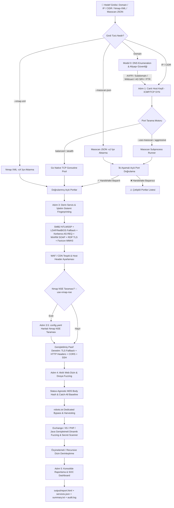

<div align="center">

# ⚡ SpecterRecon (v0.9.0)
### *Yüksek Performanslı, Bağlam Duyarlı ve Hibrit Ağ Keşif & Zafiyet Görünürlük Motoru*

[](https://go.dev/)
[](LICENSE)
[](.github/workflows/ci.yml)
[](#)
[](#)
[](#)

<br>

```ascii
  ____                  _             ____                     
 / ___| _ __   ___  ___| |_ ___ _ __ |  _ \ ___  ___ ___  _ __ 
 \___ \| '_ \ / _ \/ __| __/ _ \ '__|| |_) / _ \/ __/ _ \| '_ \ 
  ___) | |_) |  __/ (__| ||  __/ |   |  _ <  __/ (_| (_) | | | |
 |____/| .__/ \___|\___|\__\___|_|   |_| \_\___|\___\___/|_| |_|
       |_|                                                     
    -- Context-Aware High Performance Reconnaissance Engine --   
```

<p align="center">
  <b>SpecterRecon</b>; sızma testi uzmanları, kırmızı takım (Red Team) operatörleri, siber güvenlik araştırmacıları ve SOC analistleri için <b>Go (Golang 1.26+)</b> ile sıfırdan tasarlanmış modern bir keşif ve zafiyet görünürlük platformudur.<br>
  <b>DNS Altyapı Güvenliği (AXFR Zone Transfer, Wildcard DNS, 25+ Sağlayıcı Subdomain Takeover), Canlı Host Keşfi, Hibrit Port Tarama (Native Goroutine / Masscan), İki Aşamalı Port Doğrulama ve Çelişki Çözümleme (Conflict Resolution), Kimliksiz Derin Protokol & İşletim Sistemi Parmak İzi (SMB2 NTLMSSP Build + LDAP RootDSE & NetBIOS Fallback, Kerberos ASN.1 AS-REQ Realm, WinRM SOAP Identify & OS Regex, TLS Multi-Version Fallback, MSSQL TDS 7.x, RDP TLS, VNC RFB, Fortinet FSSO), WAF/CDN Tespiti (Akamai, Cloudflare, AWS), Status-Agnostic MD5 Body Hash Korumalı Akıllı Web Fuzzing, robots.txt Dedicated Bypass, Exchange OWA/EWS Wordlist, IIS Critical Paths, Pasif Kredansiyel & API Key Sızıntı Taraması, Nmap NSE Zafiyet Eşleme ve Glassmorphism Temalı SOC Dashboard Raporlama</b> süreçlerini tek bir bağımsız ikili dosyada (zero-dependency binary) birleştirir.
</p>

---

</div>

## 📌 İçindekiler

- [🎯 1. Temel Felsefe ve Mimari Prensipler](#-1-temel-felsefe-ve-mimari-prensipler)
- [⚡ 2. Modüler Mimari ve Yetenek Matrisi](#-2-modüler-mimari-ve-yetenek-matrisi)
- [🔄 3. Derinlemesine Keşif Boru Hattı (Recon Pipeline Architecture)](#-3-derinlemesine-keşif-boru-hattı-recon-pipeline-architecture)
- [🎯 4. Tarama Profilleri (`--profile`)](#-4-tarama-profilleri---profile)
- [🌐 5. DNS & Altyapı Güvenlik Analiz Motoru](#-5-dns--altyapı-güvenlik-analiz-motoru)
- [🔬 6. Derin Servis & İşletim Sistemi (OS) Tespit Motoru](#-6-derin-servis--i̇şletim-sistemi-os-tespit-motoru)
- [📂 7. Akıllı Web Fuzzing, MD5 Body Hash Filtresi & robots.txt Bypass](#-7-akıllı-web-fuzzing-md5-body-hash-filtresi--robotstxt-bypass)
- [🛡️ 8. Port Doğrulama ve Çelişki Çözümleme Katmanı (Conflict Resolution)](#-8-port-doğrulama-ve-çelişki-çözümleme-katmanı-conflict-resolution)
- [💻 9. İnteraktif Konsol Modu (Readline / REPL Interface)](#-9-i̇nteraktif-konsol-modu-readline--repl-interface)
- [📁 10. Proje Dizin Yapısı](#-10-proje-dizin-yapısı)
- [📥 11. İşletim Sistemlerine Göre Ayrıntılı Kurulum Kılavuzu](#-11-i̇şletim-sistemlerine-göre-ayrıntılı-kurulum-kılavuzu)
  - [🐧 Linux (Ubuntu, Debian, Kali Linux, Parrot OS)](#-linux-ubuntu-debian-kali-linux-parrot-os)
  - [🏹 Linux (Arch Linux, Manjaro, BlackArch)](#-linux-arch-linux-manjaro-blackarch)
  - [🎩 Linux (Fedora, RHEL, Rocky Linux, CentOS)](#-linux-fedora-rhel-rocky-linux-centos)
  - [🍎 macOS (Apple Silicon M1/M2/M3/M4 & Intel x86_64)](#-macos-apple-silicon-m1m2m3m4--intel-x86_64)
  - [🪟 Windows (Windows 10, 11 & Windows Server)](#-windows-windows-10-11--windows-server)
  - [🐳 Docker / Container ile Çalıştırma](#-docker--container-ile-çalıştırma)
- [🚀 12. Kapsamlı Komut Satırı Kullanım Kılavuzu (CLI Reference & Examples)](#-12-kapsamlı-komut-satırı-kullanım-kılavuzu-cli-reference--examples)
- [⚙️ 13. Yapılandırma Dosyası (`config.yaml`)](#️-13-yapılandırma-dosyası-configyaml)
- [📊 14. SOC Raporlama ve Çıktı Formatları](#-14-soc-raporlama-ve-çıktı-formatları)
- [📋 15. Günlük Tutma, Denetim İzi (Audit Log) & Uyumluluk](#-15-günlük-tutma-denetim-izi-audit-log--uyumluluk)
- [⚖️ 16. Yasal Uyarı ve Lisans](#️-16-yasal-uyarı-ve-lisans)

---

## 🎯 1. Temel Felsefe ve Mimari Prensipler

Geleneksel keşif süreçlerinde güvenlik uzmanları onlarca farklı aracı (amass, subfinder, nmap, masscan, httpx, ffuf, testssl, nuclei vb.) peş peşe çalıştırır. Bu durum şu kronik problemlere yol açar:
1. **Bağlam Kopukluğu (Context Loss):** Bir aracın bulduğu bilgi (örneğin WAF varlığı, Exchange OWA veya IIS servisi) bir sonraki fuzzer aracına aktarılmaz; fuzzer körlemesine standart PHP wordlist dener.
2. **Soket Darboğazı ve SYN-Flood Filtreleri:** Yüksek eşzamanlılıkla kontrolsüz gönderilen SYN paketleri durum bilgili (stateful) kurumsal firewall'lar tarafından engellenir ve canlı portlar "kapalı" veya "filtrelenmiş" olarak raporlanır.
3. **Catch-All ve Yönlendirme Fırtınası (False-Positive Flood):** Hedef web sunucusu bilinmeyen tüm isteklere `302 Found ➔ /Login.aspx?ReturnUrl=...`, `401 Unauthorized` veya `403 Forbidden` dönüyorsa, standart fuzzer'lar binlerce sahte pozitif "Kritik Dosya Bulundu" uyarısı üretir.
4. **NTLMSSP Challenge & TLS Reset Sorunları:** SMB2 oturum açma paketleri NTLMSSP Challenge dönemediğinde sistem OS tespitini bırakır; TLSv1.3 desteklemeyen eski IIS/Exchange sunucuları bağlantıyı sıfırlar.

**SpecterRecon'un Çözüm İlkeleri:**
* **Sıfır Dış Bağımlılık (Zero-Dependency Architecture):** Sistemde Masscan veya Nmap olmasa dahi, Go'nun yerel Goroutine Worker Pool motoru ve gömülü wordlist'leri (`//go:embed`) sayesinde tek bir binary halinde eksiksiz çalışır.
* **Akıllı Bağlam Aktarımı (Context-Aware Pipeline):** Port taramasında tespit edilen servisler otomatik olarak Banner Grabbing modülüne, oradan elde edilen web teknolojisi ve WAF bilgisi ise doğrudan Dizin Fuzzing ve NSE motoruna aktarılır.
* **Status-Agnostic MD5 Body Hash & Catch-All Baseline Koruması:** Fuzzing öncesinde hedef sisteme 5 farklı formatta test probu gönderilir; dönen durum kodları (200, 302, 401, 403, 500), yanıt gövdesi MD5 ve FNV-1a snippet hash'leri ve yönlendirme hedefleri kümelenerek baseline oluşturulur.
* **robots.txt Dedicated Bypass:** robots.txt içeriğinden elde edilen gizli yollar Catch-All 302/403 tarafından ezilmeden özel tolerans ile taranır.
* **Kimliksiz Derin Keşif & Fallback Zinciri:** Windows/Active Directory ormanlarında kimlik doğrulamaya gerek duymadan SMB2 NTLMSSP Challenge (LDAP RootDSE ve NetBIOS UDP 137 fallback ile), Kerberos ASN.1 AS-REQ Realm extraction, WinRM SOAP Identify OS build regex ve RDP TLS paketleri ile tam işletim sistemi build'i, AD domain adı ve sunucu sertifikaları çekilir.
* **TLS Multi-Version Fallback:** TLSv1.3, TLSv1.2, TLSv1.1 ve TLSv1.0 ardışık olarak denenerek connection reset sorunları aşılır.

---

## ⚡ 2. Modüler Mimari ve Yetenek Matrisi

| Modül | Protokol / Algoritma | Açıklama ve Tespit Edilen Kritik Bulgular |
| :--- | :--- | :--- |
| **DNS Güvenlik Motoru** | DNS RFC 1035 / TCP 53 AXFR / CNAME Resolver | **DNS Zone Transfer (AXFR) Açığı**, **Wildcard DNS Tespiti**, **Subdomain Takeover (25+ Bulut Sağlayıcı)**, Active Directory SRV (`_ldap`, `_kerberos`), Ters DNS (PTR). |
| **Canlı Host Keşfi** | ICMP Echo, ARP, TCP Probe (`TCP_OPEN` / `TCP_RST`) | Ağ topolojisi haritalama, canlı IP listesi, milisaniye hassasiyetli RTT ölçümü. |
| **Hibrit Port Tarayıcı** | Native Go TCP Connect Worker Pool + Masscan Subprocess | 1-65535 arası yüksek hızlı TCP taraması, otomatik yedek tarama (fallback retry) ile SYN-flood engellerini aşma. |
| **Port Teyit & Çelişki Katmanı**| İki Aşamalı TCP 3-Way Handshake Doğrulaması | Masscan ve harici araçların ürettiği sahte açık portları teyit eder; çelişkileri `Conflicting Ports` tablosunda belgeler. |
| **SMB2/3 OS Fingerprint & Fallback** | NTLMSSP Type 2 + LDAP RootDSE + NetBIOS UDP 137 | Windows Server Build (`2012 R2 / 2016 / 2019 / 2022 / 2025`), NetBIOS Bilgisayar Adı, Active Directory Domain & Forest FQDN. |
| **Kerberos KDC Realm Motoru** | Proaktif ASN.1 AS-REQ (Application 10) | KRB-ERROR / AS-REP üzerinden Kerberos Realm, Active Directory LDAP DN ve FQDN tespiti. |
| **WinRM / WSMAN Motoru** | SOAP Identify over HTTP/HTTPS (`/wsman`) | 5000ms timeout ve OS regex analizi ile Windows Server Build (`10.0.17763 ➔ Server 2019`), WSMAN Stack 3.0. |
| **TLS Multi-Version Fallback** | TLS 1.3 ➔ 1.2 ➔ 1.1 ➔ 1.0 Fallback Loop | Eski/legacy sunucularda Connection Reset sorununu aşar; sertifika, SANs, zayıf protokol (SSLv3, TLS 1.0/1.1) tespiti. |
| **LDAP RootDSE Motoru** | ASN.1 Lightweight Directory Access Protocol | AD Domain Controller Fonksiyonel Seviyesi (`FuncLevel 6=2012R2, 7=2016+`), DefaultNamingContext, Domain FQDN. |
| **MSSQL TDS Motoru** | TDS 7.x Pre-Login Handshake Byte Stream | SQL Server ana sürümü ve tam derleme numarası (örn: `SQL Server 2022 v16.0.1000`). |
| **RDP & VNC Motoru** | X.224 Connection Request + TLS/NLA / RFB Handshake | RDP TLS Sertifika CN/FQDN bilgileri, VNC RFB Protokol sürümü (`RFB 003.008` / `005.000`). |
| **Favicon MMH3 Motoru** | Shodan %100 Uyumlu 32-bit MurmurHash3 | Spring Boot (`116323821`), Jenkins (`81586312`), phpMyAdmin, Grafana, WordPress, VMware vCenter vb. |
| **WAF & CDN Tespiti** | HTTP Header & Body Analizi | Akamai (`AkamaiGHost`), Cloudflare, AWS CloudFront, Imperva, F5 BIG-IP, Sucuri tespiti; dinamik Host header optimizasyonu. |
| **Catch-All Web Fuzzing** | Multi-Probe Baseline & MD5 Body Hash Analizi | 302 Dynamic Query, 401 Unauthorized, 403 Forbidden, 500 Error ve 200 Soft-404 filtreleme; SecLists & Embedded wordlist. |
| **Exchange OWA & EWS Wordlist**| Exchange Özel Fuzzing Listesi (`exchange.txt`) | `/owa/auth/logon.aspx`, `/EWS/Exchange.asmx`, `/Autodiscover/`, `/ecp/`, `/mapi/`, `/PowerShell`. |
| **IIS Critical Paths** | ASP.NET Handlers & Config Taraması | `elmah.axd`, `web.config`, `Global.asax`, `_layouts/15/`, `Telerik.Web.UI...axd`, `appsettings.json`. |
| **robots.txt Dedicated Bypass** | Crawler Excluded Path Harvesting | robots.txt'ten çekilen gizli yollar özel toleransla taranır, catch-all tarafından ezilmez. |
| **Pasif Secret Sızıntı Taraması**| Regex Pattern Matching on HTTP Bodies | **AWS Access Key (`AKIA...`)**, **Google API Key**, **GitHub PAT**, **Slack Webhook**, **JWT**, **RSA/SSH Private Key**, **DB URI**. |
| **Debug Sayfası Tespiti** | Framework Error Signature Matching | **Django Debug (Settings/Stack)**, **Spring Boot Whitelabel**, **Laravel Ignition (Whoops)**, **PHP Stack Trace**, **ASP.NET Yellow Screen**. |
| **Özyinelemeli (Recursive) Fuzz**| Multi-Threaded Depth-First Fuzzing | Keşfedilen kök dizinlerin (`/admin/`, `/api/`, `/v1/`, `/portal/`, `/owa/`, `/ecp/`, `/elmah/`) derinleştirilmesi. |
| **Genişletilmiş Pasif Denetim**| TLS Cipher/Cert Suite, HTTP Security Headers, CORS, SSH | Zayıf protokoller (SSLv3, TLS 1.0/1.1), eksik HSTS/CSP/X-Frame-Options, tehlikeli metotlar (`TRACE`, `PUT`), SSH zayıf algoritmalar. |
| **Nmap NSE Zafiyet Eşleme** | Otomatik Servis-NSE Haritalama (`config.yaml`) | **SMB EternalBlue (`MS17-010`)**, **SSL Heartbleed**, **Apache RCE**, **RDP Encryption** zafiyet taramaları. |
| **SOC Raporlama Dashboard'u** | Glassmorphism Responsive HTML5 + JSON/TXT | İnteraktif arama, filtreleme, zafiyet kartları, çelişki tabloları, tam denetim izi (`audit.log`). |

---

## 🔄 3. Derinlemesine Keşif Boru Hattı (Recon Pipeline Architecture)

SpecterRecon, hedefe yönelik girdiyi (Domain, IP, CIDR veya dosya) adım adım işleyen tam senkronize bir boru hattına sahiptir:



---

## 🎯 4. Tarama Profilleri (`--profile`)

SpecterRecon, operasyonel ihtiyaçlara göre optimize edilmiş 3 yerleşik profil sunar:

| Profil | Port Eşzamanlılığı | Gecikme (Delay) | Masscan | Nmap NSE | Web Fuzzing Wordlist |
| :--- | :--- | :--- | :--- | :--- | :--- |
| `stealth` | 20 Worker | 100 ms | ❌ Kapalı | ❌ Kapalı | `quick` (Gömülü 1,000 Kelime) |
| `balanced` *(Varsayılan)* | 100 Worker | 0 ms | ❌ Kapalı | ❌ Kapalı | `quick` (Gömülü + Servis Eşleme) |
| `aggressive` | 300 Worker | 0 ms | Otomatik | Otomatik | `full` (SecLists Raft Medium) |

---

## 🌐 5. DNS & Altyapı Güvenlik Analiz Motoru

DNS modülü, harici bir API anahtarına ihtiyaç duymadan hedef alan adının güvenlik mimarisini analiz eder:
* **AXFR Zone Transfer Açığı:** Hedefin tüm NS kayıtlarına TCP 53 üzerinden AXFR sorgusu gönderilir; açık varsa tüm DNS haritası tek saniyede çekilir.
* **Wildcard DNS Algılama:** Rastgele üretilen 3 sahte subdomain (`rnd-xyz-1234.domain.com`) sorgulanır. Tümüne aynı A kaydı dönüyorsa wildcard bayrağı set edilir ve sahte subdomain keşifleri engellenir.
* **25+ Bulut Sağlayıcı Subdomain Takeover Tespiti:** CNAME zincirleri çözümlenir; GitHub Pages, AWS S3, Azure Websites, Heroku, Shopify, Bitbucket, Fastly, Pantheons vb. "unclaimed" yanıt imzalarıyla zafiyet raporlanır.
* **Active Directory SRV & Ters DNS (PTR):** `_ldap._tcp.dc._msdcs.DOMAIN`, `_kerberos._tcp.DOMAIN` kayıtları taranarak Domain Controller IP'leri listelenir.

---

## 🔬 6. Derin Servis & İşletim Sistemi (OS) Tespit Motoru

SpecterRecon, standart banner grabbing'in yetersiz kaldığı durumlarda özel ikili (binary) problarla derin analiz yapar:

### 1. SMB2/3 NTLMSSP OS Fingerprint & Multi-Stage Fallback
* **Aşama 1 (SMB2 Negotiate):** SMB 2.0.2 / 2.1 / 3.0 / 3.1.1 dialect'leri ile el sıkışılır.
* **Aşama 2 (Session Setup NTLMSSP Type 1):** Anonymous/Null NTLMSSP Type 1 paketi gönderilerek sunucudan NTLMSSP Type 2 Challenge paketi istenir. Windows Major/Minor/Build (`17763 ➔ Windows Server 2019`), NetBIOS ve Domain FQDN okunur.
* **Aşama 3 (LDAP RootDSE Fallback):** Eğer SMB Session Setup NTLMSSP challenge dönemezse (örneğin sıkılaştırılmış SMB yapılandırmalarında), port 389/636 üzerinden LDAP RootDSE sorgulanır (`domainControllerFunctionality`, `defaultNamingContext`).
* **Aşama 4 (NetBIOS UDP 137 Fallback):** NetBIOS Node Status sorgusuyla bilgisayar ve domain adı UDP 137 üzerinden çekilir.

### 2. Kerberos KDC Realm Extraction (Port 88)
* Proaktif ASN.1 `AS-REQ` paketi gönderilerek sunucudan `KRB-ERROR` (0x7e) veya `AS-REP` (0x6b) tetiklenir.
* Regex ve ASN.1 parser ile Kerberos Realm (`CORP.EXAMPLE.COM`) ve Active Directory LDAP DN (`DC=CORP,DC=EXAMPLE`) çıkarılır.

### 3. WinRM SOAP Identify & OS Regex (Port 5985/5986)
* `/wsman` endpoint'ine SOAP `Identify` isteği gönderilir (5000ms zaman aşımı).
* `<wsmid:ProductVersion>` ve `OS: 10.0.XXXXX` regex analizi ile Windows Server 2012 R2, 2016, 2019, 2022 veya 2025 sürümü tespit edilir.

### 4. TLS Multi-Version Fallback (Port 443 / SSL Servisleri)
* Sunucu bağlantıyı sıfırladığında (Connection Reset) TLSv1.3, TLSv1.2, TLSv1.1 ve TLSv1.0 ardışık olarak denenir.
* Sertifika CN, SANs, geçerlilik süresi ve zayıf protokoller (SSLv3, TLS 1.0/1.1) raporlanır.

---

## 📂 7. Akıllı Web Fuzzing, MD5 Body Hash Filtresi & robots.txt Bypass

### Multi-Probe Baseline & MD5 Body Hash
Hedefe 5 farklı rastgele uzantılı yol gönderilir. Gelen yanıtların durum kodları, yanıt boyutları ve **MD5 body hash'leri** kaydedilir.
* Eğer bilinmeyen tüm yollara `302 Found ➔ /Login.aspx`, `401 Unauthorized` veya `403 Forbidden` dönüyorsa bu yanıtlar baseline olarak kaydedilir.
* Fuzzing sırasında gelen yanıtın MD5 hash'i baseline hash'i ile eşleşiyorsa sahte bulgu olarak elenir.
* **403/401 Özel Kuralı:** Eğer 403 dönen bir dosyanın (`web.config`, `elmah.axd`) boyutu ve MD5 hash'i baseline'dan farklıysa, gerçek bir dosya olarak kabul edilir ve raporlanır.

### robots.txt Dedicated Bypass
`/robots.txt` içeriğinden çekilen yollar standart fuzzer'ların aksine Catch-All filtresi tarafından ezilmez; özel tolerans kontrolü ile doğrulanarak raporlanır.

### Teknolojiye Özel Wordlist Genişletme
* **Exchange:** `wordlists/exchange.txt` gömülü listesi (`/owa/`, `/EWS/`, `/Autodiscover/`, `/ecp/`, `/mapi/`, `/PowerShell/`).
* **IIS & ASP.NET Critical Paths:** `elmah.axd`, `trace.axd`, `web.config`, `web.config.bak`, `Global.asax`, `_layouts/15/`, `Telerik.Web.UI...axd`, `appsettings.json`.
* **PHP:** `config.php`, `wp-config.php`, `phpinfo.php`, `.env`, `composer.json`.
* **Java / Spring Boot:** `/actuator/`, `/actuator/health`, `/actuator/env`, `/swagger-ui.html`, `/manager/html`.

---

## 🛡️ 8. Port Doğrulama ve Çelişki Çözümleme Katmanı (Conflict Resolution)

SYN-taramalarında firewall'ların tüm portları açık göstermesi (Ghost/Fake Ports) problemine karşı SpecterRecon iki aşamalı doğrulama uygular:
1. Masscan veya Nmap'ten gelen port listesi için Go native TCP 3-way handshake başlatılır.
2. Bağlantı başarıyla kurulursa port **Doğrulanmış Açık Port** olarak işleme alınır.
3. Bağlantı reddedilirse (RST) veya zaman aşımına uğrarsa port **Çelişkili Port (Conflict)** olarak ayrılır ve raporda özel tabloda gösterilir.

---

## 💻 9. İnteraktif Konsol Modu (Readline / REPL Interface)

SpecterRecon bağımsız bir kabuk (interactive shell) olarak çalışabilir:

```text
specter> help
specter> scan example.com --profile aggressive --authorized
specter> dns target.local --subdomains
specter> dirfuzz http://10.0.0.100:80 --service iis
specter> report -t "Müşteri Güvenlik Testi Raporu"
```

---

## 📁 10. Proje Dizin Yapısı

```text
SpecterRecon/
├── cmd/                          # CLI Komut Katmanı (Cobra)
│   ├── root.go                   # Ana komut ve global bayraklar
│   ├── scan.go                   # Boru hattı orkestrasyonu
│   ├── dns.go                    # DNS komutu
│   ├── discover.go               # Canlı host keşfi komutu
│   ├── portscan.go               # Port tarama komutu
│   ├── banner.go                 # Servis parmak izi komutu
│   ├── dirfuzz.go                # Web fuzzing komutu
│   ├── ssl.go                    # SSL/TLS denetim komutu
│   └── report.go                 # Raporlama komutu
├── core/                         # Çekirdek Kütüphaneler & Tipler
│   ├── models.go                 # Ortak veri modelleri ve Finding yapıları
│   ├── logger.go                 # ANSI renkli konsol logger ve denetim izi
│   ├── nmap_importer.go          # Nmap XML parser
│   ├── masscan_importer.go       # Masscan JSON parser
│   └── rate_limiter.go           # Token bucket rate limiting
├── modules/                      # Keşif ve Güvenlik Modülleri
│   ├── dns.go                    # DNS AXFR, Wildcard, Takeover
│   ├── discovery.go              # ICMP, ARP, TCP Probe
│   ├── portscan.go               # Native TCP & Masscan Runner
│   ├── service_probes.go         # Derin protokol probları (Kerberos, WinRM, MSSQL)
│   ├── smb_probe.go              # SMB2 NTLMSSP, LDAP & NetBIOS Fallback
│   ├── ldap_probe.go             # LDAP ASN.1 RootDSE
│   ├── ssl_tls.go                # TLS Multi-Version Fallback & SSL Audit
│   ├── banner.go                 # HTTP Header/WAF/Favicon Analizi
│   ├── dirfuzz.go                # Catch-All Fuzzing, IIS/Exchange Paths, Secrets
│   ├── nse.go                    # Nmap NSE haritalama ve çalıştırma
│   └── reporter.go               # Glassmorphism HTML5 Dashboard & Text rapor
├── wordlists/                    # Gömülü & Harici Sözlükler
│   ├── embedded.go               # //go:embed gömülü sözlük yöneticisi
│   ├── common.txt                # 1,000 Genel web yolu
│   ├── sensitive.txt             # Hassas dosya ve konfigürasyonlar
│   ├── exchange.txt              # Exchange OWA/EWS yolları
│   └── service_wordlist_map.yaml # Servis-sözlük haritalama tablosu
├── templates/                    # HTML Rapor Şablonları
├── config.yaml                   # NSE ve Fuzzing yapılandırması
├── go.mod                        # Go modül bağımlılıkları (Go 1.26.0)
└── README.md                     # Kapsamlı Dokümantasyon
```

---

## 📥 11. İşletim Sistemlerine Göre Ayrıntılı Kurulum Kılavuzu

### 🐧 Linux (Ubuntu, Debian, Kali Linux, Parrot OS)

```bash
# 1. Gerekli sistem paketlerini yükleyin
sudo apt update && sudo apt install -y git golang libpcap-dev nmap masscan

# 2. Depoyu klonlayın
git clone https://github.com/1Ssalih/SpecterRecon.git
cd SpecterRecon

# 3. Bağımlılıkları indirin ve derleyin
go mod download
go build -trimpath -ldflags="-s -w" -o specter-recon main.go

# 4. Binary'yi sistem genelinde kullanılabilir yapın
mkdir -p ~/.local/bin
cp specter-recon ~/.local/bin/specter-recon

# Eğer ~/.local/bin PATH'inizde değilse (.bashrc veya .zshrc):
export PATH="$HOME/.local/bin:$PATH"

# 5. Kurulumu test edin
specter-recon --help
```

---

### 🏹 Linux (Arch Linux, Manjaro, BlackArch)

```bash
# 1. Paketleri yükleyin
sudo pacman -Syu --needed git go libpcap nmap masscan

# 2. Klonlayın ve derleyin
git clone https://github.com/1Ssalih/SpecterRecon.git
cd SpecterRecon
go build -trimpath -ldflags="-s -w" -o specter-recon main.go
sudo cp specter-recon /usr/local/bin/
specter-recon --help
```

---

### 🎩 Linux (Fedora, RHEL, Rocky Linux, CentOS)

```bash
# 1. Paketleri yükleyin
sudo dnf install -y git golang libpcap-devel nmap

# 2. Klonlayın ve derleyin
git clone https://github.com/1Ssalih/SpecterRecon.git
cd SpecterRecon
go build -trimpath -ldflags="-s -w" -o specter-recon main.go
sudo cp specter-recon /usr/local/bin/
specter-recon --help
```

---

### 🍎 macOS (Apple Silicon M1/M2/M3/M4 & Intel x86_64)

```bash
# 1. Homebrew ile paketleri yükleyin
brew install go libpcap nmap

# 2. Klonlayın ve derleyin
git clone https://github.com/1Ssalih/SpecterRecon.git
cd SpecterRecon
go build -trimpath -ldflags="-s -w" -o specter-recon main.go
sudo cp specter-recon /usr/local/bin/
specter-recon --help
```

---

### 🪟 Windows (Windows 10, 11 & Windows Server)

#### Yöntem A: Windows PowerShell Üzerinde Derleme
```powershell
# 1. Git ve Go yüklü olduğundan emin olun
git clone https://github.com/1Ssalih/SpecterRecon.git
cd SpecterRecon

# 2. Bağımsız binary derleyin
go build -trimpath -ldflags="-s -w" -o specter-recon.exe main.go

# 3. Çalıştırın
.\specter-recon.exe --help
```

#### Yöntem B: Linux / macOS Üzerinden Windows İçin Çapraz Derleme (Cross-Compilation)
```bash
GOOS=windows GOARCH=amd64 go build -trimpath -ldflags="-s -w" -o specter-recon.exe main.go
```

---

### 🐳 Docker / Container ile Çalıştırma

```bash
# Docker imajını derleyin
docker build -t specter-recon .

# Host network yetkisi ile tarama yapın
docker run --rm --net=host --cap-add=NET_RAW --cap-add=NET_ADMIN -v $(pwd)/output:/app/output specter-recon scan example.com --authorized
```

---

## 🚀 12. Kapsamlı Komut Satırı Kullanım Kılavuzu (CLI Reference & Examples)

### 1. Uçtan Uca Boru Hattı Taraması (`scan` & `fullscan`)

```bash
# 🎯 Standart Boru Hattı Taraması (DNS + Host + Port + Banner + Catch-All Web Fuzzing)
specter-recon scan example.com --authorized

# 🛡️ Genişletilmiş Tam Denetim (Subdomain Brute-force + SSL/TLS + HTTP Headers + CORS + SSH Audit)
specter-recon fullscan example.com --subdomains --authorized

# ⚡ Saldırgan Tarama Profili (Masscan + Nmap NSE + SecLists Raft Wordlist)
specter-recon scan 10.0.0.0/16 --profile aggressive --authorized

# 🤫 Sessiz / Stealth Tarama Profili (20 Worker, 100ms adaptif gecikme)
specter-recon scan target.local --profile stealth -d 100 --authorized

# 🔢 Tüm 65535 Portu 200 Eşzamanlı Worker İle Tara
specter-recon scan 10.0.0.100 -p 1-65535 -t 200 --authorized

# 📥 Önceden Alınmış Nmap XML Çıktısını İçe Aktarma (-oX)
specter-recon scan --nmap-xml nmap_results.xml --authorized

# 📥 Önceden Alınmış Masscan JSON Çıktısını İçe Aktarma ve TCP Handshake ile Doğrulama (-oJ)
specter-recon scan --masscan-json masscan_out.json --authorized
```

### 2. Bağımsız Alt Modül Komutları

```bash
# 📡 DNS Enumeration (AXFR Zone Transfer, Wildcard & Subdomain Takeover Testi)
specter-recon dns example.com --subdomains -t 100 --authorized

# 🔍 Canlı Host Keşfi (ICMP/TCP Ping)
specter-recon discover 192.168.1.0/24 --authorized

# 🔌 Yüksek Hızlı Port Taraması
specter-recon portscan 10.0.0.100 -p 1-65535 -t 200 --authorized

# 🏷️ Banner Grabbing & Derin Protokol Tespiti
specter-recon banner -i output/ports.json -o output/services.json --authorized

# 📂 Akıllı Web Dizin Fuzzing (IIS Critical Paths / Exchange / Catch-All MD5)
specter-recon dirfuzz http://10.0.0.100:80 --service iis --authorized
specter-recon dirfuzz https://10.0.0.88:443 --service exchange --authorized

# 🔒 SSL/TLS Sertifika, Zayıf Cipher & Güvenlik Başlıkları Audit (Multi-Version Fallback)
specter-recon ssl example.com:443 --authorized

# 📊 Mevcut Çıktılardan HTML Dashboard Raporu Üretme
specter-recon report -t "Kurumsal Güvenlik Denetim Raporu" --authorized
```

---

## ⚙️ 13. Yapılandırma Dosyası (`config.yaml`)

```yaml
# Nmap Scripting Engine (NSE) Otomatik Script Eşleştirmeleri
nse_mappings:
  "445":
    - smb-vuln-ms17-010
    - smb-os-discovery
  "443":
    - ssl-heartbleed
    - ssl-cert
    - ssl-enum-ciphers
  "80":
    - http-vuln-cve2021-41773
    - http-methods
  "22":
    - ssh-auth-methods
  "3389":
    - rdp-enum-encryption
  "http":
    - http-vuln-cve2021-41773
    - http-methods
  "smb":
    - smb-vuln-ms17-010

# Web Fuzzing Yapılandırması
dirfuzz:
  wordlist_path: "wordlists/common.txt"
  sensitive_wordlist_path: "wordlists/sensitive.txt"
  concurrency: 30
  timeout: 4.0
  status_codes_of_interest: [200, 204, 301, 302, 307, 308, 401, 403, 405, 500]
```

---

## 📊 14. SOC Raporlama ve Çıktı Formatları

Tarama tamamlandığında `output/` klasöründe aşağıdaki dosyalar oluşturulur:

1. **`output/report.html` (Görsel SOC Dashboard):** Glassmorphism CSS teması, WAF rozetleri, Nmap NSE Zafiyet Bulguları kartı, Secret Sızıntıları tablosu ve Masscan Çelişkili Portlar tablosu içeren interaktif HTML raporu.
2. **`output/summary.txt` (Konsolide Metin Özeti):** Tüm host, port, servis, tam versiyon, güven skoru ve zafiyet özetini içeren yönetici özeti.
3. **`output/services.json`:** Her servis için kanıt dizisi (`evidence`), güven skoru (`confidence`), WAF bilgisi ve TLS sertifika detaylarını içeren yapılandırılmış JSON verisi.
4. **`output/findings.txt`:** Catch-All sahte bulgularından arındırılmış, durum kodları ve hassas dosya etiketleri içeren web bulguları.
5. **`output/ip_list.json`:** DNS, SRV ve Ters DNS sorgularından elde edilen tüm doğrulanmış IP listesi.
6. **`audit.log`:** SOC ve yasal uyumluluk için zaman damgalı tüm tarama ve komut denetim izi.

---

## 📋 15. Günlük Tutma, Denetim İzi (Audit Log) & Uyumluluk

SpecterRecon, kurumsal sızma testleri ve ISO 27001 / SOC 2 uyumluluk süreçleri için tüm eylemleri `audit.log` dosyasına otomatik olarak yazar:

```text
2026-08-31 10:24:13 [AUDIT] ACTION=DIR_FUZZ_START TARGET="http://10.0.0.100" DETAILS="words=2500, matchTag=iis, concurrency=25" STATUS=SUCCESS
2026-08-31 10:24:14 [AUDIT] ACTION=SECRET_LEAK_DETECTED TARGET="http://10.0.0.100/config.json" DETAILS="leaks=[AWS Access Key, JWT Token]" STATUS=ALERT
```

---

## ⚖️ 16. Yasal Uyarı ve Lisans

> ⚠️ **YASAL UYARI:**  
> **SpecterRecon**, yalnızca **yasal olarak izin alınmış güvenlik denetimleri**, sızma testleri, kurum içi altyapı kontrolleri ve eğitim lab ortamları için geliştirilmiştir. Yetkisiz sistemlere karşı izin almadan tarama yapmak yasalara (TCK Madde 243/244, 5651 Sayılı Kanun, US CFAA vb.) aykırıdır ve ağır cezai sorumluluk doğurur.  
> Geliştirici, aracın kötüye kullanımından doğabilecek hiçbir zarardan sorumlu tutulamaz.

### Lisans
Bu proje **[MIT Lisansı](LICENSE)** altında lisanslanmıştır.
