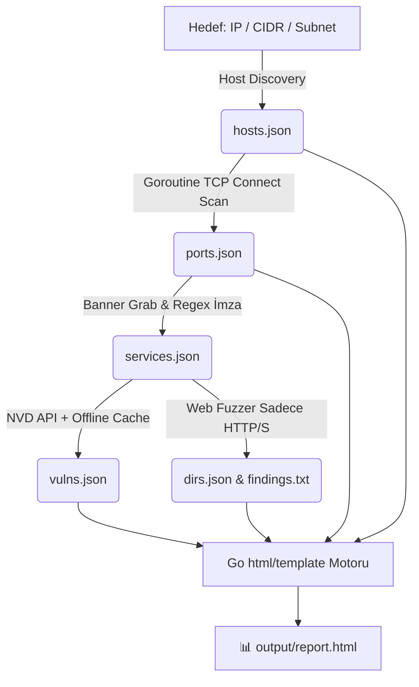

<div align="center">

# ⚡ SpecterRecon (v1.0.0)
### *Next-Gen High-Performance Network Reconnaissance & Vulnerability Assessment Engine in Go*

[](https://go.dev/)
[](#)
[](#)
[](#)
[](#)

<br>

```ascii
  ____                  _             ____                     
 / ___| _ __   ___  ___| |_ ___ _ __ |  _ \ ___  ___ ___  _ __ 
 \___ \| '_ \ / _ \/ __| __/ _ \ '__|| |_) / _ \/ __/ _ \| '_ \ 
  ___) | |_) |  __/ (__| ||  __/ |   |  _ <  __/ (_| (_) | | | |
 |____/| .__/ \___|\___|\__\___|_|   |_| \_\___|\___\___/|_| |_|
       |_|                                                     
    -- Fast, Modular Network Recon & Vulnerability Scanner --   
```

<p align="center">
  <b>SpecterRecon</b>, siber güvenlik uzmanları, sızma testi (pentest) ekipleri ve CTF/lab araştırmacıları için geliştirilmiş; <b>aktif ağ keşfi, Goroutine tabanlı asenkron port taraması, servis/versiyon parmak izi analizi, NVD REST API destekli CVE zafiyet eşleştirmesi, web dizin/dosya fuzzer'ı ve modern HTML SOC raporlamasını</b> tek bir bağımsız binary dosyasında birleştiren yeni nesil güvenlik tarama motorudur.
</p>

---

</div>

## 📌 Neden SpecterRecon?

Geleneksel tarayıcılar genellikle ya yalnızca port tarar (Nmap gibi) ya da yalnızca web dizinlerini hedefler (Gobuster/ffuf gibi). **SpecterRecon**, keşiften raporlamaya tüm adımları **birbirine veri aktaran modüler bir boru hattı (pipeline) mimarisinde** toplar:

1. **⚡ Saf Go Gücü & Goroutine Eşzamanlılığı:** Go'nun hafif eşzamanlılık modeli (`Goroutines` + `Worker Pools`) ile binlerce portu ve web yolunu milisaniyeler içinde non-blocking olarak tarar.
2. **🛡️ Otomatik CVE & Risk Skorlama:** Tanımlanan servis/versiyonları (örn: `Apache 2.4.49`, `OpenSSH 8.9p1`) NVD REST API v2 ve yerel zafiyet veritabanında arayarak **CVSS v3.1 puanlarına** göre sıralar.
3. **🎯 Akıllı Web Fuzzing:** Sadece HTTP/HTTPS tespit edilen portlarda otomatik devreye girer; `.env`, `.git/HEAD`, `backup.sql` gibi kritik sızıntı dosyalarını anında alarm olarak işaretler.
4. **📊 Görsel HTML SOC Raporu:** Tarama sonuçlarını karanlık temalı, responsive, filtreli ve görsel istatistik kartlarına sahip bağımsız bir HTML raporu (`output/report.html`) olarak dışa aktarır.
5. **🔒 Güvenlik & Denetim Guardrail'leri:** Yetkisiz taramaları önlemek için izin doğrulaması (`--authorized`) ve yapılan her eylemi kaydeden denetim kütüğü (`output/audit.log`) içerir.
6. **📦 Tek Bağımsız Binary:** Python veya harici runtime bağımlılığı olmadan doğrudan çalıştırılabilir (`specter-recon.exe` / `specter-recon`).

---

## 🏗️ Mimari ve Veri Akışı (Data Flow)

SpecterRecon, her modülün bir önceki adımın çıktısı olan JSON verisini girdi alıp zenginleştirdiği **Lineer Pipeline (Boru Hattı)** mimarisini kullanır:



---

## 🧰 Teknoloji Yığını (Tech Stack)

| Bileşen | Teknoloji | Açıklama |
|---|---|---|
| **Programlama Dili** | `Go (Golang) 1.26+` | Yüksek derleme hızı, düşük bellek ayak izi ve tek ikili (binary) çıktı. |
| **Eşzamanlılık** | `Goroutines` + `Worker Pools` + `sync.WaitGroup` | Sıfır bellek sızıntısı ile binlerce paralel ağ bağlantısı. |
| **CLI & Arayüz** | `github.com/spf13/cobra` + `github.com/pterm/pterm` | Tip güvenli CLI argümanları, renkli kutular, canlı loglar ve tablolar. |
| **Ağ & Soket** | Standart `net`, `net/http`, `crypto/tls` | Yüksek performanslı TCP soket ve HTTP istemcisi. |
| **Veri & Yapılandırma** | `encoding/json`, `gopkg.in/yaml.v3` | Katı JSON veri doğrulaması ve merkezi `config.yaml` desteği. |
| **Rapor Şablonlama**| Standart `html/template` | XSS güvenli, karanlık temalı modern SOC güvenlik dashboard'u. |

---

## 📦 Proje Dizin Ağacı

```
Cyber-Security/
├── main.go                  # Uygulama ana giriş noktası
├── go.mod                   # Go modül tanımı
├── go.sum                   # Go bağımlılık doğrulama hashleri
├── config.yaml              # Merkezi tarama ve port yapılandırması
├── README.md                # Kapsamlı proje dokümantasyonu
│
├── cmd/                     # Cobra CLI komutları
│   ├── root.go              # Ana komut ve yasal izin (--authorized) kontrolü
│   ├── scan.go              # Tam otomatik 6 adımlı pipeline komutu
│   ├── discover.go          # Host keşif komutu
│   ├── portscan.go          # TCP port tarama komutu
│   ├── banner.go            # Banner grabbing ve versiyon komutu
│   ├── vuln.go              # CVE zafiyet analiz komutu
│   ├── dirfuzz.go           # Web dizin fuzzer komutu
│   └── report.go            # HTML rapor üretim komutu
│
├── core/                    # Çekirdek yardımcılar
│   ├── models.go            # Go struct veri şemaları (Host, Port, Service, Vuln, Finding)
│   ├── storage.go           # JSON saklama ve yükleme yardımcıları
│   └── logger.go            # PTerm konsol tabloları ve audit.log kaydedici
│
├── modules/                 # Güvenlik modülleri
│   ├── discovery.go         # Modül 1: Host Keşfi (ARP / ICMP / TCP ping)
│   ├── portscan.go          # Modül 2: Goroutine Worker Pool Port Tarayıcısı
│   ├── banner.go            # Modül 3: Banner Grabbing & Versiyon Çıkarımı
│   ├── vulnmatch.go         # Modül 4: NVD API & Offline CVE Eşleştirici
│   ├── dirfuzz.go           # Modül 5: Web Dizin ve Hassas Dosya Fuzzer'ı
│   ├── report.go            # Modül 6: HTML Rapor Üreticisi
│   └── modules_test.go      # Go birim testleri
│
├── templates/               # Rapor şablonları
│   └── report.html.tmpl     # Modern karanlık temalı HTML rapor şablonu
│
├── wordlists/               # Fuzzing kelime listeleri
│   ├── common.txt           # Yaygın dizinler ve API yolları
│   └── sensitive.txt        # .env, .git, config, backup dosyaları
│
└── output/                  # Tarama sonuçları (Otomatik üretilir)
    ├── hosts.json           # Keşfedilen hostlar
    ├── ports.json           # Açık port listesi
    ├── services.json        # Tanımlanan servisler & teknolojiler
    ├── vulns.json           # CVE zafiyetleri ve CVSS puanları
    ├── dirs.json            # Web dizin bulguları (JSON)
    ├── findings.txt         # Web bulguları (Düz metin)
    ├── report.html          # İnteraktif görsel HTML raporu
    └── audit.log            # Zaman damgalı işlem denetim kütüğü
```

---

## 🚀 Hızlı Başlangıç & Kurulum

### 1. Bağımlılıkları İndirin ve Derleyin

```bash
# Go bağımlılıklarını indirin
go mod tidy

# Bağımsız çalıştırılabilir ikili (binary) dosyayı derleyin
go build -o specter-recon.exe main.go
```

---

## 💻 Kullanım Kılavuzu & Komutlar

### 🌟 1. Tam Otomatik Pipeline Taraması (`scan`)

Tüm adımları (Keşif ➔ Port Tarama ➔ Banner ➔ CVE Analizi ➔ Web Fuzzing ➔ HTML Rapor) sırasıyla yürütür:

```bash
# Yerel host üzerinde tam tarama
.\specter-recon.exe scan 127.0.0.1 --authorized

# Bir alt ağda (subnet) en popüler 20 portu tarama
.\specter-recon.exe scan 192.168.1.0/24 -p top-20 --authorized

# Belirli portları 100 eşzamanlı bağlantı ile tarama
.\specter-recon.exe scan 10.10.10.50 -p 80,443,8080,3306 -t 100 --authorized

# Stealth / Sessiz Mod (İstekler arasına 200 ms gecikme koyarak)
.\specter-recon.exe scan 192.168.1.10 -d 200 --authorized

# Web fuzzing adımını atlayıp yalnızca port ve CVE analizi yapma
.\specter-recon.exe scan 10.10.10.25 --skip-dirfuzz --authorized
```

---

### 🧩 2. Modülleri Bağımsız Çalıştırma

Herhangi bir adımı tek başına bağımsız bir araç gibi kullanabilirsiniz:

```bash
# 🔍 1. Sadece Canlı Hostları Keşfetme (ARP / ICMP / TCP Ping)
.\specter-recon.exe discover 192.168.1.0/24 --authorized

# 🔌 2. Sadece Port Taraması Yapma
.\specter-recon.exe portscan 192.168.1.10 -p top-100 --authorized

# 🏷️ 3. Açık Portlar İçin Banner & Versiyon Tespiti
.\specter-recon.exe banner -i output/ports.json -o output/services.json

# 🛡️ 4. Servis Listesi İçin CVE/Zafiyet Eşleştirme
.\specter-recon.exe vuln -i output/services.json -o output/vulns.json

# 📂 5. Web Hedefinde Dizin/Dosya Fuzzing
.\specter-recon.exe dirfuzz http://192.168.1.10:8080 -w wordlists/common.txt --authorized

# 📊 6. Mevcut JSON Verilerinden HTML Raporu Üretme
.\specter-recon.exe report -t "Lab Target" -o output/report.html
```

---

## 🧪 Testleri Çalıştırma

```bash
# Tüm Go birim testlerini yürütme
go test -v ./...
```

---

## ⚖️ Yasal Uyarı ve Etik Bildirimi

> **ÖNEMLİ:** Bu araç yalnızca **yasal izin alınmış sistemler**, yetkili sızma testi sözleşmeleri, laboratuvar ortamları ve CTF yarışmaları için tasarlanmıştır. İzin alınmamış üçüncü taraf sistemlere karşı tarama yapmak yasalara aykırıdır. Geliştiriciler, aracın kötüye kullanımından sorumlu tutulamaz.
