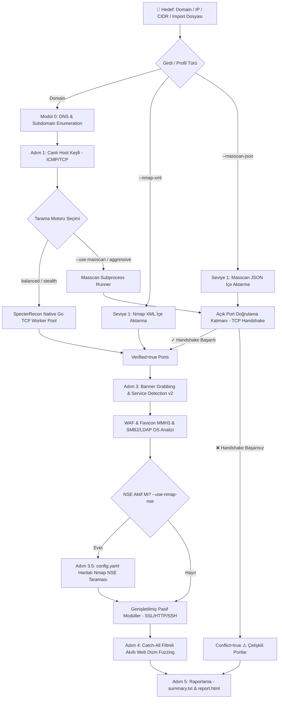

<div align="center">

# ⚡ SpecterRecon (v0.8.0)
### *Yüksek Performanslı, Bağlam Duyarlı ve Hibrit Ağ Keşif & Zafiyet Görünürlük Motoru*

[](https://go.dev/)
[](LICENSE)
[](.github/workflows/ci.yml)
[](#)
[](#)
[](#)

<br>

```ascii
  ____                  _             ____                     
 / ___| _ __   ___  ___| |_ ___ _ __ |  _ \ ___  ___ ___  _ __ 
 \___ \| '_ \ / _ \/ __| __/ _ \ '__|| |_) / _ \/ __/ _ \| '_ \ 
  ___) | |_) |  __/ (__| ||  __/ |   |  _ <  __/ (_| (_) | | | |
 |____/| .__/ \___|\___|\__\___|_|   |_| \_\___|\___\___/|_| |_|
       |_|                                                     
    -- Context-Aware High Performance Reconnaissance Engine --   
```

<p align="center">
  <b>SpecterRecon</b>, sızma testi uzmanları, güvenlik araştırmacıları ve SOC ekipleri için <b>Go (Golang)</b> ile geliştirilmiş; <b>DNS Enumeration, Host Discovery, Yüksek Hızlı Port Tarama, Nmap/Masscan Hibrit Entegrasyonu, Probe-v2 Servis & OS Fingerprinting (SMB2 NTLMSSP, LDAP RootDSE, RDP TLS, MSRPC, Kerberos), WAF/CDN Tespiti (Akamai, Cloudflare, AWS), Catch-All Filtreli Akıllı Web Fuzzing ve Pasif Güvenlik Denetimi (SSL/HTTP/SSH)</b> süreçlerini tek bir bağımsız binary içerisinde otomatikleştiren yeni nesil keşif motorudur.
</p>

---

</div>

## 📌 İçindekiler

- [🎯 1. Genel Bakış ve Temel İlkeler](#-1-genel-bakış-ve-temel-i̇lkeler)
- [⚡ 2. Öne Çıkan Yetenekler ve Modüller](#--2-öne-çıkan-yetenekler-ve-modüller)
- [🔄 3. Pipeline ve Hibrit Tarama Mimarisi](#-3-pipeline-ve-hibrit-tarama-mimarisi)
- [🎯 4. Tarama Profilleri (`--profile`)](#-4-tarama-profilleri---profile)
- [🛡️ 5. Doğrulama ve Çelişki Çözümleme Katmanı (Conflict Resolution)](#-5-doğrulama-ve-çelişki-çözümleme-katmanı-conflict-resolution)
- [🔬 6. Servis, OS & WAF Tespit Motoru](#-6-servis-os--waf-tespit-motoru)
- [📂 7. Catch-All & Soft-404 Korumalı Web Fuzzing](#-7-catch-all--soft-404-korumalı-web-fuzzing)
- [📁 8. Proje Dizin Yapısı](#-8-proje-dizin-yapısı)
- [📥 9. Kurulum ve Yetki Yönetimi](#-9-kurulum-ve-yetki-yönetimi)
- [🚀 10. Komut Satırı Kullanım Rehberi (CLI Examples)](#-10-komut-satırı-kullanım-rehberi-cli-examples)
- [⚙️ 11. Yapılandırma (`config.yaml`)](#️-11-yapılandırma-configyaml)
- [📊 12. Raporlama ve Çıktılar](#-12-raporlama-ve-çıktılar)
- [⚖️ 13. Yasal Uyarı ve Lisans](#️-13-yasal-uyarı-ve-lisans)

---

## 🎯 1. Genel Bakış ve Temel İlkeler

Modern kurumsal ortamlarda Active Directory mimarileri, Cloudflare/Akamai arkasına gizlenmiş web uygulamaları ve mikroservisler bulunur. Geleneksel araçların ayrı ayrı koşturulması zaman kaybı yaratır ve yüzlerce sahte bulguya (false-positive) yol açar.

**SpecterRecon'un Temel Prensipleri:**
1. **Sıfır Dış Bağımlılık (Zero-Dependency):** Harici araçlar (Nmap/Masscan) sistemde olmasa dahi Go'nun yerel eşzamanlı worker pool motoruyla %100 taşınabilir ve eksiksiz çalışır.
2. **Hibrit Güç:** Sistemde Nmap veya Masscan mevcutsa, Masscan'in saniyede yüzbinlerce paketlik hızından ve Nmap'in zengin NSE zafiyet betiklerinden otomatik faydalanır.
3. **Çift Doğrulama ve Kaynak Şeffaflığı:** Masscan'in durumsuz (stateless) SYN yanıtları SpecterRecon tarafından TCP handshake ile teyit edilir. Teyit edilemeyenler silinmez, **`⚠️ Conflicting Ports`** olarak raporda şeffaf biçimde sunulur.
4. **Sıfır Sahte Bulgu (Zero False-Positive):** Fuzzing öncesi 3 rastgele yol ile Catch-All/Soft-404 baseline analizi yapılır; binlerce sahte 301/302 yönlendirmesi tamamen ayıklanır.
5. **Kimlik Doğrulamasız Derin OS Tespiti:** SMB2 NTLMSSP Type 2 ve LDAP Anonymous RootDSE protokol handshake'leri ile kimlik bilgisi gerekmeden Windows Server sürümü, Build numarası, Domain ve Forest bilgileri çıkarılır.

---

## ⚡ 2. Öne Çıkan Yetenekler ve Modüller

| Modül | Açıklama |
| :--- | :--- |
| **DNS Enumeration** | A, AAAA, CNAME, MX, TXT, NS, SOA kayıt analizi ve eşzamanlı Subdomain Brute-Force. |
| **Host Discovery** | ARP, ICMP Echo ve TCP SYN Ping ile canlı hostların milisaniye hassasiyetinde tespiti. |
| **Port Scanning** | Goroutine Worker Pool tabanlı TCP Connect tarayıcısı veya Masscan Subprocess entegrasyonu. |
| **Port Verification** | Harici/durumsuz tarayıcılardan gelen portların TCP handshake ile teyit edilerek çelişkilerin tespiti. |
| **Service Engine v2** | 20+ protokol probu, SMB2 OS Fingerprint, LDAP RootDSE, RDP TLS, MSRPC, Kerberos, Favicon MMH3 hash. |
| **WAF & CDN Detection** | AkamaiGHost, Cloudflare, AWS CloudFront, Imperva, F5 BIG-IP, Sucuri tespiti ve zorunlu Host header. |
| **Smart Web Fuzzing** | Catch-All Baseline Filtresi, Teknolojiye Duyarlı Çoklu Wordlist Birleştirme, 429 Hız Sınırlama Adaptasyonu. |
| **NSE Vulnerability Audit**| Tespit edilen servis ve portlara özel Nmap NSE zafiyet scriptlerinin (`config.yaml` haritası) çalıştırılması. |
| **Extended Passive Audit**| SSL/TLS Sertifika & Cipher Analizi, HTTP Security Headers/CORS/GraphQL denetimi, SSH Algoritma denetimi. |
| **SOC HTML Dashboard** | Glassmorphism temalı, filtrelemeli, responsive ve interaktif görsel web raporu (`report.html`). |

---

## 🔄 3. Pipeline ve Hibrit Tarama Mimarisi

SpecterRecon, hedef girdisini aldıktan sonra sıralı, doğrulamalı ve birbirini besleyen bir boru hattı işletir:



---

## 🎯 4. Tarama Profilleri (`--profile`)

Tek bir bayrakla taramanın agresiflik, hız, gizlilik ve harici araç kullanım seviyesini ayarlayabilirsiniz:

| Profil | Motor | Eşzamanlılık (Worker) | İstek Gecikmesi | NSE Zafiyet Taraması | Wordlist Kapsamı | Kullanım Senaryosu |
| :--- | :--- | :--- | :--- | :--- | :--- | :--- |
| **`balanced`** *(Varsayılan)* | Go Native TCP | 50 Worker | 0 ms | Kapalı | Quick (`common.txt`) | Günlük taramalar, stabil ve güvenilir genel keşif. |
| **`aggressive`** | Masscan + Go Handshake | 100+ Worker | 0 ms | **Açık** (Otomatik) | Full (`SecLists Raft`) | Geniş IP blokları, CTF ve tam yetkili kapsamlı sızma testleri. |
| **`stealth`** | Go Native TCP | 20 Worker | 100 ms (Adaptive) | Kapalı | Quick (Gecikmeli) | IDS/WAF alarmlarından kaçınarak yapılan sessiz keşifler. |

---

## 🛡️ 5. Doğrulama ve Çelişki Çözümleme Katmanı (Conflict Resolution)

Masscan gibi durumsuz (stateless) SYN tarayıcılar, önlerindeki SYN-Proxy veya durumsuz güvenlik duvarları nedeniyle kapalı portlara da SYN-ACK üretebilir.

SpecterRecon bu sorunu **İki Aşamalı Doğrulama** ile çözer:
1. Masscan çıktısındaki her porta hızlı native Go TCP Connect handshake'i denenir.
2. Port erişilebilir ise `Source: "masscan"`, `Verified: true` olarak işaretlenir.
3. Bağlantı reddedilir veya zaman aşımına uğrarsa veri **asla silinmez**; `Conflict: true` olarak etiketlenir ve HTML raporda **`⚠️ Çelişkili Port Bulguları (Conflicting Ports)`** bölümünde şeffaf olarak listelenir.

---

## 🔬 6. Servis, OS & WAF Tespit Motoru

Körlemesine HTTP istekleri atmak yerine servise özgü minimal problar kullanılır:

* **SMB2 NTLMSSP Fingerprint (445, 139):** Kimlik doğrulamaya gerek kalmadan NTLM Challenge paketinden Windows OS Major/Minor versiyonu, Build numarası (örn: `Build 17763 ➔ Windows Server 2019`), NetBIOS Bilgisayar Adı, Active Directory Domain ve Forest bilgileri çekilir.
* **LDAP Anonymous RootDSE (389, 636):** Domain Controller işlevsellik seviyesi (Forest Functionality: 7 = 2016+, 6 = 2012R2), FQDN ve Naming Contexts çözümlenir.
* **RDP TLS Upgrade (3389):** X.224 Connection Request ardından TLS handshake yapılarak sunucu CommonName ve sertifika bilgisi alınır.
* **WAF / CDN Tespiti:** Akamai (`AkamaiGHost`), Cloudflare, AWS CloudFront, Imperva, F5 BIG-IP, Sucuri tespit edilir ve `Host` header'ı sunucu adına eşitlenerek 400 Bad Request engelleri aşılır.
* **Favicon Murmur3 (MMH3) 32-bit Hash:** Shodan ile %100 uyumlu hash algoritmasıyla Spring Boot (`116323821`), Jenkins (`81586312`), phpMyAdmin, Grafana, WordPress vb. framework'ler tespit edilir.

---

## 📂 7. Catch-All & Soft-404 Korumalı Web Fuzzing

Wildcard yönlendirme (Catch-All 301/302) yapan modern web mimarilerinde sahte bulgu fırtınasını önlemek için 3 kademeli filtreleme uygulanır:

1. **Baseline Tespiti:** Fuzzing başlamadan önce `/specter-fp-check-xyz-123` gibi var olmayan 3 yol sorgulanır. Aynı durum kodu ve içerik uzunluğu dönüyorsa baseline profili oluşturulur.
2. **Baseline Eleme:** Fuzzing sırasında bu baseline status ve boyutuna uyan yanıtlar otomatik elenir.
3. **Frekans Kümeleme (Frequency Clustering):** 200 haricindeki aynı (status:boyut) ikilisi 15 defadan fazla tekrar ederse sahte wildcard seli otomatik bastırılır.
4. **429/503 Adaptif Backoff:** Sunucudan HTTP 429 Too Many Requests gelirse token-bucket otomatik olarak yavaşlatılır.

---

## 📁 8. Proje Dizin Yapısı

```
Cyber-Security/
├── main.go                       # Uygulama ana giriş noktası
├── go.mod                        # Go modül bağımlılık tanımı (Go 1.21+)
├── config.yaml                   # Tarama, zaman aşımı ve NSE script haritaları
├── LICENSE                       # MIT Lisansı
├── CONTRIBUTING.md               # Katkı ve etik kurallar rehberi
├── README.md                     # Proje ana dokümantasyonu
│
├── cmd/                          # Cobra CLI Komut Katmanı
│   ├── root.go                   # Kök komut ve yetki teyidi (Guardrail)
│   ├── scan.go                   # Ana recon pipeline komutu (Profiller & İçe Aktarma)
│   ├── fullscan.go               # scan --extended kısayolu
│   ├── shell.go                  # İnteraktif Metasploit-style konsol modu
│   ├── dns.go                    # Bağımsız DNS & Subdomain tarama komutu
│   ├── discover.go               # Bağımsız Host keşif komutu
│   ├── portscan.go               # Bağımsız Port tarama komutu
│   ├── banner.go                 # Bağımsız Banner grabbing & versiyon komutu
│   ├── dirfuzz.go                # Bağımsız Web Dizin fuzzer komutu (Catch-All filtreli)
│   ├── ssl.go                    # Bağımsız SSL/TLS audit komutu
│   └── report.go                 # JSON/XML çıktılarından HTML/TXT rapor üretme komutu
│
├── core/                         # Çekirdek Veri Modelleri ve Yardımcılar
│   ├── models.go                 # Struct şemaları (PortInfo Source/Conflict, NSEFinding vb.)
│   ├── storage.go                # JSON/TXT kaydetme/okuma ve özet rapor yazıcısı
│   └── logger.go                 # PTerm konsol logları, NSE tabloları ve kaynak rozetleri
│
├── modules/                      # Keşif ve Analiz Motorları
│   ├── nmap_import.go            # Nmap XML (-oX) Ayrıştırıcı Motoru (Seviye 1)
│   ├── masscan_import.go         # Masscan JSON (-oJ) Ayrıştırıcı Motoru (Seviye 1)
│   ├── port_verify.go            # Açık Port Doğrulama & Çelişki Çözümleme Katmanı
│   ├── external_tools.go         # Masscan & Nmap NSE Subprocess Yöneticisi (Seviye 2 & 3)
│   ├── dirfuzz.go                # Catch-All Baseline & Soft-404 filtreli Akıllı Web Fuzzer
│   ├── smb_probe.go              # SMB2 Negotiate & NTLMSSP OS Fingerprint Motoru
│   ├── ldap_probe.go             # LDAP/LDAPS Anonymous RootDSE ASN.1 Keşif Motoru
│   ├── favicon.go                # Favicon Murmur3 (MMH3) 32-bit Hash & Framework İmzaları
│   ├── service_probes.go         # Probe Registry, RDP TLS, MSRPC, Kerberos & Binary Parsers
│   ├── banner.go                 # Wappalyzer Regex, WAF Tespiti & AnalyzeService Boru Hattı
│   ├── dns_enum.go               # DNS çözümleme & Subdomain brute-force motoru
│   ├── discovery.go              # ARP, ICMP ve TCP SYN ping ile canlı host keşfi
│   ├── portscan.go               # Goroutine Worker Pool TCP Connect tarayıcısı
│   ├── ssl_tls.go                # SSL/TLS SNI, sertifika geçerlilik ve zayıf protokol denetleyici
│   ├── http_audit.go             # HTTP Security Headers, CORS, GraphQL ve yöntem denetleyici
│   ├── ssh_audit.go              # SSH algoritma, banner ve root login denetleyici
│   ├── report.go                 # HTML Rapor oluşturucu motor
│   └── modules_test.go           # Tüm modüller için kapsamlı Go birim testleri (24 Test)
│
├── docs/                         # Geliştirme Yol Haritası ve Görev Takip Dokümanları
│   └── roadmap_and_tasks.md      # Görev ve mimari durum takip dokümanı
│
├── templates/
│   └── report.html.tmpl          # Modern SOC HTML raporu (WAF, NSE ve Çelişki Kartları)
│
└── wordlists/                    # Wordlist Dosyaları ve Yapılandırma
    ├── common.txt                # Hızlı web dizin listesi (Quick mod)
    ├── api.txt                   # Hızlı API endpoint listesi
    ├── sensitive.txt             # Hassas dosya listesi (.env, .git, config vb.)
    ├── subdomains.txt            # Subdomain brute-force listesi
    ├── service_wordlist_map.yaml # Servis ➔ Wordlist eşleştirme haritası
    └── SecLists/                 # SecLists git submodule (Full mod)
```

---

## 📥 9. Kurulum ve Yetki Yönetimi

### 1. Repoyu Klonlama ve Derleme
```bash
# Repoyu SecLists submodule'ü ile birlikte klonlayın:
git clone --recurse-submodules https://github.com/1Ssalih/SpecterRecon.git
cd SpecterRecon

# Bağımlılıkları kontrol edin ve derleyin:
go mod download
go build -o specter-recon.exe main.go
```

### 2. Linux Raw Socket Yetkisi (Masscan Kullanımı İçin)
Linux üzerinde root olmadan Masscan raw socket paketleri göndermek için:
```bash
sudo setcap cap_net_raw,cap_net_admin=eip specter-recon
```

---

## 🚀 10. Komut Satırı Kullanım Rehberi (CLI Examples)

### ⚡ İnteraktif Shell Konsolu (Metasploit Tarzı)
```powershell
.\specter-recon.exe
```
```text
specter-recon > scan example.com --subdomains
specter-recon > scan 10.0.0.0/16 --profile aggressive
specter-recon > dirfuzz http://192.168.1.50:8080 --service springboot
specter-recon > help
specter-recon > exit
```

---

### 📡 Tam Recon Pipeline Taraması (`scan` & `fullscan`)

```bash
# 1. Standart Recon Taraması (Balanced Profil: Go Native Port + Banner + Catch-All Filtreli Fuzzer)
.\specter-recon.exe scan example.com --authorized

# 2. Saldırgan Profil (Aggressive: Masscan + Nmap NSE + SecLists Full Fuzzing)
.\specter-recon.exe scan 10.0.0.0/16 --profile aggressive --authorized

# 3. Gizli Profil (Stealth: 20 Worker, 100ms Gecikmeli İstekler)
.\specter-recon.exe scan example.com --profile stealth --authorized

# 4. Nmap XML Çıktısını İçe Aktarma ve Pipeline'a Bağlama (Seviye 1)
.\specter-recon.exe scan --nmap-xml nmap_results.xml --authorized

# 5. Masscan JSON Çıktısını İçe Aktarma ve TCP Handshake ile Doğrulama (Seviye 1)
.\specter-recon.exe scan --masscan-json masscan_output.json --authorized

# 6. Tespit Edilen Servislere Otomatik Nmap NSE Zafiyet Scriptleri Çalıştırma (Seviye 3)
.\specter-recon.exe scan example.com --use-nmap-nse --authorized

# 7. Subdomain Brute-Force ve Pasif Genişletilmiş Modüllerle (SSL + HTTP + SSH Audit)
.\specter-recon.exe scan example.com --subdomains --extended --authorized

# 8. Tam Kapsamlı Tarama (scan --extended kısayolu)
.\specter-recon.exe fullscan 192.168.1.10 --authorized

# 9. SecLists ile Derin Web Dizin Taraması (Full Mod)
.\specter-recon.exe scan example.com --wordlist-size full --authorized
```

---

### 🧩 Bağımsız Modül Komutları

```bash
# 📡 DNS Enumeration & Subdomain Keşfi
.\specter-recon.exe dns example.com --subdomains --authorized

# 🔍 Canlı Host Keşfi (ARP/ICMP/TCP Ping)
.\specter-recon.exe discover 192.168.1.0/24 --authorized

# 🔌 Yüksek Hızlı Port Taraması
.\specter-recon.exe portscan 192.168.1.10 -p top-100 -t 100 --authorized

# 🏷️ Banner Grabbing & Servis Tespiti (JSON veya XML Çıktısından)
.\specter-recon.exe banner -i output/ports.json -o output/services.json --authorized
.\specter-recon.exe banner -i masscan_out.json --authorized
.\specter-recon.exe banner -i nmap_out.xml --authorized

# 📂 Akıllı Web Dizin Fuzzing (Catch-All Baseline ve Soft-404 Filtreli)
.\specter-recon.exe dirfuzz http://192.168.1.10:8080 --service springboot --authorized

# ⏱️ Token Bucket Hız Sınırlayıcı ile Web Fuzzing (50ms gecikme = 20 req/s)
.\specter-recon.exe dirfuzz http://192.168.1.10 -d 50 --authorized

# 🔒 SSL/TLS Sertifika & Protokol Audit
.\specter-recon.exe ssl example.com:443

# 📊 Mevcut Çıktılardan Rapor Üretme
.\specter-recon.exe report -t "Lab Target" -d output/ -o output/report.html
```

---

## ⚙️ 11. Yapılandırma (`config.yaml`)

`config.yaml` üzerinden NSE script eşleştirmelerini, zaman aşımlarını ve fuzzer davranışını özelleştirebilirsiniz:

```yaml
# Nmap Scripting Engine (NSE) Otomatik Script Eşleştirmeleri
nse_mappings:
  "445":
    - smb-vuln-ms17-010
    - smb-os-discovery
  "443":
    - ssl-heartbleed
    - ssl-cert
    - ssl-enum-ciphers
  "80":
    - http-vuln-cve2021-41773
    - http-methods
  "http":
    - http-vuln-cve2021-41773
    - http-methods
  "smb":
    - smb-vuln-ms17-010

# Web Fuzzing Yapılandırması
dirfuzz:
  wordlist_path: "wordlists/common.txt"
  sensitive_wordlist_path: "wordlists/sensitive.txt"
  concurrency: 30
  timeout: 4.0
  status_codes_of_interest: [200, 204, 301, 302, 307, 308, 401, 403, 405, 500]
```

---

## 📊 12. Raporlama ve Çıktılar

Tarama sonuçları `output/` dizininde oluşturulur (`.gitignore` ile korumalıdır):

1. **`output/report.html` (Görsel SOC Dashboard):** Glassmorphism CSS teması, WAF rozetleri, Nmap NSE Zafiyet Bulguları kartı ve Masscan Çelişkili Portlar tablosu içeren modern HTML raporu.
2. **`output/summary.txt` (Konsolide Metin Özeti):** Tüm host, port, servis, versiyon, güven skoru ve zafiyet özetini içeren yönetici özeti.
3. **`output/services.json`:** Her servis için kanıt dizisi (`evidence`), güven skoru (`confidence`), WAF bilgisi ve TLS sertifika detaylarını içeren yapılandırılmış JSON verisi.
4. **`output/findings.txt`:** Catch-All sahte bulgularından arındırılmış, durum kodları ve hassas dosya etiketleri içeren web bulguları.

---

## ⚖️ 13. Yasal Uyarı ve Lisans

> ⚠️ **YASAL UYARI:**  
> **SpecterRecon**, yalnızca **yasal olarak izin alınmış güvenlik denetimleri**, sızma testleri, kurum içi denetimler ve eğitim lab ortamları için geliştirilmiştir. Yetkisiz sistemlere karşı izin almadan tarama yapmak yasalara (TCK Madde 243/244, 5651 Sayılı Kanun, CFAA vb.) aykırıdır ve ağır cezai sorumluluk doğurur.  
> Geliştirici, aracın kötüye kullanımından doğabilecek hiçbir zarardan sorumlu tutulamaz.

### Lisans
Bu proje **[MIT Lisansı](LICENSE)** altında lisanslanmıştır.
